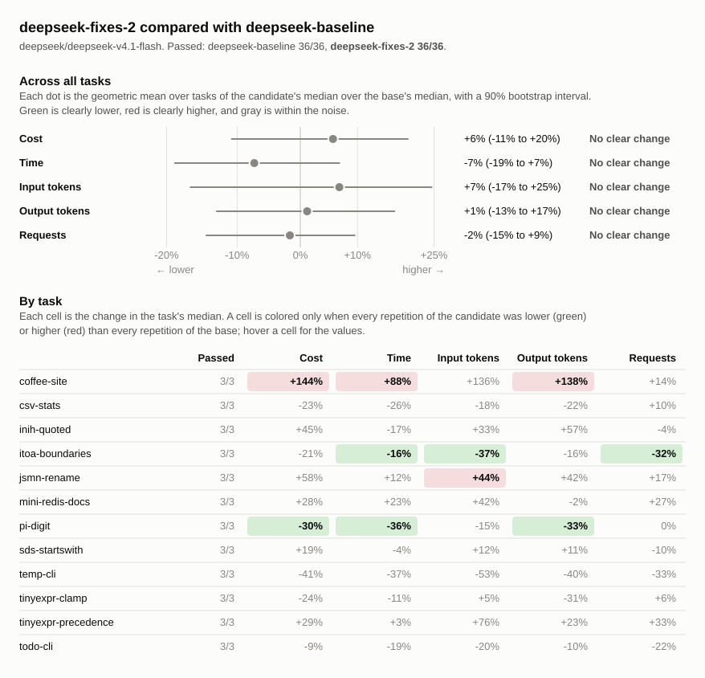

# Benchmark comparison: deepseek-baseline, deepseek-fixes-2

## Runs

| Label             | Commit       | Dirty | Model                          | Effort  | Providers | Results |
| ----------------- | ------------ | ----- | ------------------------------ | ------- | --------- | ------- |
| deepseek-baseline | `540ece7f39` | no    | `deepseek/deepseek-v4.1-flash` | default | deepseek  | 36      |
| deepseek-fixes-2  | `540ece7f39` | yes   | `deepseek/deepseek-v4.1-flash` | default | deepseek  | 36      |

## Chart

## Summary

Changes are relative to `deepseek-baseline`. A task's values are medians over
its repetitions, with the range in parentheses. Totals are sums of task medians.

| Metric            | deepseek-baseline | deepseek-fixes-2 | Change |
| ----------------- | ----------------: | ---------------: | -----: |
| passed            |             36/36 |            36/36 |        |
| seconds           |              1165 |             1108 |    -5% |
| requests          |               239 |              256 |    +7% |
| tool_calls        |               332 |              340 |    +2% |
| failed_calls      |                 6 |                6 |    +0% |
| cancelled_calls   |                 0 |                0 |        |
| repeated_calls    |                 1 |                0 |  -100% |
| input_tokens      |           7646434 |         11011749 |   +44% |
| cached_tokens     |           7447936 |         10797312 |   +45% |
| output_tokens     |            165422 |           187722 |   +13% |
| reasoning_tokens  |             98503 |           123443 |   +25% |
| cost              |           $0.1517 |          $0.1824 |   +20% |
| max_input_tokens  |            365587 |           404045 |   +11% |
| tool_output_chars |            548957 |           597896 |    +9% |
| compactions       |                 0 |                0 |        |
| summarizer_cost   |           $0.0000 |          $0.0000 |        |
| subagents         |                 0 |                0 |        |

### Pass rate and cost by task

| Task                  | deepseek-baseline passed | deepseek-fixes-2 passed |    deepseek-baseline cost |     deepseek-fixes-2 cost | Change |
| --------------------- | -----------------------: | ----------------------: | ------------------------: | ------------------------: | -----: |
| `coffee-site`         |                      3/3 |                     3/3 | $0.0020 ($0.0019–$0.0036) | $0.0048 ($0.0040–$0.0069) |  +144% |
| `csv-stats`           |                      3/3 |                     3/3 | $0.0087 ($0.0063–$0.0089) | $0.0067 ($0.0066–$0.0081) |   -23% |
| `inih-quoted`         |                      3/3 |                     3/3 | $0.0294 ($0.0241–$0.0590) | $0.0427 ($0.0375–$0.0434) |   +45% |
| `itoa-boundaries`     |                      3/3 |                     3/3 | $0.0084 ($0.0066–$0.0277) | $0.0067 ($0.0067–$0.0069) |   -21% |
| `jsmn-rename`         |                      3/3 |                     3/3 | $0.0013 ($0.0012–$0.0015) | $0.0021 ($0.0012–$0.0022) |   +58% |
| `mini-redis-docs`     |                      3/3 |                     3/3 | $0.0290 ($0.0274–$0.0328) | $0.0372 ($0.0253–$0.0376) |   +28% |
| `pi-digit`            |                      3/3 |                     3/3 | $0.0077 ($0.0064–$0.0093) | $0.0054 ($0.0050–$0.0057) |   -30% |
| `sds-startswith`      |                      3/3 |                     3/3 | $0.0024 ($0.0022–$0.0038) | $0.0028 ($0.0027–$0.0043) |   +19% |
| `temp-cli`            |                      3/3 |                     3/3 | $0.0031 ($0.0022–$0.0032) | $0.0018 ($0.0015–$0.0033) |   -41% |
| `tinyexpr-clamp`      |                      3/3 |                     3/3 | $0.0060 ($0.0038–$0.0073) | $0.0046 ($0.0041–$0.0088) |   -24% |
| `tinyexpr-precedence` |                      3/3 |                     3/3 | $0.0493 ($0.0372–$0.0699) | $0.0636 ($0.0571–$0.0906) |   +29% |
| `todo-cli`            |                      3/3 |                     3/3 | $0.0044 ($0.0036–$0.0044) | $0.0040 ($0.0027–$0.0045) |    -9% |

## Tasks

### `coffee-site`

| Metric                 |         deepseek-baseline |          deepseek-fixes-2 | Change |
| ---------------------- | ------------------------: | ------------------------: | -----: |
| passed                 |                       3/3 |                       3/3 |        |
| status                 |                finished 3 |                finished 3 |        |
| seconds                |                17 (16–26) |                32 (26–41) |   +87% |
| requests               |                   7 (6–8) |                  8 (7–11) |   +14% |
| tool_calls             |                  8 (7–10) |                 10 (9–11) |   +25% |
| failed_calls           |                         0 |                         0 |        |
| cancelled_calls        |                         0 |                         0 |        |
| `glob` calls           |                   0 (0–1) |                         0 |        |
| `glob` failed          |                         0 |                         0 |        |
| `shell` calls          |                   4 (3–4) |                   6 (5–6) |   +50% |
| `shell` failed         |                         0 |                         0 |        |
| `shell_process` calls  |                   1 (1–2) |                   1 (1–2) |    +0% |
| `shell_process` failed |                         0 |                         0 |        |
| `write_file` calls     |                         3 |                         3 |    +0% |
| `write_file` failed    |                         0 |                         0 |        |
| repeated_calls         |                         0 |                         0 |        |
| input_tokens           |       33944 (29214–52837) |       79955 (49637–83842) |  +136% |
| cached_tokens          |       32384 (27904–51072) |       78080 (47872–80128) |  +141% |
| output_tokens          |          2825 (2645–5310) |         6712 (6069–10596) |  +138% |
| reasoning_tokens       |              128 (73–133) |            916 (226–1140) |  +616% |
| cost                   | $0.0020 ($0.0019–$0.0036) | $0.0048 ($0.0040–$0.0069) |  +144% |
| max_input_tokens       |          5864 (5699–8484) |        10433 (9660–13731) |   +78% |
| tool_output_chars      |           1599 (876–1656) |          2509 (1811–2558) |   +57% |
| compactions            |                         0 |                         0 |        |
| summarizer_cost        |                   $0.0000 |                   $0.0000 |        |
| subagents              |                         0 |                         0 |        |

### `csv-stats`

| Metric              |         deepseek-baseline |          deepseek-fixes-2 | Change |
| ------------------- | ------------------------: | ------------------------: | -----: |
| passed              |                       3/3 |                       3/3 |        |
| status              |                finished 3 |                finished 3 |        |
| seconds             |                66 (43–67) |                49 (47–56) |   -26% |
| requests            |                 10 (9–14) |                 11 (9–11) |   +10% |
| tool_calls          |                13 (12–14) |                12 (12–14) |    -8% |
| failed_calls        |                   0 (0–1) |                         0 |        |
| cancelled_calls     |                         0 |                         0 |        |
| `edit_file` calls   |                   0 (0–1) |                   1 (1–2) |        |
| `edit_file` failed  |                         0 |                         0 |        |
| `glob` calls        |                   1 (0–1) |                         0 |  -100% |
| `glob` failed       |                         0 |                         0 |        |
| `shell` calls       |                   7 (6–8) |                   6 (6–7) |   -14% |
| `shell` failed      |                   0 (0–1) |                         0 |        |
| `write_file` calls  |                         5 |                         5 |    +0% |
| `write_file` failed |                         0 |                         0 |        |
| repeated_calls      |                         0 |                   0 (0–1) |        |
| input_tokens        |     128476 (85475–172586) |     105699 (95549–126305) |   -18% |
| cached_tokens       |     126336 (83200–169600) |     103040 (93056–121856) |   -18% |
| output_tokens       |        12968 (9512–13682) |        10072 (9858–11764) |   -22% |
| reasoning_tokens    |          8010 (5165–9041) |          6209 (5950–7068) |   -22% |
| cost                | $0.0087 ($0.0063–$0.0089) | $0.0067 ($0.0066–$0.0081) |   -23% |
| max_input_tokens    |       16672 (13170–17113) |       13996 (13280–15809) |   -16% |
| tool_output_chars   |          3192 (2739–3928) |          3608 (2843–3701) |   +13% |
| compactions         |                         0 |                         0 |        |
| summarizer_cost     |                   $0.0000 |                   $0.0000 |        |
| subagents           |                         0 |                         0 |        |

### `inih-quoted`

| Metric              |         deepseek-baseline |          deepseek-fixes-2 | Change |
| ------------------- | ------------------------: | ------------------------: | -----: |
| passed              |                       3/3 |                       3/3 |        |
| status              |                finished 3 |                finished 3 |        |
| seconds             |             330 (180–402) |             276 (252–410) |   -17% |
| requests            |                55 (33–66) |                53 (51–55) |    -4% |
| tool_calls          |                62 (43–80) |                69 (65–70) |   +11% |
| failed_calls        |                   2 (1–4) |                   2 (0–2) |    +0% |
| cancelled_calls     |                         0 |                         0 |        |
| `edit_file` calls   |                   2 (1–2) |                  3 (3–12) |   +50% |
| `edit_file` failed  |                         0 |                         0 |        |
| `glob` calls        |                         1 |                   1 (0–1) |    +0% |
| `glob` failed       |                         0 |                         0 |        |
| `grep` calls        |                   0 (0–1) |                   0 (0–2) |        |
| `grep` failed       |                         0 |                         0 |        |
| `read_file` calls   |                  7 (5–13) |                 11 (9–17) |   +57% |
| `read_file` failed  |                         0 |                         0 |        |
| `shell` calls       |                50 (35–60) |                47 (42–51) |    -6% |
| `shell` failed      |                   2 (1–4) |                   2 (0–2) |    +0% |
| `write_file` calls  |                   1 (1–4) |                   2 (1–2) |  +100% |
| `write_file` failed |                         0 |                         0 |        |
| repeated_calls      |                         0 |                         0 |        |
| input_tokens        | 1976092 (1146826–4232933) | 2631687 (2407494–2686475) |   +33% |
| cached_tokens       | 1940480 (1115776–4179968) | 2589568 (2373120–2646016) |   +33% |
| output_tokens       |       30368 (26813–64184) |       47720 (42063–48911) |   +57% |
| reasoning_tokens    |       21420 (20624–52953) |       38398 (32654–38406) |   +79% |
| cost                | $0.0294 ($0.0241–$0.0590) | $0.0427 ($0.0375–$0.0434) |   +45% |
| max_input_tokens    |      62696 (56810–113471) |       86928 (72965–87914) |   +39% |
| tool_output_chars   |      93771 (85907–141867) |     106098 (85497–108782) |   +13% |
| compactions         |                         0 |                         0 |        |
| summarizer_cost     |                   $0.0000 |                   $0.0000 |        |
| subagents           |                         0 |                         0 |        |

### `itoa-boundaries`

| Metric              |         deepseek-baseline |          deepseek-fixes-2 | Change |
| ------------------- | ------------------------: | ------------------------: | -----: |
| passed              |                       3/3 |                       3/3 |        |
| status              |                finished 3 |                finished 3 |        |
| seconds             |               63 (59–238) |                53 (47–56) |   -16% |
| requests            |                19 (16–38) |                13 (10–14) |   -32% |
| tool_calls          |                24 (18–47) |                15 (12–17) |   -38% |
| failed_calls        |                   0 (0–1) |                         0 |        |
| cancelled_calls     |                         0 |                         0 |        |
| `edit_file` calls   |                   2 (1–5) |                   1 (1–2) |   -50% |
| `edit_file` failed  |                         0 |                         0 |        |
| `glob` calls        |                         1 |                         1 |    +0% |
| `glob` failed       |                         0 |                         0 |        |
| `read_file` calls   |                   7 (5–7) |                   4 (3–4) |   -43% |
| `read_file` failed  |                         0 |                         0 |        |
| `shell` calls       |                10 (10–36) |                   8 (5–9) |   -20% |
| `shell` failed      |                   0 (0–1) |                         0 |        |
| `write_file` calls  |                         1 |                   1 (1–2) |    +0% |
| `write_file` failed |                         0 |                         0 |        |
| repeated_calls      |                   1 (0–1) |                   0 (0–1) |  -100% |
| input_tokens        |   288135 (211910–1247963) |    181255 (126885–198293) |   -37% |
| cached_tokens       |   273920 (200192–1216640) |    170624 (116864–187264) |   -38% |
| output_tokens       |         9109 (7062–32332) |          7620 (7432–8345) |   -16% |
| reasoning_tokens    |         4558 (4280–24688) |          4659 (4304–5929) |    +2% |
| cost                | $0.0084 ($0.0066–$0.0277) | $0.0067 ($0.0067–$0.0069) |   -21% |
| max_input_tokens    |       23220 (19664–62185) |       19564 (19415–19675) |   -16% |
| tool_output_chars   |       35427 (31750–80995) |       28967 (27169–29174) |   -18% |
| compactions         |                         0 |                         0 |        |
| summarizer_cost     |                   $0.0000 |                   $0.0000 |        |
| subagents           |                         0 |                         0 |        |

### `jsmn-rename`

| Metric             |         deepseek-baseline |          deepseek-fixes-2 | Change |
| ------------------ | ------------------------: | ------------------------: | -----: |
| passed             |                       3/3 |                       3/3 |        |
| status             |                finished 3 |                finished 3 |        |
| seconds            |                11 (10–13) |                12 (10–15) |   +12% |
| requests           |                   6 (6–7) |                   7 (7–8) |   +17% |
| tool_calls         |                   8 (7–9) |                 10 (8–11) |   +25% |
| failed_calls       |                   0 (0–1) |                         0 |        |
| cancelled_calls    |                         0 |                         0 |        |
| `grep` calls       |                   1 (1–2) |                         1 |    +0% |
| `grep` failed      |                         0 |                         0 |        |
| `read_file` calls  |                   1 (0–2) |                   1 (1–6) |    +0% |
| `read_file` failed |                         0 |                         0 |        |
| `shell` calls      |                   6 (5–6) |                   6 (4–8) |    +0% |
| `shell` failed     |                   0 (0–1) |                         0 |        |
| repeated_calls     |                         0 |                         0 |        |
| input_tokens       |       31913 (29271–32863) |       45951 (33346–58685) |   +44% |
| cached_tokens      |       28672 (25600–28800) |       39424 (30464–52736) |   +38% |
| output_tokens      |          1149 (1067–1315) |          1637 (1078–1967) |   +42% |
| reasoning_tokens   |             371 (311–507) |             542 (263–926) |   +46% |
| cost               | $0.0013 ($0.0012–$0.0015) | $0.0021 ($0.0012–$0.0022) |   +58% |
| max_input_tokens   |          6528 (6015–7130) |         9946 (6003–10446) |   +52% |
| tool_output_chars  |          8043 (6044–9235) |        14814 (5232–16820) |   +84% |
| compactions        |                         0 |                         0 |        |
| summarizer_cost    |                   $0.0000 |                   $0.0000 |        |
| subagents          |                         0 |                         0 |        |

### `mini-redis-docs`

| Metric              |         deepseek-baseline |          deepseek-fixes-2 | Change |
| ------------------- | ------------------------: | ------------------------: | -----: |
| passed              |                       3/3 |                       3/3 |        |
| status              |                finished 3 |                finished 3 |        |
| seconds             |             150 (141–172) |             185 (113–187) |   +23% |
| requests            |                44 (43–57) |                56 (29–80) |   +27% |
| tool_calls          |             102 (100–107) |              100 (94–108) |    -2% |
| failed_calls        |                   2 (1–3) |                   2 (1–5) |    +0% |
| cancelled_calls     |                         0 |                         0 |        |
| `bash` calls        |                         0 |                   0 (0–1) |        |
| `bash` failed       |                         0 |                   0 (0–1) |        |
| `edit_file` calls   |                48 (37–52) |                50 (47–53) |    +4% |
| `edit_file` failed  |                         0 |                         0 |        |
| `glob` calls        |                   1 (0–1) |                   0 (0–1) |  -100% |
| `glob` failed       |                         0 |                         0 |        |
| `read_file` calls   |                40 (37–41) |                32 (30–32) |   -20% |
| `read_file` failed  |                         1 |                   1 (0–2) |    +0% |
| `shell` calls       |                14 (13–24) |                21 (13–22) |   +50% |
| `shell` failed      |                   1 (0–2) |                   2 (0–2) |  +100% |
| `write_file` calls  |                   0 (0–1) |                         0 |        |
| `write_file` failed |                         0 |                         0 |        |
| repeated_calls      |                   0 (0–2) |                         0 |        |
| input_tokens        | 2221669 (2201098–2997492) | 3160704 (1504961–4727920) |   +42% |
| cached_tokens       | 2158336 (2136960–2934144) | 3092096 (1444864–4655104) |   +43% |
| output_tokens       |       21685 (18877–24154) |       21251 (19876–29366) |    -2% |
| reasoning_tokens    |        10544 (7281–13180) |         9941 (9674–16116) |    -6% |
| cost                | $0.0290 ($0.0274–$0.0328) | $0.0372 ($0.0253–$0.0376) |   +28% |
| max_input_tokens    |       83173 (80870–83552) |       85009 (79805–94414) |    +2% |
| tool_output_chars   |    212553 (205663–215285) |    221600 (207586–223426) |    +4% |
| compactions         |                         0 |                         0 |        |
| summarizer_cost     |                   $0.0000 |                   $0.0000 |        |
| subagents           |                         0 |                         0 |        |

### `pi-digit`

| Metric              |         deepseek-baseline |          deepseek-fixes-2 | Change |
| ------------------- | ------------------------: | ------------------------: | -----: |
| passed              |                       3/3 |                       3/3 |        |
| status              |                finished 3 |                finished 3 |        |
| seconds             |                56 (47–70) |                36 (36–39) |   -36% |
| requests            |                  8 (7–11) |                  8 (6–10) |    +0% |
| tool_calls          |                 10 (8–13) |                  9 (8–13) |   -10% |
| failed_calls        |                         0 |                   0 (0–1) |        |
| cancelled_calls     |                         0 |                         0 |        |
| `edit_file` calls   |                   0 (0–1) |                   1 (0–3) |        |
| `edit_file` failed  |                         0 |                         0 |        |
| `read_file` calls   |                   0 (0–1) |                   0 (0–1) |        |
| `read_file` failed  |                         0 |                         0 |        |
| `shell` calls       |                   7 (5–8) |                   6 (4–6) |   -14% |
| `shell` failed      |                         0 |                   0 (0–1) |        |
| `write_file` calls  |                         3 |                         3 |    +0% |
| `write_file` failed |                         0 |                         0 |        |
| repeated_calls      |                         0 |                         0 |        |
| input_tokens        |      78280 (74667–130745) |       66455 (48932–88556) |   -15% |
| cached_tokens       |      76928 (72960–128256) |       64768 (46080–85760) |   -16% |
| output_tokens       |        12179 (9825–14200) |          8133 (7624–8361) |   -33% |
| reasoning_tokens    |          8816 (7067–9248) |          4732 (4290–4930) |   -46% |
| cost                | $0.0077 ($0.0064–$0.0093) | $0.0054 ($0.0050–$0.0057) |   -30% |
| max_input_tokens    |       15093 (12920–17633) |       11266 (10857–12773) |   -25% |
| tool_output_chars   |          1315 (1041–2343) |          1151 (1055–4845) |   -12% |
| compactions         |                         0 |                         0 |        |
| summarizer_cost     |                   $0.0000 |                   $0.0000 |        |
| subagents           |                         0 |                         0 |        |

### `sds-startswith`

| Metric             |         deepseek-baseline |          deepseek-fixes-2 | Change |
| ------------------ | ------------------------: | ------------------------: | -----: |
| passed             |                       3/3 |                       3/3 |        |
| status             |                finished 3 |                finished 3 |        |
| seconds            |                20 (16–25) |                19 (18–24) |    -4% |
| requests           |                 10 (8–13) |                  9 (9–11) |   -10% |
| tool_calls         |                14 (13–17) |                13 (12–14) |    -7% |
| failed_calls       |                   0 (0–1) |                         0 |        |
| cancelled_calls    |                         0 |                         0 |        |
| `edit_file` calls  |                   3 (3–7) |                   3 (3–4) |    +0% |
| `edit_file` failed |                         0 |                         0 |        |
| `glob` calls       |                         1 |                   1 (0–1) |    +0% |
| `glob` failed      |                         0 |                         0 |        |
| `grep` calls       |                   2 (1–2) |                   1 (0–1) |   -50% |
| `grep` failed      |                         0 |                         0 |        |
| `read_file` calls  |                   4 (3–5) |                   5 (5–6) |   +25% |
| `read_file` failed |                         0 |                         0 |        |
| `shell` calls      |                   4 (3–4) |                   3 (2–4) |   -25% |
| `shell` failed     |                   0 (0–1) |                         0 |        |
| repeated_calls     |                         0 |                         0 |        |
| input_tokens       |       56991 (46683–94127) |      63805 (58000–109158) |   +12% |
| cached_tokens      |       53120 (42240–87936) |       58240 (52992–99072) |   +10% |
| output_tokens      |          2748 (2333–4288) |          3045 (2950–4209) |   +11% |
| reasoning_tokens   |            763 (760–1773) |          1327 (1275–2510) |   +74% |
| cost               | $0.0024 ($0.0022–$0.0038) | $0.0028 ($0.0027–$0.0043) |   +19% |
| max_input_tokens   |         8792 (8218–11366) |        10345 (9662–15730) |   +18% |
| tool_output_chars  |        10093 (7693–11682) |       12398 (10892–25529) |   +23% |
| compactions        |                         0 |                         0 |        |
| summarizer_cost    |                   $0.0000 |                   $0.0000 |        |
| subagents          |                         0 |                         0 |        |

### `temp-cli`

| Metric              |         deepseek-baseline |          deepseek-fixes-2 | Change |
| ------------------- | ------------------------: | ------------------------: | -----: |
| passed              |                       3/3 |                       3/3 |        |
| status              |                finished 3 |                finished 3 |        |
| seconds             |                22 (16–25) |                14 (12–24) |   -37% |
| requests            |                  9 (6–11) |                  6 (5–11) |   -33% |
| tool_calls          |                 12 (6–14) |                  6 (6–12) |   -50% |
| failed_calls        |                         0 |                         0 |        |
| cancelled_calls     |                         0 |                         0 |        |
| `edit_file` calls   |                   2 (0–3) |                   0 (0–5) |  -100% |
| `edit_file` failed  |                         0 |                         0 |        |
| `glob` calls        |                   0 (0–1) |                         0 |        |
| `glob` failed       |                         0 |                         0 |        |
| `read_file` calls   |                   0 (0–1) |                         0 |        |
| `read_file` failed  |                         0 |                         0 |        |
| `shell` calls       |                   5 (3–6) |                         3 |   -40% |
| `shell` failed      |                         0 |                         0 |        |
| `write_file` calls  |                   4 (3–4) |                   3 (3–4) |   -25% |
| `write_file` failed |                         0 |                         0 |        |
| repeated_calls      |                   0 (0–1) |                         0 |        |
| input_tokens        |       58365 (27876–63171) |       27316 (20960–64763) |   -53% |
| cached_tokens       |       55296 (26240–60544) |       25856 (19712–62208) |   -53% |
| output_tokens       |          4169 (3057–4273) |          2517 (2068–4627) |   -40% |
| reasoning_tokens    |           1176 (539–1232) |             517 (344–900) |   -56% |
| cost                | $0.0031 ($0.0022–$0.0032) | $0.0018 ($0.0015–$0.0033) |   -41% |
| max_input_tokens    |          7751 (6373–8805) |          5781 (5274–8003) |   -25% |
| tool_output_chars   |          3202 (2653–6674) |          1535 (1490–1879) |   -52% |
| compactions         |                         0 |                         0 |        |
| summarizer_cost     |                   $0.0000 |                   $0.0000 |        |
| subagents           |                         0 |                         0 |        |

### `tinyexpr-clamp`

| Metric             |         deepseek-baseline |          deepseek-fixes-2 | Change |
| ------------------ | ------------------------: | ------------------------: | -----: |
| passed             |                       3/3 |                       3/3 |        |
| status             |                finished 3 |                finished 3 |        |
| seconds            |                35 (25–37) |                31 (24–40) |   -11% |
| requests           |                17 (14–18) |                18 (15–21) |    +6% |
| tool_calls         |                21 (19–25) |                23 (16–23) |   +10% |
| failed_calls       |                   1 (0–1) |                         0 |  -100% |
| cancelled_calls    |                         0 |                         0 |        |
| `edit_file` calls  |                   7 (5–8) |                         5 |   -29% |
| `edit_file` failed |                         0 |                         0 |        |
| `glob` calls       |                   1 (1–2) |                   1 (0–2) |    +0% |
| `glob` failed      |                         0 |                         0 |        |
| `grep` calls       |                   1 (1–2) |                   2 (0–4) |  +100% |
| `grep` failed      |                         0 |                         0 |        |
| `read_file` calls  |                   9 (5–9) |                  7 (3–10) |   -22% |
| `read_file` failed |                         0 |                         0 |        |
| `shell` calls      |                   5 (4–5) |                   7 (4–7) |   +40% |
| `shell` failed     |                   1 (0–1) |                         0 |  -100% |
| repeated_calls     |                   0 (0–1) |                         0 |        |
| input_tokens       |    230086 (140268–347492) |    241058 (169801–444012) |    +5% |
| cached_tokens      |    215040 (130432–325248) |    228736 (157312–416768) |    +6% |
| output_tokens      |          4955 (3203–5150) |          3399 (2993–5730) |   -31% |
| reasoning_tokens   |           2038 (907–2343) |           1055 (949–3116) |   -48% |
| cost               | $0.0060 ($0.0038–$0.0073) | $0.0046 ($0.0041–$0.0088) |   -24% |
| max_input_tokens   |       20447 (13776–27563) |       16601 (16141–33612) |   -19% |
| tool_output_chars  |       34650 (21503–55913) |       29528 (28378–72920) |   -15% |
| compactions        |                         0 |                         0 |        |
| summarizer_cost    |                   $0.0000 |                   $0.0000 |        |
| subagents          |                         0 |                         0 |        |

### `tinyexpr-precedence`

| Metric              |         deepseek-baseline |          deepseek-fixes-2 | Change |
| ------------------- | ------------------------: | ------------------------: | -----: |
| passed              |                       3/3 |                       3/3 |        |
| status              |                finished 3 |                finished 3 |        |
| seconds             |             366 (283–424) |             378 (353–696) |    +3% |
| requests            |                45 (44–76) |                60 (59–71) |   +33% |
| tool_calls          |                50 (48–84) |                65 (64–77) |   +30% |
| failed_calls        |                   1 (1–3) |                   2 (0–5) |  +100% |
| cancelled_calls     |                         0 |                         0 |        |
| `edit_file` calls   |                  2 (0–18) |                   3 (2–3) |   +50% |
| `edit_file` failed  |                         0 |                         0 |        |
| `glob` calls        |                         1 |                   2 (1–2) |  +100% |
| `glob` failed       |                         0 |                         0 |        |
| `grep` calls        |                   1 (1–3) |                   0 (0–1) |  -100% |
| `grep` failed       |                         0 |                         0 |        |
| `read_file` calls   |                13 (12–16) |                  9 (9–12) |   -31% |
| `read_file` failed  |                         0 |                   0 (0–1) |        |
| `shell` calls       |                34 (31–43) |                51 (50–61) |   +50% |
| `shell` failed      |                   1 (1–3) |                   2 (0–4) |  +100% |
| `write_file` calls  |                   0 (0–5) |                         0 |        |
| `write_file` failed |                         0 |                         0 |        |
| repeated_calls      |                   0 (0–2) |                         0 |        |
| input_tokens        | 2480026 (2221783–6069376) | 4357770 (4213533–6820499) |   +76% |
| cached_tokens       | 2426880 (2176896–6004992) | 4299136 (4145792–6742016) |   +77% |
| output_tokens       |       56805 (39881–70368) |       69809 (57557–97677) |   +23% |
| reasoning_tokens    |       39637 (29090–54271) |       54364 (44488–75318) |   +37% |
| cost                | $0.0493 ($0.0372–$0.0699) | $0.0636 ($0.0571–$0.0906) |   +29% |
| max_input_tokens    |     105705 (81917–127229) |    124646 (120392–168619) |   +18% |
| tool_output_chars   |    142810 (117594–152242) |    173676 (149954–180940) |   +22% |
| compactions         |                         0 |                         0 |        |
| summarizer_cost     |                   $0.0000 |                   $0.0000 |        |
| subagents           |                         0 |                         0 |        |

### `todo-cli`

| Metric              |         deepseek-baseline |          deepseek-fixes-2 | Change |
| ------------------- | ------------------------: | ------------------------: | -----: |
| passed              |                       3/3 |                       3/3 |        |
| status              |                finished 3 |                finished 3 |        |
| seconds             |                30 (25–32) |                24 (18–29) |   -19% |
| requests            |                   9 (8–9) |                   7 (6–9) |   -22% |
| tool_calls          |                  8 (7–11) |                   8 (7–9) |    +0% |
| failed_calls        |                         0 |                         0 |        |
| cancelled_calls     |                         0 |                         0 |        |
| `edit_file` calls   |                   0 (0–3) |                   1 (0–1) |        |
| `edit_file` failed  |                         0 |                         0 |        |
| `glob` calls        |                   0 (0–1) |                   0 (0–1) |        |
| `glob` failed       |                         0 |                         0 |        |
| `shell` calls       |                   4 (4–5) |                         4 |    +0% |
| `shell` failed      |                         0 |                         0 |        |
| `write_file` calls  |                         3 |                         3 |    +0% |
| `write_file` failed |                         0 |                         0 |        |
| repeated_calls      |                         0 |                   0 (0–1) |        |
| input_tokens        |       62457 (48942–65758) |       50094 (32905–61158) |   -20% |
| cached_tokens       |       60544 (46848–63232) |       47744 (31616–57472) |   -21% |
| output_tokens       |          6462 (5201–6494) |          5807 (4003–6287) |   -10% |
| reasoning_tokens    |           1042 (952–2011) |            783 (672–1312) |   -25% |
| cost                | $0.0044 ($0.0036–$0.0044) | $0.0040 ($0.0027–$0.0045) |    -9% |
| max_input_tokens    |          9646 (8507–9942) |          9530 (7154–9879) |    -1% |
| tool_output_chars   |          2302 (2226–2933) |          2012 (1354–4307) |   -13% |
| compactions         |                         0 |                         0 |        |
| summarizer_cost     |                   $0.0000 |                   $0.0000 |        |
| subagents           |                         0 |                         0 |        |
