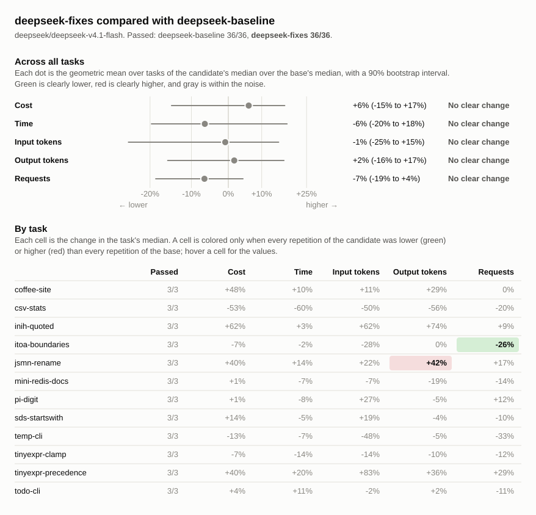

# Benchmark comparison: deepseek-baseline, deepseek-fixes

## Runs

| Label             | Commit       | Dirty | Model                          | Effort  | Providers | Results |
| ----------------- | ------------ | ----- | ------------------------------ | ------- | --------- | ------- |
| deepseek-baseline | `540ece7f39` | no    | `deepseek/deepseek-v4.1-flash` | default | deepseek  | 36      |
| deepseek-fixes    | `540ece7f39` | yes   | `deepseek/deepseek-v4.1-flash` | default | deepseek  | 36      |

## Chart

## Summary

Changes are relative to `deepseek-baseline`. A task's values are medians over
its repetitions, with the range in parentheses. Totals are sums of task medians.

| Metric            | deepseek-baseline | deepseek-fixes | Change |
| ----------------- | ----------------: | -------------: | -----: |
| passed            |             36/36 |          36/36 |        |
| seconds           |              1165 |           1192 |    +2% |
| requests          |               239 |            239 |    +0% |
| tool_calls        |               332 |            336 |    +1% |
| failed_calls      |                 6 |             13 |  +117% |
| cancelled_calls   |                 0 |              0 |        |
| repeated_calls    |                 1 |              1 |    +0% |
| input_tokens      |           7646434 |       10631010 |   +39% |
| cached_tokens     |           7447936 |       10411264 |   +40% |
| output_tokens     |            165422 |         197012 |   +19% |
| reasoning_tokens  |             98503 |         137080 |   +39% |
| cost              |           $0.1517 |        $0.1859 |   +23% |
| max_input_tokens  |            365587 |         411124 |   +12% |
| tool_output_chars |            548957 |         566189 |    +3% |
| compactions       |                 0 |              0 |        |
| summarizer_cost   |           $0.0000 |        $0.0000 |        |
| subagents         |                 0 |              0 |        |

### Pass rate and cost by task

| Task                  | deepseek-baseline passed | deepseek-fixes passed |    deepseek-baseline cost |       deepseek-fixes cost | Change |
| --------------------- | -----------------------: | --------------------: | ------------------------: | ------------------------: | -----: |
| `coffee-site`         |                      3/3 |                   3/3 | $0.0020 ($0.0019–$0.0036) | $0.0029 ($0.0013–$0.0032) |   +48% |
| `csv-stats`           |                      3/3 |                   3/3 | $0.0087 ($0.0063–$0.0089) | $0.0041 ($0.0035–$0.0074) |   -53% |
| `inih-quoted`         |                      3/3 |                   3/3 | $0.0294 ($0.0241–$0.0590) | $0.0476 ($0.0411–$0.0708) |   +62% |
| `itoa-boundaries`     |                      3/3 |                   3/3 | $0.0084 ($0.0066–$0.0277) | $0.0079 ($0.0077–$0.0093) |    -7% |
| `jsmn-rename`         |                      3/3 |                   3/3 | $0.0013 ($0.0012–$0.0015) | $0.0018 ($0.0013–$0.0019) |   +40% |
| `mini-redis-docs`     |                      3/3 |                   3/3 | $0.0290 ($0.0274–$0.0328) | $0.0292 ($0.0253–$0.0317) |    +1% |
| `pi-digit`            |                      3/3 |                   3/3 | $0.0077 ($0.0064–$0.0093) | $0.0078 ($0.0066–$0.0121) |    +1% |
| `sds-startswith`      |                      3/3 |                   3/3 | $0.0024 ($0.0022–$0.0038) | $0.0027 ($0.0026–$0.0028) |   +14% |
| `temp-cli`            |                      3/3 |                   3/3 | $0.0031 ($0.0022–$0.0032) | $0.0027 ($0.0018–$0.0034) |   -13% |
| `tinyexpr-clamp`      |                      3/3 |                   3/3 | $0.0060 ($0.0038–$0.0073) | $0.0056 ($0.0034–$0.0085) |    -7% |
| `tinyexpr-precedence` |                      3/3 |                   3/3 | $0.0493 ($0.0372–$0.0699) | $0.0691 ($0.0379–$0.0821) |   +40% |
| `todo-cli`            |                      3/3 |                   3/3 | $0.0044 ($0.0036–$0.0044) | $0.0045 ($0.0032–$0.0055) |    +4% |

## Tasks

### `coffee-site`

| Metric                 |         deepseek-baseline |            deepseek-fixes | Change |
| ---------------------- | ------------------------: | ------------------------: | -----: |
| passed                 |                       3/3 |                       3/3 |        |
| status                 |                finished 3 |                finished 3 |        |
| seconds                |                17 (16–26) |                18 (11–23) |   +10% |
| requests               |                   7 (6–8) |                   7 (5–8) |    +0% |
| tool_calls             |                  8 (7–10) |                  9 (6–11) |   +12% |
| failed_calls           |                         0 |                         0 |        |
| cancelled_calls        |                         0 |                         0 |        |
| `glob` calls           |                   0 (0–1) |                         0 |        |
| `glob` failed          |                         0 |                         0 |        |
| `shell` calls          |                   4 (3–4) |                   5 (2–6) |   +25% |
| `shell` failed         |                         0 |                         0 |        |
| `shell_process` calls  |                   1 (1–2) |                   1 (1–2) |    +0% |
| `shell_process` failed |                         0 |                         0 |        |
| `write_file` calls     |                         3 |                         3 |    +0% |
| `write_file` failed    |                         0 |                         0 |        |
| repeated_calls         |                         0 |                         0 |        |
| input_tokens           |       33944 (29214–52837) |       37702 (21070–50519) |   +11% |
| cached_tokens          |       32384 (27904–51072) |       33408 (19968–48768) |    +3% |
| output_tokens          |          2825 (2645–5310) |          3633 (1777–4701) |   +29% |
| reasoning_tokens       |              128 (73–133) |               93 (38–135) |   -27% |
| cost                   | $0.0020 ($0.0019–$0.0036) | $0.0029 ($0.0013–$0.0032) |   +48% |
| max_input_tokens       |          5864 (5699–8484) |          6808 (4893–8023) |   +16% |
| tool_output_chars      |           1599 (876–1656) |           1270 (814–1754) |   -21% |
| compactions            |                         0 |                         0 |        |
| summarizer_cost        |                   $0.0000 |                   $0.0000 |        |
| subagents              |                         0 |                         0 |        |

### `csv-stats`

| Metric              |         deepseek-baseline |            deepseek-fixes | Change |
| ------------------- | ------------------------: | ------------------------: | -----: |
| passed              |                       3/3 |                       3/3 |        |
| status              |                finished 3 |                finished 3 |        |
| seconds             |                66 (43–67) |                27 (26–55) |   -60% |
| requests            |                 10 (9–14) |                  8 (5–10) |   -20% |
| tool_calls          |                13 (12–14) |                 10 (8–13) |   -23% |
| failed_calls        |                   0 (0–1) |                         0 |        |
| cancelled_calls     |                         0 |                         0 |        |
| `edit_file` calls   |                   0 (0–1) |                   0 (0–2) |        |
| `edit_file` failed  |                         0 |                         0 |        |
| `glob` calls        |                   1 (0–1) |                         0 |  -100% |
| `glob` failed       |                         0 |                         0 |        |
| `shell` calls       |                   7 (6–8) |                   5 (3–6) |   -29% |
| `shell` failed      |                   0 (0–1) |                         0 |        |
| `write_file` calls  |                         5 |                         5 |    +0% |
| `write_file` failed |                         0 |                         0 |        |
| repeated_calls      |                         0 |                         0 |        |
| input_tokens        |     128476 (85475–172586) |       63979 (30882–87597) |   -50% |
| cached_tokens       |     126336 (83200–169600) |       61952 (27008–85760) |   -51% |
| output_tokens       |        12968 (9512–13682) |         5739 (4948–11410) |   -56% |
| reasoning_tokens    |          8010 (5165–9041) |          2838 (1473–7387) |   -65% |
| cost                | $0.0087 ($0.0063–$0.0089) | $0.0041 ($0.0035–$0.0074) |   -53% |
| max_input_tokens    |       16672 (13170–17113) |         8726 (8292–14819) |   -48% |
| tool_output_chars   |          3192 (2739–3928) |          1924 (1109–2257) |   -40% |
| compactions         |                         0 |                         0 |        |
| summarizer_cost     |                   $0.0000 |                   $0.0000 |        |
| subagents           |                         0 |                         0 |        |

### `inih-quoted`

| Metric              |         deepseek-baseline |            deepseek-fixes | Change |
| ------------------- | ------------------------: | ------------------------: | -----: |
| passed              |                       3/3 |                       3/3 |        |
| status              |                finished 3 |                finished 3 |        |
| seconds             |             330 (180–402) |             340 (267–651) |    +3% |
| requests            |                55 (33–66) |                60 (43–66) |    +9% |
| tool_calls          |                62 (43–80) |                72 (54–76) |   +16% |
| failed_calls        |                   2 (1–4) |                   4 (1–5) |  +100% |
| cancelled_calls     |                         0 |                         0 |        |
| `edit_file` calls   |                   2 (1–2) |                   2 (2–4) |    +0% |
| `edit_file` failed  |                         0 |                         0 |        |
| `glob` calls        |                         1 |                   1 (1–2) |    +0% |
| `glob` failed       |                         0 |                         0 |        |
| `grep` calls        |                   0 (0–1) |                   2 (0–3) |        |
| `grep` failed       |                         0 |                   1 (0–2) |        |
| `read_file` calls   |                  7 (5–13) |                 13 (7–14) |   +86% |
| `read_file` failed  |                         0 |                         0 |        |
| `shell` calls       |                50 (35–60) |                53 (36–57) |    +6% |
| `shell` failed      |                   2 (1–4) |                   3 (1–3) |   +50% |
| `write_file` calls  |                   1 (1–4) |                   1 (1–3) |    +0% |
| `write_file` failed |                         0 |                         0 |        |
| repeated_calls      |                         0 |                         0 |        |
| input_tokens        | 1976092 (1146826–4232933) | 3209040 (2007592–4683506) |   +62% |
| cached_tokens       | 1940480 (1115776–4179968) | 3166720 (1970304–4632448) |   +63% |
| output_tokens       |       30368 (26813–64184) |       52884 (49272–82068) |   +74% |
| reasoning_tokens    |       21420 (20624–52953) |       44431 (43339–69249) |  +107% |
| cost                | $0.0294 ($0.0241–$0.0590) | $0.0476 ($0.0411–$0.0708) |   +62% |
| max_input_tokens    |      62696 (56810–113471) |      92352 (84995–129017) |   +47% |
| tool_output_chars   |      93771 (85907–141867) |     109051 (96950–137966) |   +16% |
| compactions         |                         0 |                         0 |        |
| summarizer_cost     |                   $0.0000 |                   $0.0000 |        |
| subagents           |                         0 |                         0 |        |

### `itoa-boundaries`

| Metric              |         deepseek-baseline |            deepseek-fixes | Change |
| ------------------- | ------------------------: | ------------------------: | -----: |
| passed              |                       3/3 |                       3/3 |        |
| status              |                finished 3 |                finished 3 |        |
| seconds             |               63 (59–238) |               62 (54–373) |    -2% |
| requests            |                19 (16–38) |                        14 |   -26% |
| tool_calls          |                24 (18–47) |                18 (16–19) |   -25% |
| failed_calls        |                   0 (0–1) |                   1 (0–1) |        |
| cancelled_calls     |                         0 |                         0 |        |
| `edit_file` calls   |                   2 (1–5) |                   2 (1–2) |    +0% |
| `edit_file` failed  |                         0 |                         0 |        |
| `glob` calls        |                         1 |                         1 |    +0% |
| `glob` failed       |                         0 |                         0 |        |
| `read_file` calls   |                   7 (5–7) |                   5 (4–6) |   -29% |
| `read_file` failed  |                         0 |                         0 |        |
| `shell` calls       |                10 (10–36) |                 10 (9–10) |    +0% |
| `shell` failed      |                   0 (0–1) |                   1 (0–1) |        |
| `write_file` calls  |                         1 |                   0 (0–1) |  -100% |
| `write_file` failed |                         0 |                         0 |        |
| repeated_calls      |                   1 (0–1) |                   1 (0–1) |    +0% |
| input_tokens        |   288135 (211910–1247963) |    208420 (203088–214229) |   -28% |
| cached_tokens       |   273920 (200192–1216640) |    196352 (191744–201600) |   -28% |
| output_tokens       |         9109 (7062–32332) |         9104 (9086–11316) |    -0% |
| reasoning_tokens    |         4558 (4280–24688) |          6238 (6152–7234) |   +37% |
| cost                | $0.0084 ($0.0066–$0.0277) | $0.0079 ($0.0077–$0.0093) |    -7% |
| max_input_tokens    |       23220 (19664–62185) |       22007 (21485–24916) |    -5% |
| tool_output_chars   |       35427 (31750–80995) |       31720 (30890–33066) |   -10% |
| compactions         |                         0 |                         0 |        |
| summarizer_cost     |                   $0.0000 |                   $0.0000 |        |
| subagents           |                         0 |                         0 |        |

### `jsmn-rename`

| Metric             |         deepseek-baseline |            deepseek-fixes | Change |
| ------------------ | ------------------------: | ------------------------: | -----: |
| passed             |                       3/3 |                       3/3 |        |
| status             |                finished 3 |                finished 3 |        |
| seconds            |                11 (10–13) |                12 (11–19) |   +14% |
| requests           |                   6 (6–7) |                  7 (6–12) |   +17% |
| tool_calls         |                   8 (7–9) |                 10 (7–13) |   +25% |
| failed_calls       |                   0 (0–1) |                   0 (0–1) |        |
| cancelled_calls    |                         0 |                         0 |        |
| `grep` calls       |                   1 (1–2) |                         1 |    +0% |
| `grep` failed      |                         0 |                   0 (0–1) |        |
| `read_file` calls  |                   1 (0–2) |                   1 (0–3) |    +0% |
| `read_file` failed |                         0 |                         0 |        |
| `shell` calls      |                   6 (5–6) |                  6 (6–11) |    +0% |
| `shell` failed     |                   0 (0–1) |                         0 |        |
| repeated_calls     |                         0 |                         0 |        |
| input_tokens       |       31913 (29271–32863) |       39030 (32521–62717) |   +22% |
| cached_tokens      |       28672 (25600–28800) |       33536 (29952–58880) |   +17% |
| output_tokens      |          1149 (1067–1315) |          1631 (1338–1826) |   +42% |
| reasoning_tokens   |             371 (311–507) |             667 (521–715) |   +80% |
| cost               | $0.0013 ($0.0012–$0.0015) | $0.0018 ($0.0013–$0.0019) |   +40% |
| max_input_tokens   |          6528 (6015–7130) |          6650 (6045–9022) |    +2% |
| tool_output_chars  |          8043 (6044–9235) |         5847 (5068–13470) |   -27% |
| compactions        |                         0 |                         0 |        |
| summarizer_cost    |                   $0.0000 |                   $0.0000 |        |
| subagents          |                         0 |                         0 |        |

### `mini-redis-docs`

| Metric                 |         deepseek-baseline |            deepseek-fixes | Change |
| ---------------------- | ------------------------: | ------------------------: | -----: |
| passed                 |                       3/3 |                       3/3 |        |
| status                 |                finished 3 |                finished 3 |        |
| seconds                |             150 (141–172) |             139 (119–172) |    -7% |
| requests               |                44 (43–57) |                38 (36–67) |   -14% |
| tool_calls             |             102 (100–107) |               97 (88–101) |    -5% |
| failed_calls           |                   2 (1–3) |                   1 (1–3) |   -50% |
| cancelled_calls        |                         0 |                         0 |        |
| `edit_file` calls      |                48 (37–52) |                51 (42–54) |    +6% |
| `edit_file` failed     |                         0 |                         0 |        |
| `glob` calls           |                   1 (0–1) |                   0 (0–1) |  -100% |
| `glob` failed          |                         0 |                         0 |        |
| `read_file` calls      |                40 (37–41) |                31 (31–33) |   -22% |
| `read_file` failed     |                         1 |                         1 |    +0% |
| `shell` calls          |                14 (13–24) |                14 (13–14) |    +0% |
| `shell` failed         |                   1 (0–2) |                   0 (0–2) |  -100% |
| `shell_process` calls  |                         0 |                   0 (0–1) |        |
| `shell_process` failed |                         0 |                         0 |        |
| `write_file` calls     |                   0 (0–1) |                   0 (0–1) |        |
| `write_file` failed    |                         0 |                         0 |        |
| repeated_calls         |                   0 (0–2) |                   0 (0–1) |        |
| input_tokens           | 2221669 (2201098–2997492) | 2068644 (1953759–3911303) |    -7% |
| cached_tokens          | 2158336 (2136960–2934144) | 2006144 (1893120–3844224) |    -7% |
| output_tokens          |       21685 (18877–24154) |       17458 (16869–23090) |   -19% |
| reasoning_tokens       |        10544 (7281–13180) |         7237 (6569–12421) |   -31% |
| cost                   | $0.0290 ($0.0274–$0.0328) | $0.0292 ($0.0253–$0.0317) |    +1% |
| max_input_tokens       |       83173 (80870–83552) |       76877 (76405–85141) |    -8% |
| tool_output_chars      |    212553 (205663–215285) |    205296 (204813–213191) |    -3% |
| compactions            |                         0 |                         0 |        |
| summarizer_cost        |                   $0.0000 |                   $0.0000 |        |
| subagents              |                         0 |                         0 |        |

### `pi-digit`

| Metric              |         deepseek-baseline |            deepseek-fixes | Change |
| ------------------- | ------------------------: | ------------------------: | -----: |
| passed              |                       3/3 |                       3/3 |        |
| status              |                finished 3 |                finished 3 |        |
| seconds             |                56 (47–70) |                52 (50–88) |    -8% |
| requests            |                  8 (7–11) |                  9 (7–12) |   +12% |
| tool_calls          |                 10 (8–13) |                  8 (8–15) |   -20% |
| failed_calls        |                         0 |                   1 (0–4) |        |
| cancelled_calls     |                         0 |                         0 |        |
| `edit_file` calls   |                   0 (0–1) |                         0 |        |
| `edit_file` failed  |                         0 |                         0 |        |
| `read_file` calls   |                   0 (0–1) |                         0 |        |
| `read_file` failed  |                         0 |                         0 |        |
| `shell` calls       |                   7 (5–8) |                   5 (5–8) |   -29% |
| `shell` failed      |                         0 |                   1 (0–1) |        |
| `write_file` calls  |                         3 |                   3 (3–7) |    +0% |
| `write_file` failed |                         0 |                   0 (0–3) |        |
| repeated_calls      |                         0 |                   0 (0–1) |        |
| input_tokens        |      78280 (74667–130745) |      99507 (76431–164132) |   +27% |
| cached_tokens       |      76928 (72960–128256) |      98048 (72064–161792) |   +27% |
| output_tokens       |        12179 (9825–14200) |       11522 (10131–18846) |    -5% |
| reasoning_tokens    |          8816 (7067–9248) |         8815 (7526–13744) |    -0% |
| cost                | $0.0077 ($0.0064–$0.0093) | $0.0078 ($0.0066–$0.0121) |    +1% |
| max_input_tokens    |       15093 (12920–17633) |       14660 (13149–22404) |    -3% |
| tool_output_chars   |          1315 (1041–2343) |           1342 (722–2143) |    +2% |
| compactions         |                         0 |                         0 |        |
| summarizer_cost     |                   $0.0000 |                   $0.0000 |        |
| subagents           |                         0 |                         0 |        |

### `sds-startswith`

| Metric             |         deepseek-baseline |            deepseek-fixes | Change |
| ------------------ | ------------------------: | ------------------------: | -----: |
| passed             |                       3/3 |                       3/3 |        |
| status             |                finished 3 |                finished 3 |        |
| seconds            |                20 (16–25) |                19 (17–19) |    -5% |
| requests           |                 10 (8–13) |                  9 (9–10) |   -10% |
| tool_calls         |                14 (13–17) |                14 (13–15) |    +0% |
| failed_calls       |                   0 (0–1) |                   1 (1–3) |        |
| cancelled_calls    |                         0 |                         0 |        |
| `edit_file` calls  |                   3 (3–7) |                   3 (3–4) |    +0% |
| `edit_file` failed |                         0 |                         0 |        |
| `glob` calls       |                         1 |                   0 (0–1) |  -100% |
| `glob` failed      |                         0 |                         0 |        |
| `grep` calls       |                   2 (1–2) |                   3 (3–4) |   +50% |
| `grep` failed      |                         0 |                   1 (1–2) |        |
| `read_file` calls  |                   4 (3–5) |                   4 (4–5) |    +0% |
| `read_file` failed |                         0 |                   0 (0–1) |        |
| `shell` calls      |                   4 (3–4) |                   2 (2–4) |   -50% |
| `shell` failed     |                   0 (0–1) |                         0 |        |
| repeated_calls     |                         0 |                         0 |        |
| input_tokens       |       56991 (46683–94127) |       67840 (52719–72378) |   +19% |
| cached_tokens      |       53120 (42240–87936) |       62592 (47616–64768) |   +18% |
| output_tokens      |          2748 (2333–4288) |          2634 (2431–3040) |    -4% |
| reasoning_tokens   |            763 (760–1773) |           1047 (562–1163) |   +37% |
| cost               | $0.0024 ($0.0022–$0.0038) | $0.0027 ($0.0026–$0.0028) |   +14% |
| max_input_tokens   |         8792 (8218–11366) |         9700 (9594–11529) |   +10% |
| tool_output_chars  |        10093 (7693–11682) |       10659 (10158–17064) |    +6% |
| compactions        |                         0 |                         0 |        |
| summarizer_cost    |                   $0.0000 |                   $0.0000 |        |
| subagents          |                         0 |                         0 |        |

### `temp-cli`

| Metric              |         deepseek-baseline |            deepseek-fixes | Change |
| ------------------- | ------------------------: | ------------------------: | -----: |
| passed              |                       3/3 |                       3/3 |        |
| status              |                finished 3 |                finished 3 |        |
| seconds             |                22 (16–25) |                21 (13–24) |    -7% |
| requests            |                  9 (6–11) |                   6 (5–7) |   -33% |
| tool_calls          |                 12 (6–14) |                   7 (6–7) |   -42% |
| failed_calls        |                         0 |                         0 |        |
| cancelled_calls     |                         0 |                         0 |        |
| `edit_file` calls   |                   2 (0–3) |                         0 |  -100% |
| `edit_file` failed  |                         0 |                         0 |        |
| `glob` calls        |                   0 (0–1) |                         0 |        |
| `glob` failed       |                         0 |                         0 |        |
| `read_file` calls   |                   0 (0–1) |                         0 |        |
| `read_file` failed  |                         0 |                         0 |        |
| `shell` calls       |                   5 (3–6) |                   4 (3–4) |   -20% |
| `shell` failed      |                         0 |                         0 |        |
| `write_file` calls  |                   4 (3–4) |                         3 |   -25% |
| `write_file` failed |                         0 |                         0 |        |
| repeated_calls      |                   0 (0–1) |                         0 |        |
| input_tokens        |       58365 (27876–63171) |       30478 (22431–44427) |   -48% |
| cached_tokens       |       55296 (26240–60544) |       29056 (21248–42624) |   -47% |
| output_tokens       |          4169 (3057–4273) |          3971 (2543–5000) |    -5% |
| reasoning_tokens    |           1176 (539–1232) |           1534 (876–2418) |   +30% |
| cost                | $0.0031 ($0.0022–$0.0032) | $0.0027 ($0.0018–$0.0034) |   -13% |
| max_input_tokens    |          7751 (6373–8805) |          7312 (5812–8517) |    -6% |
| tool_output_chars   |          3202 (2653–6674) |          2327 (1273–2420) |   -27% |
| compactions         |                         0 |                         0 |        |
| summarizer_cost     |                   $0.0000 |                   $0.0000 |        |
| subagents           |                         0 |                         0 |        |

### `tinyexpr-clamp`

| Metric             |         deepseek-baseline |            deepseek-fixes | Change |
| ------------------ | ------------------------: | ------------------------: | -----: |
| passed             |                       3/3 |                       3/3 |        |
| status             |                finished 3 |                finished 3 |        |
| seconds            |                35 (25–37) |                30 (22–41) |   -14% |
| requests           |                17 (14–18) |                15 (14–17) |   -12% |
| tool_calls         |                21 (19–25) |                23 (18–24) |   +10% |
| failed_calls       |                   1 (0–1) |                   1 (0–1) |    +0% |
| cancelled_calls    |                         0 |                         0 |        |
| `edit_file` calls  |                   7 (5–8) |                   5 (4–7) |   -29% |
| `edit_file` failed |                         0 |                         0 |        |
| `glob` calls       |                   1 (1–2) |                         1 |    +0% |
| `glob` failed      |                         0 |                         0 |        |
| `grep` calls       |                   1 (1–2) |                   1 (1–4) |    +0% |
| `grep` failed      |                         0 |                         0 |        |
| `read_file` calls  |                   9 (5–9) |                  9 (6–11) |    +0% |
| `read_file` failed |                         0 |                   0 (0–1) |        |
| `shell` calls      |                   5 (4–5) |                   5 (3–6) |    +0% |
| `shell` failed     |                   1 (0–1) |                   0 (0–1) |  -100% |
| repeated_calls     |                   0 (0–1) |                   0 (0–1) |        |
| input_tokens       |    230086 (140268–347492) |    197837 (117294–401732) |   -14% |
| cached_tokens      |    215040 (130432–325248) |    182272 (107904–375296) |   -15% |
| output_tokens      |          4955 (3203–5150) |          4460 (2706–5735) |   -10% |
| reasoning_tokens   |           2038 (907–2343) |           1849 (804–2721) |    -9% |
| cost               | $0.0060 ($0.0038–$0.0073) | $0.0056 ($0.0034–$0.0085) |    -7% |
| max_input_tokens   |       20447 (13776–27563) |       21092 (13222–32750) |    +3% |
| tool_output_chars  |       34650 (21503–55913) |       38306 (21765–71062) |   +11% |
| compactions        |                         0 |                         0 |        |
| summarizer_cost    |                   $0.0000 |                   $0.0000 |        |
| subagents          |                         0 |                         0 |        |

### `tinyexpr-precedence`

| Metric              |         deepseek-baseline |            deepseek-fixes | Change |
| ------------------- | ------------------------: | ------------------------: | -----: |
| passed              |                       3/3 |                       3/3 |        |
| status              |                finished 3 |                finished 3 |        |
| seconds             |             366 (283–424) |             439 (234–528) |   +20% |
| requests            |                45 (44–76) |                58 (37–64) |   +29% |
| tool_calls          |                50 (48–84) |                60 (43–65) |   +20% |
| failed_calls        |                   1 (1–3) |                   3 (2–5) |  +200% |
| cancelled_calls     |                         0 |                         0 |        |
| `edit_file` calls   |                  2 (0–18) |                         2 |    +0% |
| `edit_file` failed  |                         0 |                         0 |        |
| `glob` calls        |                         1 |                   1 (0–2) |    +0% |
| `glob` failed       |                         0 |                         0 |        |
| `grep` calls        |                   1 (1–3) |                   1 (0–2) |    +0% |
| `grep` failed       |                         0 |                         0 |        |
| `read_file` calls   |                13 (12–16) |                 12 (8–13) |    -8% |
| `read_file` failed  |                         0 |                         0 |        |
| `shell` calls       |                34 (31–43) |                44 (29–48) |   +29% |
| `shell` failed      |                   1 (1–3) |                   2 (1–5) |  +100% |
| `write_file` calls  |                   0 (0–5) |                   1 (0–1) |        |
| `write_file` failed |                         0 |                   1 (0–1) |        |
| repeated_calls      |                   0 (0–2) |                   0 (0–1) |        |
| input_tokens        | 2480026 (2221783–6069376) | 4547547 (1968063–4586987) |   +83% |
| cached_tokens       | 2426880 (2176896–6004992) | 4484992 (1921536–4526336) |   +85% |
| output_tokens       |       56805 (39881–70368) |       77378 (41961–98845) |   +36% |
| reasoning_tokens    |       39637 (29090–54271) |       61353 (30539–84080) |   +55% |
| cost                | $0.0493 ($0.0372–$0.0699) | $0.0691 ($0.0379–$0.0821) |   +40% |
| max_input_tokens    |     105705 (81917–127229) |     134801 (86841–158534) |   +28% |
| tool_output_chars   |    142810 (117594–152242) |    156080 (126125–158355) |    +9% |
| compactions         |                         0 |                         0 |        |
| summarizer_cost     |                   $0.0000 |                   $0.0000 |        |
| subagents           |                         0 |                         0 |        |

### `todo-cli`

| Metric              |         deepseek-baseline |            deepseek-fixes | Change |
| ------------------- | ------------------------: | ------------------------: | -----: |
| passed              |                       3/3 |                       3/3 |        |
| status              |                finished 3 |                finished 3 |        |
| seconds             |                30 (25–32) |                33 (26–34) |   +11% |
| requests            |                   9 (8–9) |                  8 (8–10) |   -11% |
| tool_calls          |                  8 (7–11) |                  8 (7–15) |    +0% |
| failed_calls        |                         0 |                   1 (0–1) |        |
| cancelled_calls     |                         0 |                         0 |        |
| `edit_file` calls   |                   0 (0–3) |                   0 (0–5) |        |
| `edit_file` failed  |                         0 |                         0 |        |
| `glob` calls        |                   0 (0–1) |                   0 (0–1) |        |
| `glob` failed       |                         0 |                         0 |        |
| `shell` calls       |                   4 (4–5) |                   5 (4–6) |   +25% |
| `shell` failed      |                         0 |                   1 (0–1) |        |
| `write_file` calls  |                         3 |                         3 |    +0% |
| `write_file` failed |                         0 |                         0 |        |
| repeated_calls      |                         0 |                   0 (0–1) |        |
| input_tokens        |       62457 (48942–65758) |       60986 (44989–76013) |    -2% |
| cached_tokens       |       60544 (46848–63232) |       56192 (43136–73728) |    -7% |
| output_tokens       |          6462 (5201–6494) |          6598 (4711–7619) |    +2% |
| reasoning_tokens    |           1042 (952–2011) |            978 (703–2553) |    -6% |
| cost                | $0.0044 ($0.0036–$0.0044) | $0.0045 ($0.0032–$0.0055) |    +4% |
| max_input_tokens    |          9646 (8507–9942) |        10139 (7834–10725) |    +5% |
| tool_output_chars   |          2302 (2226–2933) |          2367 (2056–3030) |    +3% |
| compactions         |                         0 |                         0 |        |
| summarizer_cost     |                   $0.0000 |                   $0.0000 |        |
| subagents           |                         0 |                         0 |        |
