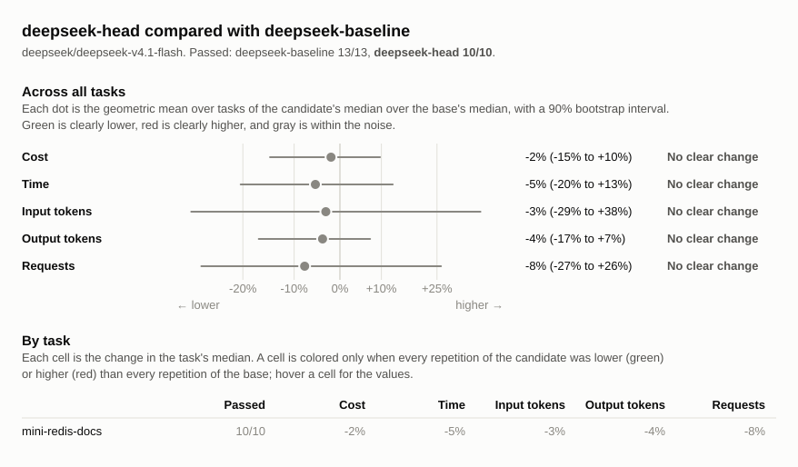

# Benchmark comparison: deepseek-baseline, deepseek-head

## Runs

| Label             | Commit       | Dirty | Model                          | Effort  | Providers | Results |
| ----------------- | ------------ | ----- | ------------------------------ | ------- | --------- | ------- |
| deepseek-baseline | `540ece7f39` | no    | `deepseek/deepseek-v4.1-flash` | default | deepseek  | 13      |
| deepseek-head     | `d8223d253c` | no    | `deepseek/deepseek-v4.1-flash` | default | deepseek  | 10      |

## Chart

## Summary

Changes are relative to `deepseek-baseline`. A task's values are medians over
its repetitions, with the range in parentheses. Totals are sums of task medians.
Tasks without results for every label are left out: `coffee-site`, `csv-stats`,
`inih-quoted`, `itoa-boundaries`, `jsmn-rename`, `pi-digit`, `sds-startswith`,
`temp-cli`, `tinyexpr-clamp`, `tinyexpr-precedence`, `todo-cli`.

| Metric            | deepseek-baseline | deepseek-head | Change |
| ----------------- | ----------------: | ------------: | -----: |
| passed            |             13/13 |         10/10 |        |
| seconds           |               145 |           137 |    -5% |
| requests          |                45 |          41.5 |    -8% |
| tool_calls        |               102 |            88 |   -14% |
| failed_calls      |                 2 |           0.5 |   -75% |
| cancelled_calls   |                 0 |             0 |        |
| repeated_calls    |                 0 |             0 |        |
| input_tokens      |           2218212 |     2147461.5 |    -3% |
| cached_tokens     |           2152832 |       2084160 |    -3% |
| output_tokens     |             18877 |         18137 |    -4% |
| reasoning_tokens  |              7786 |        8725.5 |   +12% |
| cost              |           $0.0277 |       $0.0272 |    -2% |
| max_input_tokens  |             80870 |         76449 |    -5% |
| tool_output_chars |            205663 |        202742 |    -1% |
| compactions       |                 0 |             0 |        |
| summarizer_cost   |           $0.0000 |       $0.0000 |        |
| subagents         |                 0 |             0 |        |

### Pass rate and cost by task

| Task              | deepseek-baseline passed | deepseek-head passed |    deepseek-baseline cost |        deepseek-head cost | Change |
| ----------------- | -----------------------: | -------------------: | ------------------------: | ------------------------: | -----: |
| `mini-redis-docs` |                    13/13 |                10/10 | $0.0277 ($0.0224–$0.0384) | $0.0272 ($0.0221–$0.0360) |    -2% |

## Tasks

### `mini-redis-docs`

| Metric              |         deepseek-baseline |               deepseek-head | Change |
| ------------------- | ------------------------: | --------------------------: | -----: |
| passed              |                     13/13 |                       10/10 |        |
| status              |               finished 13 |                 finished 10 |        |
| seconds             |             145 (111–224) |               137 (108–186) |    -5% |
| requests            |                45 (35–65) |                41.5 (31–70) |    -8% |
| tool_calls          |              102 (68–118) |                 88 (71–101) |   -14% |
| failed_calls        |                   2 (0–3) |                   0.5 (0–3) |   -75% |
| cancelled_calls     |                         0 |                           0 |        |
| `edit_file` calls   |                 48 (2–52) |                  41 (32–54) |   -15% |
| `edit_file` failed  |                         0 |                           0 |        |
| `glob` calls        |                   1 (0–1) |                     0 (0–1) |  -100% |
| `glob` failed       |                         0 |                           0 |        |
| `read_file` calls   |                39 (35–45) |                  30 (30–34) |   -23% |
| `read_file` failed  |                   1 (0–1) |                     0 (0–1) |  -100% |
| `shell` calls       |                 15 (8–28) |                   13 (8–20) |   -13% |
| `shell` failed      |                   1 (0–2) |                   0.5 (0–2) |   -50% |
| `write_file` calls  |                   0 (0–2) |                     0 (0–1) |        |
| `write_file` failed |                         0 |                           0 |        |
| repeated_calls      |                   0 (0–4) |                     0 (0–2) |        |
| input_tokens        | 2218212 (1499104–3652655) | 2147461.5 (1486019–4027843) |    -3% |
| cached_tokens       | 2152832 (1438592–3581440) |   2084160 (1430016–3951232) |    -3% |
| output_tokens       |       18877 (14805–28332) |         18137 (13821–21174) |    -4% |
| reasoning_tokens    |         7786 (4260–15730) |         8725.5 (5416–10706) |   +12% |
| cost                | $0.0277 ($0.0224–$0.0384) |   $0.0272 ($0.0221–$0.0360) |    -2% |
| max_input_tokens    |       80870 (71417–92563) |         76449 (70334–91568) |    -5% |
| tool_output_chars   |    205663 (190558–228375) |      202742 (191097–240778) |    -1% |
| compactions         |                         0 |                           0 |        |
| summarizer_cost     |                   $0.0000 |                     $0.0000 |        |
| subagents           |                         0 |                           0 |        |
