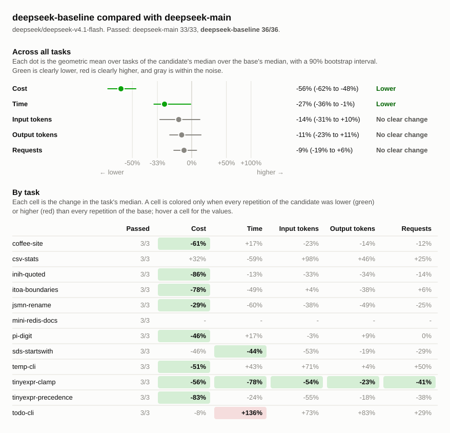

# Benchmark comparison: deepseek-main, deepseek-baseline

## Runs

| Label             | Commit       | Dirty | Model                          | Effort  | Providers | Results |
| ----------------- | ------------ | ----- | ------------------------------ | ------- | --------- | ------- |
| deepseek-main     | `82d15b17c1` | no    | `deepseek/deepseek-v4.1-flash` | default | any       | 33      |
| deepseek-baseline | `540ece7f39` | no    | `deepseek/deepseek-v4.1-flash` | default | deepseek  | 36      |

## Chart

## Summary

Changes are relative to `deepseek-main`. A task's values are medians over its
repetitions, with the range in parentheses. Totals are sums of task medians.

| Metric            | deepseek-main | deepseek-baseline | Change |
| ----------------- | ------------: | ----------------: | -----: |
| passed            |         33/33 |             36/36 |        |
| seconds           |          1460 |              1165 |   -20% |
| requests          |           242 |               239 |    -1% |
| tool_calls        |           260 |               332 |   +28% |
| failed_calls      |            13 |                 6 |   -54% |
| cancelled_calls   |             0 |                 0 |        |
| repeated_calls    |             0 |                 1 |        |
| input_tokens      |       9604839 |           7646434 |   -20% |
| cached_tokens     |       8396544 |           7447936 |   -11% |
| output_tokens     |        172378 |            165422 |    -4% |
| reasoning_tokens  |        114916 |             98503 |   -14% |
| cost              |       $0.5942 |           $0.1517 |   -74% |
| max_input_tokens  |        335464 |            365587 |    +9% |
| tool_output_chars |        383987 |            548957 |   +43% |
| compactions       |             0 |                 0 |        |
| summarizer_cost   |       $0.0000 |           $0.0000 |        |
| subagents         |             0 |                 0 |        |

### Pass rate and cost by task

| Task                  | deepseek-main passed | deepseek-baseline passed |        deepseek-main cost |    deepseek-baseline cost | Change |
| --------------------- | -------------------: | -----------------------: | ------------------------: | ------------------------: | -----: |
| `coffee-site`         |                  3/3 |                      3/3 | $0.0051 ($0.0041–$0.0079) | $0.0020 ($0.0019–$0.0036) |   -61% |
| `csv-stats`           |                  3/3 |                      3/3 | $0.0066 ($0.0052–$0.0095) | $0.0087 ($0.0063–$0.0089) |   +32% |
| `inih-quoted`         |                  3/3 |                      3/3 | $0.2027 ($0.1681–$0.2089) | $0.0294 ($0.0241–$0.0590) |   -86% |
| `itoa-boundaries`     |                  3/3 |                      3/3 | $0.0376 ($0.0314–$0.0525) | $0.0084 ($0.0066–$0.0277) |   -78% |
| `jsmn-rename`         |                  3/3 |                      3/3 | $0.0018 ($0.0015–$0.0030) | $0.0013 ($0.0012–$0.0015) |   -29% |
| `mini-redis-docs`     |                  0/0 |                      3/3 |                         - | $0.0290 ($0.0274–$0.0328) |        |
| `pi-digit`            |                  3/3 |                      3/3 | $0.0143 ($0.0134–$0.0179) | $0.0077 ($0.0064–$0.0093) |   -46% |
| `sds-startswith`      |                  3/3 |                      3/3 | $0.0045 ($0.0031–$0.0045) | $0.0024 ($0.0022–$0.0038) |   -46% |
| `temp-cli`            |                  3/3 |                      3/3 | $0.0063 ($0.0050–$0.0070) | $0.0031 ($0.0022–$0.0032) |   -51% |
| `tinyexpr-clamp`      |                  3/3 |                      3/3 | $0.0138 ($0.0110–$0.0209) | $0.0060 ($0.0038–$0.0073) |   -56% |
| `tinyexpr-precedence` |                  3/3 |                      3/3 | $0.2969 ($0.2327–$0.3787) | $0.0493 ($0.0372–$0.0699) |   -83% |
| `todo-cli`            |                  3/3 |                      3/3 | $0.0047 ($0.0041–$0.0091) | $0.0044 ($0.0036–$0.0044) |    -8% |

## Tasks

### `coffee-site`

| Metric                 |             deepseek-main |         deepseek-baseline | Change |
| ---------------------- | ------------------------: | ------------------------: | -----: |
| passed                 |                       3/3 |                       3/3 |        |
| status                 |                finished 3 |                finished 3 |        |
| seconds                |                14 (14–18) |                17 (16–26) |   +17% |
| requests               |                   8 (7–9) |                   7 (6–8) |   -12% |
| tool_calls             |                   8 (6–8) |                  8 (7–10) |    +0% |
| failed_calls           |                         0 |                         0 |        |
| cancelled_calls        |                         0 |                         0 |        |
| `apply_patch` calls    |                         1 |                         0 |  -100% |
| `apply_patch` failed   |                         0 |                         0 |        |
| `glob` calls           |                   0 (0–1) |                   0 (0–1) |        |
| `glob` failed          |                         0 |                         0 |        |
| `shell` calls          |                   4 (4–5) |                   4 (3–4) |    +0% |
| `shell` failed         |                         0 |                         0 |        |
| `shell_process` calls  |                   2 (1–2) |                   1 (1–2) |   -50% |
| `shell_process` failed |                         0 |                         0 |        |
| `write_file` calls     |                         0 |                         3 |        |
| `write_file` failed    |                         0 |                         0 |        |
| repeated_calls         |                         0 |                         0 |        |
| input_tokens           |       43826 (36264–69235) |       33944 (29214–52837) |   -23% |
| cached_tokens          |       40960 (35328–67200) |       32384 (27904–51072) |   -21% |
| output_tokens          |          3301 (2977–5735) |          2825 (2645–5310) |   -14% |
| reasoning_tokens       |               63 (49–242) |              128 (73–133) |  +103% |
| cost                   | $0.0051 ($0.0041–$0.0079) | $0.0020 ($0.0019–$0.0036) |   -61% |
| max_input_tokens       |         6930 (6463–10061) |          5864 (5699–8484) |   -15% |
| tool_output_chars      |          1790 (1264–3121) |           1599 (876–1656) |   -11% |
| compactions            |                         0 |                         0 |        |
| summarizer_cost        |                   $0.0000 |                   $0.0000 |        |
| subagents              |                         0 |                         0 |        |

### `csv-stats`

| Metric               |             deepseek-main |         deepseek-baseline | Change |
| -------------------- | ------------------------: | ------------------------: | -----: |
| passed               |                       3/3 |                       3/3 |        |
| status               |                finished 3 |                finished 3 |        |
| seconds              |              163 (54–244) |                66 (43–67) |   -59% |
| requests             |                  8 (7–15) |                 10 (9–14) |   +25% |
| tool_calls           |                  7 (6–14) |                13 (12–14) |   +86% |
| failed_calls         |                   1 (0–1) |                   0 (0–1) |  -100% |
| cancelled_calls      |                         0 |                         0 |        |
| `apply_patch` calls  |                   2 (1–3) |                         0 |  -100% |
| `apply_patch` failed |                         0 |                         0 |        |
| `edit_file` calls    |                         0 |                   0 (0–1) |        |
| `edit_file` failed   |                         0 |                         0 |        |
| `glob` calls         |                         0 |                   1 (0–1) |        |
| `glob` failed        |                         0 |                         0 |        |
| `shell` calls        |                  5 (5–11) |                   7 (6–8) |   +40% |
| `shell` failed       |                   1 (0–1) |                   0 (0–1) |  -100% |
| `write_file` calls   |                         0 |                         5 |        |
| `write_file` failed  |                         0 |                         0 |        |
| repeated_calls       |                         0 |                         0 |        |
| input_tokens         |      64826 (59004–156223) |     128476 (85475–172586) |   +98% |
| cached_tokens        |      54272 (49152–135424) |     126336 (83200–169600) |  +133% |
| output_tokens        |          8886 (6343–9819) |        12968 (9512–13682) |   +46% |
| reasoning_tokens     |          4089 (2854–4826) |          8010 (5165–9041) |   +96% |
| cost                 | $0.0066 ($0.0052–$0.0095) | $0.0087 ($0.0063–$0.0089) |   +32% |
| max_input_tokens     |        12399 (9539–14535) |       16672 (13170–17113) |   +34% |
| tool_output_chars    |          1711 (1388–5168) |          3192 (2739–3928) |   +87% |
| compactions          |                         0 |                         0 |        |
| summarizer_cost      |                   $0.0000 |                   $0.0000 |        |
| subagents            |                         0 |                         0 |        |

### `inih-quoted`

| Metric               |             deepseek-main |         deepseek-baseline | Change |
| -------------------- | ------------------------: | ------------------------: | -----: |
| passed               |                       3/3 |                       3/3 |        |
| status               |                finished 3 |                finished 3 |        |
| seconds              |             379 (229–417) |             330 (180–402) |   -13% |
| requests             |                64 (58–68) |                55 (33–66) |   -14% |
| tool_calls           |                73 (72–79) |                62 (43–80) |   -15% |
| failed_calls         |                   2 (1–4) |                   2 (1–4) |    +0% |
| cancelled_calls      |                         0 |                         0 |        |
| `apply_patch` calls  |                   2 (1–4) |                         0 |  -100% |
| `apply_patch` failed |                         0 |                         0 |        |
| `edit_file` calls    |                         0 |                   2 (1–2) |        |
| `edit_file` failed   |                         0 |                         0 |        |
| `glob` calls         |                   1 (1–2) |                         1 |    +0% |
| `glob` failed        |                         0 |                         0 |        |
| `grep` calls         |                   0 (0–2) |                   0 (0–1) |        |
| `grep` failed        |                         0 |                         0 |        |
| `read_file` calls    |                 12 (9–13) |                  7 (5–13) |   -42% |
| `read_file` failed   |                         0 |                         0 |        |
| `shell` calls        |                57 (55–65) |                50 (35–60) |   -12% |
| `shell` failed       |                   2 (1–4) |                   2 (1–4) |    +0% |
| `write_file` calls   |                         0 |                   1 (1–4) |        |
| `write_file` failed  |                         0 |                         0 |        |
| repeated_calls       |                         0 |                         0 |        |
| input_tokens         | 2938663 (2494816–2968630) | 1976092 (1146826–4232933) |   -33% |
| cached_tokens        | 2433920 (2098048–2475008) | 1940480 (1115776–4179968) |   -20% |
| output_tokens        |       45684 (39754–53673) |       30368 (26813–64184) |   -34% |
| reasoning_tokens     |       35961 (30553–43458) |       21420 (20624–52953) |   -40% |
| cost                 | $0.2027 ($0.1681–$0.2089) | $0.0294 ($0.0241–$0.0590) |   -86% |
| max_input_tokens     |       81794 (77721–85875) |      62696 (56810–113471) |   -23% |
| tool_output_chars    |     103444 (89415–106309) |      93771 (85907–141867) |    -9% |
| compactions          |                         0 |                         0 |        |
| summarizer_cost      |                   $0.0000 |                   $0.0000 |        |
| subagents            |                         0 |                         0 |        |

### `itoa-boundaries`

| Metric               |             deepseek-main |         deepseek-baseline | Change |
| -------------------- | ------------------------: | ------------------------: | -----: |
| passed               |                       3/3 |                       3/3 |        |
| status               |                finished 3 |                finished 3 |        |
| seconds              |              123 (78–129) |               63 (59–238) |   -49% |
| requests             |                18 (17–24) |                19 (16–38) |    +6% |
| tool_calls           |                20 (19–27) |                24 (18–47) |   +20% |
| failed_calls         |                   1 (0–1) |                   0 (0–1) |  -100% |
| cancelled_calls      |                         0 |                         0 |        |
| `apply_patch` calls  |                         1 |                         0 |  -100% |
| `apply_patch` failed |                         0 |                         0 |        |
| `edit_file` calls    |                         0 |                   2 (1–5) |        |
| `edit_file` failed   |                         0 |                         0 |        |
| `glob` calls         |                         1 |                         1 |    +0% |
| `glob` failed        |                         0 |                         0 |        |
| `read_file` calls    |                   5 (5–7) |                   7 (5–7) |   +40% |
| `read_file` failed   |                         0 |                         0 |        |
| `shell` calls        |                13 (12–18) |                10 (10–36) |   -23% |
| `shell` failed       |                   1 (0–1) |                   0 (0–1) |  -100% |
| `write_file` calls   |                         0 |                         1 |        |
| `write_file` failed  |                         0 |                         0 |        |
| repeated_calls       |                   0 (0–1) |                   1 (0–1) |        |
| input_tokens         |    277087 (273372–507741) |   288135 (211910–1247963) |    +4% |
| cached_tokens        |    188544 (157056–356864) |   273920 (200192–1216640) |   +45% |
| output_tokens        |       14748 (12428–17822) |         9109 (7062–32332) |   -38% |
| reasoning_tokens     |        10313 (7537–13637) |         4558 (4280–24688) |   -56% |
| cost                 | $0.0376 ($0.0314–$0.0525) | $0.0084 ($0.0066–$0.0277) |   -78% |
| max_input_tokens     |       26868 (25332–34359) |       23220 (19664–62185) |   -14% |
| tool_output_chars    |       30770 (29584–41925) |       35427 (31750–80995) |   +15% |
| compactions          |                         0 |                         0 |        |
| summarizer_cost      |                   $0.0000 |                   $0.0000 |        |
| subagents            |                         0 |                         0 |        |

### `jsmn-rename`

| Metric             |             deepseek-main |         deepseek-baseline | Change |
| ------------------ | ------------------------: | ------------------------: | -----: |
| passed             |                       3/3 |                       3/3 |        |
| status             |                finished 3 |                finished 3 |        |
| seconds            |                 28 (4–37) |                11 (10–13) |   -60% |
| requests           |                  8 (5–10) |                   6 (6–7) |   -25% |
| tool_calls         |                 13 (5–14) |                   8 (7–9) |   -38% |
| failed_calls       |                   0 (0–1) |                   0 (0–1) |        |
| cancelled_calls    |                         0 |                         0 |        |
| `grep` calls       |                   1 (1–3) |                   1 (1–2) |    +0% |
| `grep` failed      |                         0 |                         0 |        |
| `read_file` calls  |                   3 (1–3) |                   1 (0–2) |   -67% |
| `read_file` failed |                         0 |                         0 |        |
| `shell` calls      |                   8 (3–9) |                   6 (5–6) |   -25% |
| `shell` failed     |                   0 (0–1) |                   0 (0–1) |        |
| repeated_calls     |                         0 |                         0 |        |
| input_tokens       |       51335 (21494–90943) |       31913 (29271–32863) |   -38% |
| cached_tokens      |       46336 (19456–78592) |       28672 (25600–28800) |   -38% |
| output_tokens      |           2259 (676–2344) |          1149 (1067–1315) |   -49% |
| reasoning_tokens   |            987 (136–1152) |             371 (311–507) |   -62% |
| cost               | $0.0018 ($0.0015–$0.0030) | $0.0013 ($0.0012–$0.0015) |   -29% |
| max_input_tokens   |         8641 (5241–13680) |          6528 (6015–7130) |   -24% |
| tool_output_chars  |         9609 (3691–23991) |          8043 (6044–9235) |   -16% |
| compactions        |                         0 |                         0 |        |
| summarizer_cost    |                   $0.0000 |                   $0.0000 |        |
| subagents          |                         0 |                         0 |        |

### `mini-redis-docs`

| Metric              | deepseek-main |         deepseek-baseline | Change |
| ------------------- | ------------: | ------------------------: | -----: |
| passed              |           0/0 |                       3/3 |        |
| status              |               |                finished 3 |        |
| seconds             |             - |             150 (141–172) |        |
| requests            |             - |                44 (43–57) |        |
| tool_calls          |             - |             102 (100–107) |        |
| failed_calls        |             - |                   2 (1–3) |        |
| cancelled_calls     |             - |                         0 |        |
| `edit_file` calls   |             - |                48 (37–52) |        |
| `edit_file` failed  |             - |                         0 |        |
| `glob` calls        |             - |                   1 (0–1) |        |
| `glob` failed       |             - |                         0 |        |
| `read_file` calls   |             - |                40 (37–41) |        |
| `read_file` failed  |             - |                         1 |        |
| `shell` calls       |             - |                14 (13–24) |        |
| `shell` failed      |             - |                   1 (0–2) |        |
| `write_file` calls  |             - |                   0 (0–1) |        |
| `write_file` failed |             - |                         0 |        |
| repeated_calls      |             - |                   0 (0–2) |        |
| input_tokens        |             - | 2221669 (2201098–2997492) |        |
| cached_tokens       |             - | 2158336 (2136960–2934144) |        |
| output_tokens       |             - |       21685 (18877–24154) |        |
| reasoning_tokens    |             - |        10544 (7281–13180) |        |
| cost                |             - | $0.0290 ($0.0274–$0.0328) |        |
| max_input_tokens    |             - |       83173 (80870–83552) |        |
| tool_output_chars   |             - |    212553 (205663–215285) |        |
| compactions         |             - |                         0 |        |
| summarizer_cost     |             - |                   $0.0000 |        |
| subagents           |             - |                         0 |        |

### `pi-digit`

| Metric               |             deepseek-main |         deepseek-baseline | Change |
| -------------------- | ------------------------: | ------------------------: | -----: |
| passed               |                       3/3 |                       3/3 |        |
| status               |                finished 3 |                finished 3 |        |
| seconds              |                48 (40–61) |                56 (47–70) |   +17% |
| requests             |                  8 (6–10) |                  8 (7–11) |    +0% |
| tool_calls           |                   7 (6–9) |                 10 (8–13) |   +43% |
| failed_calls         |                   0 (0–1) |                         0 |        |
| cancelled_calls      |                         0 |                         0 |        |
| `apply_patch` calls  |                   1 (1–2) |                         0 |  -100% |
| `apply_patch` failed |                         0 |                         0 |        |
| `edit_file` calls    |                         0 |                   0 (0–1) |        |
| `edit_file` failed   |                         0 |                         0 |        |
| `read_file` calls    |                         0 |                   0 (0–1) |        |
| `read_file` failed   |                         0 |                         0 |        |
| `shell` calls        |                   6 (5–7) |                   7 (5–8) |   +17% |
| `shell` failed       |                   0 (0–1) |                         0 |        |
| `write_file` calls   |                         0 |                         3 |        |
| `write_file` failed  |                         0 |                         0 |        |
| repeated_calls       |                         0 |                         0 |        |
| input_tokens         |      80826 (58083–110581) |      78280 (74667–130745) |    -3% |
| cached_tokens        |       67584 (23296–79616) |      76928 (72960–128256) |   +14% |
| output_tokens        |        11210 (8807–11263) |        12179 (9825–14200) |    +9% |
| reasoning_tokens     |          7032 (5491–7164) |          8816 (7067–9248) |   +25% |
| cost                 | $0.0143 ($0.0134–$0.0179) | $0.0077 ($0.0064–$0.0093) |   -46% |
| max_input_tokens     |       14771 (12143–14810) |       15093 (12920–17633) |    +2% |
| tool_output_chars    |           1361 (905–1484) |          1315 (1041–2343) |    -3% |
| compactions          |                         0 |                         0 |        |
| summarizer_cost      |                   $0.0000 |                   $0.0000 |        |
| subagents            |                         0 |                         0 |        |

### `sds-startswith`

| Metric               |             deepseek-main |         deepseek-baseline | Change |
| -------------------- | ------------------------: | ------------------------: | -----: |
| passed               |                       3/3 |                       3/3 |        |
| status               |                finished 3 |                finished 3 |        |
| seconds              |                35 (27–37) |                20 (16–25) |   -44% |
| requests             |                14 (11–15) |                 10 (8–13) |   -29% |
| tool_calls           |                17 (15–18) |                14 (13–17) |   -18% |
| failed_calls         |                   1 (1–2) |                   0 (0–1) |  -100% |
| cancelled_calls      |                         0 |                         0 |        |
| `apply_patch` calls  |                   4 (3–4) |                         0 |  -100% |
| `apply_patch` failed |                         1 |                         0 |  -100% |
| `edit_file` calls    |                         0 |                   3 (3–7) |        |
| `edit_file` failed   |                         0 |                         0 |        |
| `glob` calls         |                   1 (0–1) |                         1 |    +0% |
| `glob` failed        |                         0 |                         0 |        |
| `grep` calls         |                   2 (2–3) |                   2 (1–2) |    +0% |
| `grep` failed        |                         0 |                         0 |        |
| `read_file` calls    |                   6 (4–7) |                   4 (3–5) |   -33% |
| `read_file` failed   |                         0 |                         0 |        |
| `shell` calls        |                   4 (3–6) |                   4 (3–4) |    +0% |
| `shell` failed       |                   0 (0–1) |                   0 (0–1) |        |
| repeated_calls       |                         0 |                         0 |        |
| input_tokens         |     121593 (80687–152524) |       56991 (46683–94127) |   -53% |
| cached_tokens        |     109952 (72704–140672) |       53120 (42240–87936) |   -52% |
| output_tokens        |          3413 (3045–4102) |          2748 (2333–4288) |   -19% |
| reasoning_tokens     |           1197 (813–1493) |            763 (760–1773) |   -36% |
| cost                 | $0.0045 ($0.0031–$0.0045) | $0.0024 ($0.0022–$0.0038) |   -46% |
| max_input_tokens     |       12708 (10500–14061) |         8792 (8218–11366) |   -31% |
| tool_output_chars    |       14404 (11415–22205) |        10093 (7693–11682) |   -30% |
| compactions          |                         0 |                         0 |        |
| summarizer_cost      |                   $0.0000 |                   $0.0000 |        |
| subagents            |                         0 |                         0 |        |

### `temp-cli`

| Metric               |             deepseek-main |         deepseek-baseline | Change |
| -------------------- | ------------------------: | ------------------------: | -----: |
| passed               |                       3/3 |                       3/3 |        |
| status               |                finished 3 |                finished 3 |        |
| seconds              |                16 (14–17) |                22 (16–25) |   +43% |
| requests             |                         6 |                  9 (6–11) |   +50% |
| tool_calls           |                         5 |                 12 (6–14) |  +140% |
| failed_calls         |                         0 |                         0 |        |
| cancelled_calls      |                         0 |                         0 |        |
| `apply_patch` calls  |                   1 (1–2) |                         0 |  -100% |
| `apply_patch` failed |                         0 |                         0 |        |
| `edit_file` calls    |                         0 |                   2 (0–3) |        |
| `edit_file` failed   |                         0 |                         0 |        |
| `glob` calls         |                         0 |                   0 (0–1) |        |
| `glob` failed        |                         0 |                         0 |        |
| `read_file` calls    |                         0 |                   0 (0–1) |        |
| `read_file` failed   |                         0 |                         0 |        |
| `shell` calls        |                   4 (3–4) |                   5 (3–6) |   +25% |
| `shell` failed       |                         0 |                         0 |        |
| `write_file` calls   |                         0 |                   4 (3–4) |        |
| `write_file` failed  |                         0 |                         0 |        |
| repeated_calls       |                         0 |                   0 (0–1) |        |
| input_tokens         |       34154 (29851–35462) |       58365 (27876–63171) |   +71% |
| cached_tokens        |       16256 (15744–29440) |       55296 (26240–60544) |  +240% |
| output_tokens        |          4011 (2732–4209) |          4169 (3057–4273) |    +4% |
| reasoning_tokens     |           1225 (314–1247) |           1176 (539–1232) |    -4% |
| cost                 | $0.0063 ($0.0050–$0.0070) | $0.0031 ($0.0022–$0.0032) |   -51% |
| max_input_tokens     |          7661 (6345–7917) |          7751 (6373–8805) |    +1% |
| tool_output_chars    |          2152 (2091–3084) |          3202 (2653–6674) |   +49% |
| compactions          |                         0 |                         0 |        |
| summarizer_cost      |                   $0.0000 |                   $0.0000 |        |
| subagents            |                         0 |                         0 |        |

### `tinyexpr-clamp`

| Metric               |             deepseek-main |         deepseek-baseline | Change |
| -------------------- | ------------------------: | ------------------------: | -----: |
| passed               |                       3/3 |                       3/3 |        |
| status               |                finished 3 |                finished 3 |        |
| seconds              |             159 (141–180) |                35 (25–37) |   -78% |
| requests             |                29 (23–33) |                17 (14–18) |   -41% |
| tool_calls           |                30 (26–40) |                21 (19–25) |   -30% |
| failed_calls         |                   1 (0–1) |                   1 (0–1) |    +0% |
| cancelled_calls      |                         0 |                         0 |        |
| `apply_patch` calls  |                  7 (5–10) |                         0 |  -100% |
| `apply_patch` failed |                   0 (0–1) |                         0 |        |
| `edit_file` calls    |                         0 |                   7 (5–8) |        |
| `edit_file` failed   |                         0 |                         0 |        |
| `glob` calls         |                         1 |                   1 (1–2) |    +0% |
| `glob` failed        |                         0 |                         0 |        |
| `grep` calls         |                   4 (4–5) |                   1 (1–2) |   -75% |
| `grep` failed        |                         0 |                         0 |        |
| `read_file` calls    |                 12 (9–16) |                   9 (5–9) |   -25% |
| `read_file` failed   |                         0 |                         0 |        |
| `shell` calls        |                   7 (5–9) |                   5 (4–5) |   -29% |
| `shell` failed       |                   0 (0–1) |                   1 (0–1) |        |
| repeated_calls       |                         0 |                   0 (0–1) |        |
| input_tokens         |    496230 (375085–796967) |    230086 (140268–347492) |   -54% |
| cached_tokens        |    463104 (335872–741120) |    215040 (130432–325248) |   -54% |
| output_tokens        |          6404 (5764–8271) |          4955 (3203–5150) |   -23% |
| reasoning_tokens     |          2564 (2377–3447) |           2038 (907–2343) |   -21% |
| cost                 | $0.0138 ($0.0110–$0.0209) | $0.0060 ($0.0038–$0.0073) |   -56% |
| max_input_tokens     |       25598 (22791–33751) |       20447 (13776–27563) |   -20% |
| tool_output_chars    |       45027 (37940–65934) |       34650 (21503–55913) |   -23% |
| compactions          |                         0 |                         0 |        |
| summarizer_cost      |                   $0.0000 |                   $0.0000 |        |
| subagents            |                         0 |                         0 |        |

### `tinyexpr-precedence`

| Metric               |             deepseek-main |         deepseek-baseline | Change |
| -------------------- | ------------------------: | ------------------------: | -----: |
| passed               |                       3/3 |                       3/3 |        |
| status               |                finished 3 |                finished 3 |        |
| seconds              |             483 (361–762) |             366 (283–424) |   -24% |
| requests             |                72 (61–73) |                45 (44–76) |   -38% |
| tool_calls           |                74 (73–75) |                50 (48–84) |   -32% |
| failed_calls         |                   6 (1–7) |                   1 (1–3) |   -83% |
| cancelled_calls      |                         0 |                         0 |        |
| `apply_patch` calls  |                  2 (2–14) |                         0 |  -100% |
| `apply_patch` failed |                   0 (0–1) |                         0 |        |
| `edit_file` calls    |                         0 |                  2 (0–18) |        |
| `edit_file` failed   |                         0 |                         0 |        |
| `glob` calls         |                   0 (0–2) |                         1 |        |
| `glob` failed        |                         0 |                         0 |        |
| `grep` calls         |                   0 (0–3) |                   1 (1–3) |        |
| `grep` failed        |                         0 |                         0 |        |
| `read_file` calls    |                15 (13–16) |                13 (12–16) |   -13% |
| `read_file` failed   |                   0 (0–1) |                         0 |        |
| `shell` calls        |                52 (45–58) |                34 (31–43) |   -35% |
| `shell` failed       |                   4 (1–7) |                   1 (1–3) |   -75% |
| `write_file` calls   |                         0 |                   0 (0–5) |        |
| `write_file` failed  |                         0 |                         0 |        |
| repeated_calls       |                         0 |                   0 (0–2) |        |
| input_tokens         | 5460299 (4545502–6980145) | 2480026 (2221783–6069376) |   -55% |
| cached_tokens        | 4940672 (4202112–6504192) | 2426880 (2176896–6004992) |   -51% |
| output_tokens        |      68928 (58334–135973) |       56805 (39881–70368) |   -18% |
| reasoning_tokens     |      51065 (43389–114841) |       39637 (29090–54271) |   -22% |
| cost                 | $0.2969 ($0.2327–$0.3787) | $0.0493 ($0.0372–$0.0699) |   -83% |
| max_input_tokens     |    131157 (103921–207253) |     105705 (81917–127229) |   -19% |
| tool_output_chars    |    172078 (124511–200091) |    142810 (117594–152242) |   -17% |
| compactions          |                         0 |                         0 |        |
| summarizer_cost      |                   $0.0000 |                   $0.0000 |        |
| subagents            |                         0 |                         0 |        |

### `todo-cli`

| Metric               |             deepseek-main |         deepseek-baseline | Change |
| -------------------- | ------------------------: | ------------------------: | -----: |
| passed               |                       3/3 |                       3/3 |        |
| status               |                finished 3 |                finished 3 |        |
| seconds              |                13 (10–21) |                30 (25–32) |  +136% |
| requests             |                  7 (6–13) |                   9 (8–9) |   +29% |
| tool_calls           |                  6 (5–12) |                  8 (7–11) |   +33% |
| failed_calls         |                   1 (0–1) |                         0 |  -100% |
| cancelled_calls      |                         0 |                         0 |        |
| `apply_patch` calls  |                   1 (1–6) |                         0 |  -100% |
| `apply_patch` failed |                   0 (0–1) |                         0 |        |
| `edit_file` calls    |                         0 |                   0 (0–3) |        |
| `edit_file` failed   |                         0 |                         0 |        |
| `glob` calls         |                         0 |                   0 (0–1) |        |
| `glob` failed        |                         0 |                         0 |        |
| `shell` calls        |                   5 (4–6) |                   4 (4–5) |   -20% |
| `shell` failed       |                   0 (0–1) |                         0 |        |
| `write_file` calls   |                         0 |                         3 |        |
| `write_file` failed  |                         0 |                         0 |        |
| repeated_calls       |                         0 |                         0 |        |
| input_tokens         |      36000 (32093–104314) |       62457 (48942–65758) |   +73% |
| cached_tokens        |      34944 (31104–102144) |       60544 (46848–63232) |   +73% |
| output_tokens        |          3534 (3010–6568) |          6462 (5201–6494) |   +83% |
| reasoning_tokens     |             420 (342–703) |           1042 (952–2011) |  +148% |
| cost                 | $0.0047 ($0.0041–$0.0091) | $0.0044 ($0.0036–$0.0044) |    -8% |
| max_input_tokens     |         6937 (6408–10496) |          9646 (8507–9942) |   +39% |
| tool_output_chars    |          1641 (1395–3634) |          2302 (2226–2933) |   +40% |
| compactions          |                         0 |                         0 |        |
| summarizer_cost      |                   $0.0000 |                   $0.0000 |        |
| subagents            |                         0 |                         0 |        |
