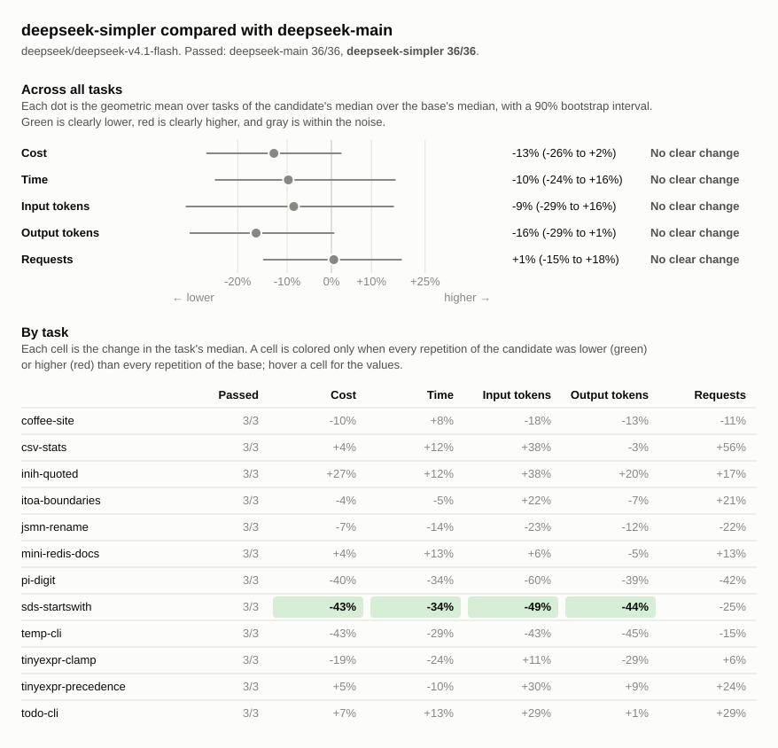

# Benchmark comparison: deepseek-main, deepseek-simpler

## Runs

| Label            | Commit       | Dirty | Model                          | Effort  | Providers | Results |
| ---------------- | ------------ | ----- | ------------------------------ | ------- | --------- | ------- |
| deepseek-main    | `b577037dbb` | no    | `deepseek/deepseek-v4.1-flash` | default | deepseek  | 36      |
| deepseek-simpler | `debe5fd3b2` | no    | `deepseek/deepseek-v4.1-flash` | default | deepseek  | 36      |

## Chart

## Summary

Changes are relative to `deepseek-main`. A task's values are medians over its
repetitions, with the range in parentheses. Totals are sums of task medians.

| Metric            | deepseek-main | deepseek-simpler | Change |
| ----------------- | ------------: | ---------------: | -----: |
| passed            |         36/36 |            36/36 |        |
| seconds           |          1308 |             1264 |    -3% |
| requests          |           258 |              284 |   +10% |
| tool_calls        |           328 |              372 |   +13% |
| failed_calls      |            13 |                8 |   -38% |
| cancelled_calls   |             0 |                0 |        |
| repeated_calls    |             0 |                0 |        |
| input_tokens      |       9847493 |         11948958 |   +21% |
| cached_tokens     |       9636864 |         11714432 |   +22% |
| output_tokens     |        193444 |           189567 |    -2% |
| reasoning_tokens  |        119067 |           122988 |    +3% |
| cost              |       $0.1788 |          $0.1818 |    +2% |
| max_input_tokens  |        412141 |           402869 |    -2% |
| tool_output_chars |        573310 |           590738 |    +3% |
| compactions       |             0 |                0 |        |
| summarizer_cost   |       $0.0000 |          $0.0000 |        |
| subagents         |             0 |                0 |        |

### Pass rate and cost by task

| Task                  | deepseek-main passed | deepseek-simpler passed |        deepseek-main cost |     deepseek-simpler cost | Change |
| --------------------- | -------------------: | ----------------------: | ------------------------: | ------------------------: | -----: |
| `coffee-site`         |                  3/3 |                     3/3 | $0.0046 ($0.0035–$0.0059) | $0.0041 ($0.0037–$0.0052) |   -10% |
| `csv-stats`           |                  3/3 |                     3/3 | $0.0086 ($0.0071–$0.0098) | $0.0090 ($0.0063–$0.0096) |    +4% |
| `inih-quoted`         |                  3/3 |                     3/3 | $0.0366 ($0.0342–$0.0474) | $0.0463 ($0.0421–$0.0640) |   +27% |
| `itoa-boundaries`     |                  3/3 |                     3/3 | $0.0104 ($0.0078–$0.0338) | $0.0099 ($0.0050–$0.0197) |    -4% |
| `jsmn-rename`         |                  3/3 |                     3/3 | $0.0019 ($0.0016–$0.0028) | $0.0018 ($0.0016–$0.0020) |    -7% |
| `mini-redis-docs`     |                  3/3 |                     3/3 | $0.0309 ($0.0206–$0.0315) | $0.0321 ($0.0267–$0.0321) |    +4% |
| `pi-digit`            |                  3/3 |                     3/3 | $0.0109 ($0.0061–$0.0225) | $0.0065 ($0.0051–$0.0086) |   -40% |
| `sds-startswith`      |                  3/3 |                     3/3 | $0.0041 ($0.0033–$0.0046) | $0.0023 ($0.0023–$0.0024) |   -43% |
| `temp-cli`            |                  3/3 |                     3/3 | $0.0065 ($0.0031–$0.0078) | $0.0037 ($0.0030–$0.0043) |   -43% |
| `tinyexpr-clamp`      |                  3/3 |                     3/3 | $0.0062 ($0.0034–$0.0065) | $0.0051 ($0.0049–$0.0064) |   -19% |
| `tinyexpr-precedence` |                  3/3 |                     3/3 | $0.0544 ($0.0412–$0.0649) | $0.0570 ($0.0539–$0.0623) |    +5% |
| `todo-cli`            |                  3/3 |                     3/3 | $0.0038 ($0.0034–$0.0040) | $0.0041 ($0.0032–$0.0042) |    +7% |

## Tasks

### `coffee-site`

| Metric                 |             deepseek-main |          deepseek-simpler | Change |
| ---------------------- | ------------------------: | ------------------------: | -----: |
| passed                 |                       3/3 |                       3/3 |        |
| status                 |                finished 3 |                finished 3 |        |
| seconds                |                33 (31–43) |                35 (33–36) |    +8% |
| requests               |                         9 |                   8 (8–9) |   -11% |
| tool_calls             |                   9 (8–9) |                  9 (9–11) |    +0% |
| failed_calls           |                   0 (0–1) |                         0 |        |
| cancelled_calls        |                         0 |                         0 |        |
| `apply_patch` calls    |                   1 (1–2) |                         0 |  -100% |
| `apply_patch` failed   |                         0 |                         0 |        |
| `glob` calls           |                   1 (0–1) |                   0 (0–1) |  -100% |
| `glob` failed          |                         0 |                         0 |        |
| `shell` calls          |                   5 (5–6) |                   5 (5–6) |    +0% |
| `shell` failed         |                   0 (0–1) |                         0 |        |
| `shell_process` calls  |                   1 (1–2) |                         1 |    +0% |
| `shell_process` failed |                         0 |                         0 |        |
| `write_file` calls     |                         0 |                         3 |        |
| `write_file` failed    |                         0 |                         0 |        |
| repeated_calls         |                         0 |                         0 |        |
| input_tokens           |       71766 (61312–87246) |       58536 (57559–66921) |   -18% |
| cached_tokens          |       69504 (59392–85504) |       56704 (54528–65024) |   -18% |
| output_tokens          |          6687 (5038–9009) |          5795 (5341–7805) |   -13% |
| reasoning_tokens       |             284 (136–284) |               86 (65–553) |   -70% |
| cost                   | $0.0046 ($0.0035–$0.0059) | $0.0041 ($0.0037–$0.0052) |   -10% |
| max_input_tokens       |        10438 (8616–12459) |         9028 (8696–11040) |   -14% |
| tool_output_chars      |          1848 (1777–2340) |          1964 (1905–2524) |    +6% |
| compactions            |                         0 |                         0 |        |
| summarizer_cost        |                   $0.0000 |                   $0.0000 |        |
| subagents              |                         0 |                         0 |        |

### `csv-stats`

| Metric               |             deepseek-main |          deepseek-simpler | Change |
| -------------------- | ------------------------: | ------------------------: | -----: |
| passed               |                       3/3 |                       3/3 |        |
| status               |                finished 3 |                finished 3 |        |
| seconds              |                64 (54–70) |                71 (46–88) |   +12% |
| requests             |                  9 (8–15) |                 14 (7–30) |   +56% |
| tool_calls           |                  9 (8–16) |                15 (13–34) |   +67% |
| failed_calls         |                   0 (0–1) |                   1 (0–2) |        |
| cancelled_calls      |                         0 |                         0 |        |
| `apply_patch` calls  |                   3 (2–4) |                         0 |  -100% |
| `apply_patch` failed |                   0 (0–1) |                         0 |        |
| `edit_file` calls    |                         0 |                   1 (0–8) |        |
| `edit_file` failed   |                         0 |                         0 |        |
| `glob` calls         |                         1 |                   1 (0–1) |    +0% |
| `glob` failed        |                         0 |                         0 |        |
| `read_file` calls    |                   0 (0–2) |                   0 (0–6) |        |
| `read_file` failed   |                         0 |                         0 |        |
| `shell` calls        |                   5 (5–9) |                  9 (7–14) |   +80% |
| `shell` failed       |                         0 |                   1 (0–2) |        |
| `write_file` calls   |                         0 |                         5 |        |
| `write_file` failed  |                         0 |                         0 |        |
| repeated_calls       |                         0 |                         0 |        |
| input_tokens         |     124495 (88638–187226) |     172067 (65950–377585) |   +38% |
| cached_tokens        |     122240 (87040–182400) |     169088 (64000–367872) |   +38% |
| output_tokens        |       12205 (11078–15200) |        11802 (9640–13334) |    -3% |
| reasoning_tokens     |          6819 (6504–6871) |          5013 (3827–8427) |   -26% |
| cost                 | $0.0086 ($0.0071–$0.0098) | $0.0090 ($0.0063–$0.0096) |    +4% |
| max_input_tokens     |       18056 (14755–19049) |       17013 (13299–20364) |    -6% |
| tool_output_chars    |          2935 (2194–8475) |         3356 (2935–18055) |   +14% |
| compactions          |                         0 |                         0 |        |
| summarizer_cost      |                   $0.0000 |                   $0.0000 |        |
| subagents            |                         0 |                         0 |        |

### `inih-quoted`

| Metric               |             deepseek-main |          deepseek-simpler | Change |
| -------------------- | ------------------------: | ------------------------: | -----: |
| passed               |                       3/3 |                       3/3 |        |
| status               |                finished 3 |                finished 3 |        |
| seconds              |             296 (238–423) |             332 (297–478) |   +12% |
| requests             |                54 (48–68) |                63 (61–73) |   +17% |
| tool_calls           |                72 (70–75) |                74 (73–95) |    +3% |
| failed_calls         |                         1 |                   2 (2–4) |  +100% |
| cancelled_calls      |                         0 |                         0 |        |
| `apply_patch` calls  |                   4 (3–5) |                         0 |  -100% |
| `apply_patch` failed |                   0 (0–1) |                         0 |        |
| `edit_file` calls    |                         0 |                   1 (1–2) |        |
| `edit_file` failed   |                         0 |                         0 |        |
| `glob` calls         |                   2 (1–2) |                   1 (1–2) |   -50% |
| `glob` failed        |                         0 |                         0 |        |
| `grep` calls         |                   1 (0–2) |                   0 (0–1) |  -100% |
| `grep` failed        |                         0 |                         0 |        |
| `read_file` calls    |                  8 (7–17) |                 15 (8–15) |   +88% |
| `read_file` failed   |                         0 |                         0 |        |
| `shell` calls        |                58 (47–60) |                56 (52–81) |    -3% |
| `shell` failed       |                   1 (0–1) |                   2 (2–3) |  +100% |
| `write_file` calls   |                         0 |                   2 (1–3) |        |
| `write_file` failed  |                         0 |                   0 (0–1) |        |
| repeated_calls       |                         0 |                         0 |        |
| input_tokens         | 2402560 (2151739–3646937) | 3324941 (3059502–4788752) |   +38% |
| cached_tokens        | 2363008 (2109952–3598720) | 3270528 (3010304–4736896) |   +38% |
| output_tokens        |       39220 (35965–48947) |       47252 (42760–70019) |   +20% |
| reasoning_tokens     |       30571 (27362–36857) |       38276 (33641–53995) |   +25% |
| cost                 | $0.0366 ($0.0342–$0.0474) | $0.0463 ($0.0421–$0.0640) |   +27% |
| max_input_tokens     |       76866 (76268–92793) |      98409 (88614–116861) |   +28% |
| tool_output_chars    |    110274 (102630–126964) |    131034 (130626–147410) |   +19% |
| compactions          |                         0 |                         0 |        |
| summarizer_cost      |                   $0.0000 |                   $0.0000 |        |
| subagents            |                         0 |                         0 |        |

### `itoa-boundaries`

| Metric               |             deepseek-main |          deepseek-simpler | Change |
| -------------------- | ------------------------: | ------------------------: | -----: |
| passed               |                       3/3 |                       3/3 |        |
| status               |                finished 3 |                finished 3 |        |
| seconds              |               91 (59–324) |               86 (49–768) |    -5% |
| requests             |                14 (13–49) |                17 (13–27) |   +21% |
| tool_calls           |                17 (17–54) |                20 (15–33) |   +18% |
| failed_calls         |                   0 (0–2) |                   0 (0–3) |        |
| cancelled_calls      |                         0 |                         0 |        |
| `apply_patch` calls  |                   2 (2–3) |                         0 |  -100% |
| `apply_patch` failed |                         0 |                         0 |        |
| `edit_file` calls    |                         0 |                   1 (1–2) |        |
| `edit_file` failed   |                         0 |                         0 |        |
| `glob` calls         |                         1 |                         1 |    +0% |
| `glob` failed        |                         0 |                         0 |        |
| `read_file` calls    |                   5 (5–6) |                         5 |    +0% |
| `read_file` failed   |                         0 |                         0 |        |
| `shell` calls        |                  9 (8–45) |                 11 (7–23) |   +22% |
| `shell` failed       |                   0 (0–2) |                   0 (0–3) |        |
| `write_file` calls   |                         0 |                   2 (1–2) |        |
| `write_file` failed  |                         0 |                         0 |        |
| repeated_calls       |                   0 (0–1) |                         0 |        |
| input_tokens         |   215733 (205460–1662323) |    263356 (137619–680418) |   +22% |
| cached_tokens        |   203264 (193408–1635840) |    251136 (127104–663552) |   +24% |
| output_tokens        |        13192 (8973–41452) |        12249 (5086–25349) |    -7% |
| reasoning_tokens     |         9679 (6444–28571) |         9014 (2393–20143) |    -7% |
| cost                 | $0.0104 ($0.0078–$0.0338) | $0.0099 ($0.0050–$0.0197) |    -4% |
| max_input_tokens     |       26958 (22181–65612) |       24685 (16870–41534) |    -8% |
| tool_output_chars    |       34026 (31688–65186) |       32380 (28708–41776) |    -5% |
| compactions          |                         0 |                         0 |        |
| summarizer_cost      |                   $0.0000 |                   $0.0000 |        |
| subagents            |                         0 |                         0 |        |

### `jsmn-rename`

| Metric             |             deepseek-main |          deepseek-simpler | Change |
| ------------------ | ------------------------: | ------------------------: | -----: |
| passed             |                       3/3 |                       3/3 |        |
| status             |                finished 3 |                finished 3 |        |
| seconds            |                16 (15–24) |                14 (13–18) |   -14% |
| requests           |                  9 (7–11) |                  7 (7–10) |   -22% |
| tool_calls         |                11 (10–16) |                 10 (7–11) |    -9% |
| failed_calls       |                   0 (0–1) |                         0 |        |
| cancelled_calls    |                         0 |                         0 |        |
| `grep` calls       |                   2 (1–3) |                         1 |   -50% |
| `grep` failed      |                         0 |                         0 |        |
| `read_file` calls  |                         2 |                   2 (0–3) |    +0% |
| `read_file` failed |                         0 |                         0 |        |
| `shell` calls      |                  8 (6–11) |                   6 (6–8) |   -25% |
| `shell` failed     |                   0 (0–1) |                         0 |        |
| repeated_calls     |                         0 |                         0 |        |
| input_tokens       |       52558 (43359–82097) |       40708 (38524–60807) |   -23% |
| cached_tokens      |       48384 (38656–76160) |       35840 (34816–55552) |   -26% |
| output_tokens      |          1805 (1328–2729) |          1581 (1554–1819) |   -12% |
| reasoning_tokens   |            701 (481–1357) |             532 (492–827) |   -24% |
| cost               | $0.0019 ($0.0016–$0.0028) | $0.0018 ($0.0016–$0.0020) |    -7% |
| max_input_tokens   |         8497 (7369–10462) |          8078 (7218–8650) |    -5% |
| tool_output_chars  |        10093 (7582–12828) |        11015 (7672–11440) |    +9% |
| compactions        |                         0 |                         0 |        |
| summarizer_cost    |                   $0.0000 |                   $0.0000 |        |
| subagents          |                         0 |                         0 |        |

### `mini-redis-docs`

| Metric               |             deepseek-main |          deepseek-simpler | Change |
| -------------------- | ------------------------: | ------------------------: | -----: |
| passed               |                       3/3 |                       3/3 |        |
| status               |                finished 3 |                finished 3 |        |
| seconds              |             158 (125–185) |             179 (172–179) |   +13% |
| requests             |                46 (37–57) |                52 (44–81) |   +13% |
| tool_calls           |                68 (53–99) |              102 (84–105) |   +50% |
| failed_calls         |                   2 (2–3) |                   2 (2–3) |    +0% |
| cancelled_calls      |                         0 |                         0 |        |
| `apply_patch` calls  |                 17 (4–31) |                         0 |  -100% |
| `apply_patch` failed |                         0 |                         0 |        |
| `edit_file` calls    |                         0 |                47 (39–48) |        |
| `edit_file` failed   |                         0 |                         0 |        |
| `glob` calls         |                   0 (0–1) |                         0 |        |
| `glob` failed        |                         0 |                         0 |        |
| `read_file` calls    |                38 (28–41) |                38 (17–39) |    +0% |
| `read_file` failed   |                   0 (0–2) |                   0 (0–1) |        |
| `shell` calls        |                23 (10–27) |                20 (15–28) |   -13% |
| `shell` failed       |                   2 (1–2) |                         2 |    +0% |
| repeated_calls       |                   0 (0–3) |                         0 |        |
| input_tokens         | 2636417 (1513520–3158901) | 2798872 (2225693–4043534) |    +6% |
| cached_tokens        | 2567552 (1456384–3090048) | 2733184 (2166528–3975424) |    +6% |
| output_tokens        |       19803 (12789–21461) |       18871 (16639–23352) |    -5% |
| reasoning_tokens     |        10289 (6252–12257) |         7806 (5831–12058) |   -24% |
| cost                 | $0.0309 ($0.0206–$0.0315) | $0.0321 ($0.0267–$0.0321) |    +4% |
| max_input_tokens     |       84162 (69307–88484) |       76532 (75400–86447) |    -9% |
| tool_output_chars    |    222792 (197376–235940) |    209270 (197405–217412) |    -6% |
| compactions          |                         0 |                         0 |        |
| summarizer_cost      |                   $0.0000 |                   $0.0000 |        |
| subagents            |                         0 |                         0 |        |

### `pi-digit`

| Metric               |             deepseek-main |          deepseek-simpler | Change |
| -------------------- | ------------------------: | ------------------------: | -----: |
| passed               |                       3/3 |                       3/3 |        |
| status               |                finished 3 |                finished 3 |        |
| seconds              |               82 (48–166) |                54 (42–67) |   -34% |
| requests             |                 12 (7–26) |                   7 (6–9) |   -42% |
| tool_calls           |                 14 (9–25) |                  8 (7–10) |   -43% |
| failed_calls         |                   1 (0–2) |                         0 |  -100% |
| cancelled_calls      |                         0 |                         0 |        |
| `apply_patch` calls  |                   4 (1–9) |                         0 |  -100% |
| `apply_patch` failed |                   1 (0–2) |                         0 |  -100% |
| `read_file` calls    |                   0 (0–2) |                         0 |        |
| `read_file` failed   |                         0 |                         0 |        |
| `shell` calls        |                 10 (8–14) |                   5 (4–6) |   -50% |
| `shell` failed       |                         0 |                         0 |        |
| `write_file` calls   |                         0 |                   3 (3–4) |        |
| `write_file` failed  |                         0 |                         0 |        |
| repeated_calls       |                         0 |                         0 |        |
| input_tokens         |     164439 (70464–680412) |       66415 (62299–89848) |   -60% |
| cached_tokens        |     161664 (68608–674560) |       64512 (61184–87296) |   -60% |
| output_tokens        |        16660 (9409–32599) |        10244 (7723–13183) |   -39% |
| reasoning_tokens     |        11215 (5969–22686) |         7127 (4041–10331) |   -36% |
| cost                 | $0.0109 ($0.0061–$0.0225) | $0.0065 ($0.0051–$0.0086) |   -40% |
| max_input_tokens     |       20598 (12883–37585) |       13067 (10680–16205) |   -37% |
| tool_output_chars    |          2746 (1397–5503) |           1202 (783–1348) |   -56% |
| compactions          |                         0 |                         0 |        |
| summarizer_cost      |                   $0.0000 |                   $0.0000 |        |
| subagents            |                         0 |                         0 |        |

### `sds-startswith`

| Metric               |             deepseek-main |          deepseek-simpler | Change |
| -------------------- | ------------------------: | ------------------------: | -----: |
| passed               |                       3/3 |                       3/3 |        |
| status               |                finished 3 |                finished 3 |        |
| seconds              |                29 (28–37) |                19 (19–23) |   -34% |
| requests             |                12 (11–14) |                  9 (9–11) |   -25% |
| tool_calls           |                15 (15–18) |                14 (13–14) |    -7% |
| failed_calls         |                         1 |                         0 |  -100% |
| cancelled_calls      |                         0 |                         0 |        |
| `apply_patch` calls  |                   3 (3–4) |                         0 |  -100% |
| `apply_patch` failed |                         1 |                         0 |  -100% |
| `edit_file` calls    |                         0 |                   3 (3–4) |        |
| `edit_file` failed   |                         0 |                         0 |        |
| `glob` calls         |                   1 (0–1) |                         1 |    +0% |
| `glob` failed        |                         0 |                         0 |        |
| `grep` calls         |                   2 (1–4) |                   2 (1–2) |    +0% |
| `grep` failed        |                         0 |                         0 |        |
| `read_file` calls    |                   6 (3–7) |                   5 (3–5) |   -17% |
| `read_file` failed   |                         0 |                         0 |        |
| `shell` calls        |                   5 (2–6) |                   3 (2–5) |   -40% |
| `shell` failed       |                         0 |                         0 |        |
| repeated_calls       |                         0 |                         0 |        |
| input_tokens         |     107989 (84814–114394) |       54643 (51178–66698) |   -49% |
| cached_tokens        |     100480 (77440–107648) |       50048 (46592–62080) |   -50% |
| output_tokens        |          4392 (3207–5459) |          2469 (2430–2517) |   -44% |
| reasoning_tokens     |           1660 (828–2549) |             922 (737–952) |   -44% |
| cost                 | $0.0041 ($0.0033–$0.0046) | $0.0023 ($0.0023–$0.0024) |   -43% |
| max_input_tokens     |       13037 (12212–13455) |          8608 (8534–8874) |   -34% |
| tool_output_chars    |       16504 (12503–16915) |         9632 (8903–10039) |   -42% |
| compactions          |                         0 |                         0 |        |
| summarizer_cost      |                   $0.0000 |                   $0.0000 |        |
| subagents            |                         0 |                         0 |        |

### `temp-cli`

| Metric               |             deepseek-main |          deepseek-simpler | Change |
| -------------------- | ------------------------: | ------------------------: | -----: |
| passed               |                       3/3 |                       3/3 |        |
| status               |                finished 3 |                finished 3 |        |
| seconds              |                49 (24–55) |                34 (26–36) |   -29% |
| requests             |                 13 (7–15) |                 11 (8–14) |   -15% |
| tool_calls           |                 12 (9–14) |                14 (10–15) |   +17% |
| failed_calls         |                   1 (0–2) |                   1 (0–1) |    +0% |
| cancelled_calls      |                         0 |                         0 |        |
| `apply_patch` calls  |                   2 (2–5) |                         0 |  -100% |
| `apply_patch` failed |                   0 (0–2) |                         0 |        |
| `edit_file` calls    |                         0 |                   3 (0–4) |        |
| `edit_file` failed   |                         0 |                         0 |        |
| `read_file` calls    |                   0 (0–2) |                         0 |        |
| `read_file` failed   |                         0 |                         0 |        |
| `shell` calls        |                  7 (7–10) |                   6 (5–7) |   -14% |
| `shell` failed       |                   0 (0–1) |                   1 (0–1) |        |
| `write_file` calls   |                         0 |                   4 (4–6) |        |
| `write_file` failed  |                         0 |                         0 |        |
| repeated_calls       |                         0 |                         0 |        |
| input_tokens         |     132195 (43568–156206) |       75509 (46347–87196) |   -43% |
| cached_tokens        |     128000 (41600–152704) |       72576 (44672–83968) |   -43% |
| output_tokens        |         9073 (4490–11392) |          4960 (4358–6138) |   -45% |
| reasoning_tokens     |          2696 (1320–3861) |          1801 (1523–1828) |   -33% |
| cost                 | $0.0065 ($0.0031–$0.0078) | $0.0037 ($0.0030–$0.0043) |   -43% |
| max_input_tokens     |        14565 (8479–16021) |         8291 (7741–10312) |   -43% |
| tool_output_chars    |          4902 (2963–8564) |          3271 (2157–4676) |   -33% |
| compactions          |                         0 |                         0 |        |
| summarizer_cost      |                   $0.0000 |                   $0.0000 |        |
| subagents            |                         0 |                         0 |        |

### `tinyexpr-clamp`

| Metric               |             deepseek-main |          deepseek-simpler | Change |
| -------------------- | ------------------------: | ------------------------: | -----: |
| passed               |                       3/3 |                       3/3 |        |
| status               |                finished 3 |                finished 3 |        |
| seconds              |                46 (26–53) |                34 (34–49) |   -24% |
| requests             |                18 (13–20) |                19 (18–26) |    +6% |
| tool_calls           |                19 (16–30) |                23 (22–28) |   +21% |
| failed_calls         |                   1 (1–2) |                         0 |  -100% |
| cancelled_calls      |                         0 |                         0 |        |
| `apply_patch` calls  |                   4 (3–4) |                         0 |  -100% |
| `apply_patch` failed |                         1 |                         0 |  -100% |
| `edit_file` calls    |                         0 |                         5 |        |
| `edit_file` failed   |                         0 |                         0 |        |
| `glob` calls         |                   1 (0–1) |                         1 |    +0% |
| `glob` failed        |                         0 |                         0 |        |
| `grep` calls         |                   2 (2–6) |                   5 (0–5) |  +150% |
| `grep` failed        |                         0 |                         0 |        |
| `read_file` calls    |                  9 (7–14) |                  9 (6–13) |    +0% |
| `read_file` failed   |                         0 |                         0 |        |
| `shell` calls        |                   4 (3–5) |                  4 (3–10) |    +0% |
| `shell` failed       |                   0 (0–1) |                         0 |        |
| repeated_calls       |                         0 |                         0 |        |
| input_tokens         |    221227 (132938–306806) |    245354 (218996–350600) |   +11% |
| cached_tokens        |    208768 (122624–290432) |    231040 (206080–334976) |   +11% |
| output_tokens        |          5357 (2528–6250) |          3830 (3686–5020) |   -29% |
| reasoning_tokens     |           2366 (969–3368) |          1332 (1243–2124) |   -44% |
| cost                 | $0.0062 ($0.0034–$0.0065) | $0.0051 ($0.0049–$0.0064) |   -19% |
| max_input_tokens     |       19790 (14405–22809) |       18650 (17472–20341) |    -6% |
| tool_output_chars    |       28788 (24786–39786) |       34147 (31056–34344) |   +19% |
| compactions          |                         0 |                         0 |        |
| summarizer_cost      |                   $0.0000 |                   $0.0000 |        |
| subagents            |                         0 |                         0 |        |

### `tinyexpr-precedence`

| Metric               |             deepseek-main |          deepseek-simpler | Change |
| -------------------- | ------------------------: | ------------------------: | -----: |
| passed               |                       3/3 |                       3/3 |        |
| status               |                finished 3 |                finished 3 |        |
| seconds              |             419 (255–678) |             376 (325–537) |   -10% |
| requests             |                55 (32–82) |                68 (46–70) |   +24% |
| tool_calls           |                75 (43–86) |                74 (55–76) |    -1% |
| failed_calls         |                   6 (2–9) |                   2 (1–4) |   -67% |
| cancelled_calls      |                         0 |                         0 |        |
| `apply_patch` calls  |                  6 (2–12) |                         0 |  -100% |
| `apply_patch` failed |                         0 |                         0 |        |
| `edit_file` calls    |                         0 |                 12 (2–14) |        |
| `edit_file` failed   |                         0 |                         0 |        |
| `glob` calls         |                   1 (1–2) |                   2 (1–2) |  +100% |
| `glob` failed        |                         0 |                         0 |        |
| `grep` calls         |                   1 (0–3) |                   1 (0–2) |    +0% |
| `grep` failed        |                         0 |                         0 |        |
| `read_file` calls    |                12 (11–15) |                11 (11–15) |    -8% |
| `read_file` failed   |                   0 (0–1) |                         0 |        |
| `shell` calls        |                48 (23–67) |                47 (36–48) |    -2% |
| `shell` failed       |                   5 (2–9) |                   2 (1–3) |   -60% |
| `write_file` calls   |                         0 |                   0 (0–1) |        |
| `write_file` failed  |                         0 |                   0 (0–1) |        |
| repeated_calls       |                         0 |                         0 |        |
| input_tokens         | 3672274 (1677479–6127799) | 4789421 (2923078–4861181) |   +30% |
| cached_tokens        | 3619584 (1632512–6056960) | 4724096 (2877952–4801280) |   +31% |
| output_tokens        |       59461 (49279–60093) |       64872 (49855–69393) |    +9% |
| reasoning_tokens     |       42086 (39953–42947) |       49464 (37158–53102) |   +18% |
| cost                 | $0.0544 ($0.0412–$0.0649) | $0.0570 ($0.0539–$0.0623) |    +5% |
| max_input_tokens     |     109593 (93659–120945) |    111523 (109363–116985) |    +2% |
| tool_output_chars    |    136039 (112363–161170) |    150138 (115346–165286) |   +10% |
| compactions          |                         0 |                         0 |        |
| summarizer_cost      |                   $0.0000 |                   $0.0000 |        |
| subagents            |                         0 |                         0 |        |

### `todo-cli`

| Metric               |             deepseek-main |          deepseek-simpler | Change |
| -------------------- | ------------------------: | ------------------------: | -----: |
| passed               |                       3/3 |                       3/3 |        |
| status               |                finished 3 |                finished 3 |        |
| seconds              |                26 (25–28) |                30 (28–30) |   +13% |
| requests             |                   7 (6–7) |                  9 (7–12) |   +29% |
| tool_calls           |                   7 (6–7) |                  9 (9–15) |   +29% |
| failed_calls         |                         0 |                   0 (0–1) |        |
| cancelled_calls      |                         0 |                         0 |        |
| `apply_patch` calls  |                         1 |                         0 |  -100% |
| `apply_patch` failed |                         0 |                         0 |        |
| `edit_file` calls    |                         0 |                   1 (0–5) |        |
| `edit_file` failed   |                         0 |                         0 |        |
| `glob` calls         |                         1 |                   1 (0–1) |    +0% |
| `glob` failed        |                         0 |                         0 |        |
| `shell` calls        |                   5 (4–5) |                   5 (5–6) |    +0% |
| `shell` failed       |                         0 |                   0 (0–1) |        |
| `write_file` calls   |                         0 |                         3 |        |
| `write_file` failed  |                         0 |                         0 |        |
| repeated_calls       |                         0 |                         0 |        |
| input_tokens         |       45840 (41895–51132) |       59136 (49444–70106) |   +29% |
| cached_tokens        |       44416 (40320–49024) |       55680 (47360–67200) |   +25% |
| output_tokens        |          5589 (5115–6053) |          5642 (4314–6162) |    +1% |
| reasoning_tokens     |             701 (626–991) |           1615 (429–1854) |  +130% |
| cost                 | $0.0038 ($0.0034–$0.0040) | $0.0041 ($0.0032–$0.0042) |    +7% |
| max_input_tokens     |          9581 (8338–9664) |          8985 (8057–9908) |    -6% |
| tool_output_chars    |          2363 (1689–4127) |          3329 (2845–4318) |   +41% |
| compactions          |                         0 |                         0 |        |
| summarizer_cost      |                   $0.0000 |                   $0.0000 |        |
| subagents            |                         0 |                         0 |        |
