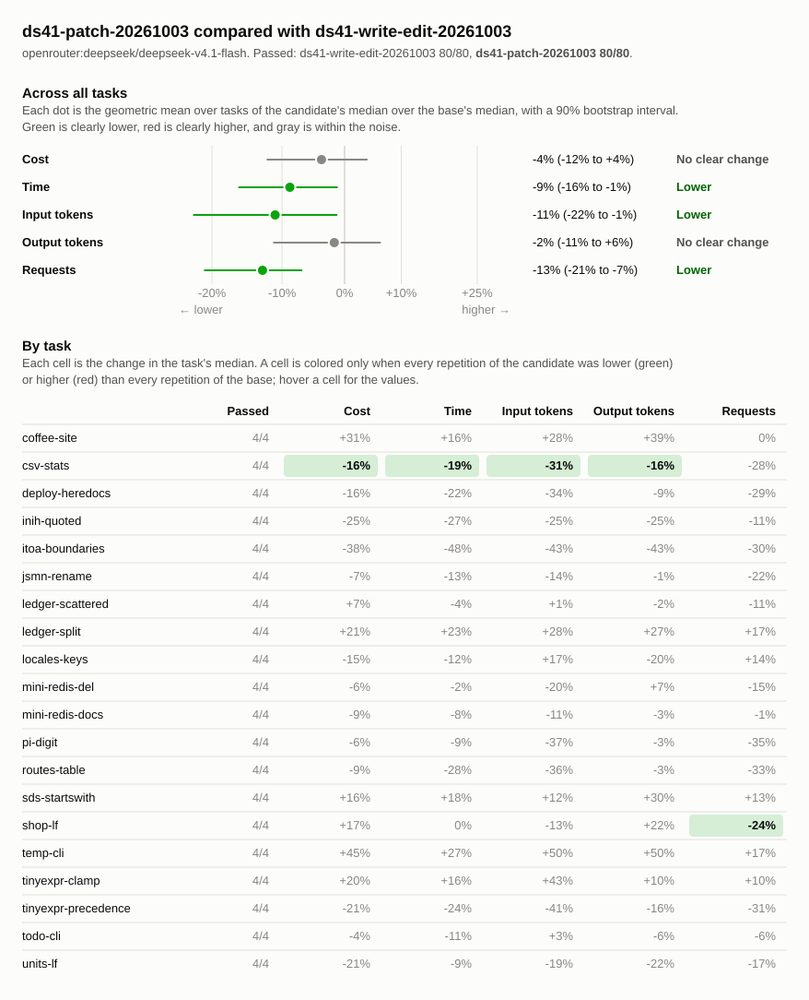
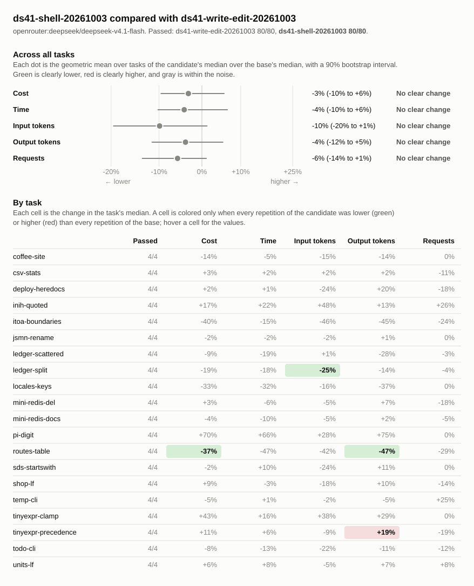

# Write/edit, patch, and shell edits on deepseek-v4.1-flash

## Runs

| Label                    | Commit       | Dirty | Model                                     | Effort  | Providers | Results |
| ------------------------ | ------------ | ----- | ----------------------------------------- | ------- | --------- | ------- |
| ds41-write-edit-20261003 | `8954a7f8b1` | no    | `openrouter:deepseek/deepseek-v4.1-flash` | default | deepseek  | 80      |
| ds41-patch-20261003      | `e445d5648f` | no    | `openrouter:deepseek/deepseek-v4.1-flash` | default | deepseek  | 80      |
| ds41-shell-20261003      | `addb7279a7` | no    | `openrouter:deepseek/deepseek-v4.1-flash` | default | deepseek  | 80      |

## Chart

## Summary

The tool set makes no difference to whether DeepSeek V4.1 Flash completes a
task: all 240 runs passed. Patch is modestly more efficient than write/edit.
Across tasks, patch makes 13% fewer requests (90% interval 7% to 21%), uses 11%
fewer input tokens (1% to 22%), and takes 9% less time (1% to 16%). Its cost is
4% lower, which is within the noise (12% lower to 4% higher). Shell and
write/edit show no clear difference in any metric.

Write/edit makes more requests because the model makes one `edit_file` call per
change, where it makes one `apply_patch` call for several. The gap is largest on
tasks with many small edits: on `itoa-boundaries` write/edit took 16 requests
against patch's 10. On tasks where the model edits by running Python or sed
through the shell, such as `jsmn-rename`, `ledger-split`, and `locales-keys`,
the tool sets perform alike.

Write/edit is branch bench/tools-write-edit, patch is commit `e445d5648f`, and
shell is branch bench/tools-shell, with the same tools as in
`gpt6-luna-write-edit-20261002-vs-gpt6-luna-patch-20261002-vs-gpt6-luna-shell-20261002.md`.
The patch commit differs from the branches' base only in benchmark scripts and
reports. All runs use openrouter:deepseek/deepseek-v4.1-flash with default
effort, pinned to the deepseek provider, with four repetitions of each of 20
tasks.

Changes are relative to `ds41-write-edit-20261003`. A task's values are medians
over its repetitions, with the range in parentheses. Totals are sums of task
medians.

| Metric            | ds41-write-edit-20261003 | ds41-patch-20261003 | ds41-patch-20261003 change | ds41-shell-20261003 | ds41-shell-20261003 change |
| ----------------- | -----------------------: | ------------------: | -------------------------: | ------------------: | -------------------------: |
| passed            |                    80/80 |               80/80 |                            |               80/80 |                            |
| seconds           |                     1511 |                1266 |                       -16% |                1556 |                        +3% |
| requests          |                      338 |                 293 |                       -13% |                 319 |                        -6% |
| tool_calls        |                      494 |               386.5 |                       -22% |               417.5 |                       -15% |
| failed_calls      |                      4.5 |                12.5 |                      +178% |                   5 |                       +11% |
| cancelled_calls   |                        0 |                   0 |                            |                   0 |                            |
| repeated_calls    |                        4 |                   2 |                       -50% |                   0 |                      -100% |
| input_tokens      |               10646053.5 |           8241041.5 |                       -23% |            10834158 |                        +2% |
| cached_tokens     |                 10328768 |             7942656 |                       -23% |            10493632 |                        +2% |
| output_tokens     |                 238639.5 |            213127.5 |                       -11% |            252768.5 |                        +6% |
| reasoning_tokens  |                 148788.5 |            130932.5 |                       -12% |              169351 |                       +14% |
| cost              |                  $0.2248 |             $0.1972 |                       -12% |             $0.2334 |                        +4% |
| max_input_tokens  |                   560245 |              533670 |                        -5% |            589013.5 |                        +5% |
| tool_output_chars |                   875935 |            876637.5 |                        +0% |              942689 |                        +8% |

### Pass rate and cost by task

| Task                  | ds41-write-edit-20261003 passed | ds41-patch-20261003 passed | ds41-shell-20261003 passed | ds41-write-edit-20261003 cost |  ds41-patch-20261003 cost | ds41-patch-20261003 change |  ds41-shell-20261003 cost | ds41-shell-20261003 change |
| --------------------- | ------------------------------: | -------------------------: | -------------------------: | ----------------------------: | ------------------------: | -------------------------: | ------------------------: | -------------------------: |
| `coffee-site`         |                             4/4 |                        4/4 |                        4/4 |     $0.0025 ($0.0021–$0.0039) | $0.0032 ($0.0025–$0.0039) |                       +31% | $0.0021 ($0.0020–$0.0023) |                       -14% |
| `csv-stats`           |                             4/4 |                        4/4 |                        4/4 |     $0.0069 ($0.0068–$0.0098) | $0.0058 ($0.0039–$0.0061) |                       -16% | $0.0071 ($0.0064–$0.0077) |                        +3% |
| `deploy-heredocs`     |                             4/4 |                        4/4 |                        4/4 |     $0.0027 ($0.0019–$0.0030) | $0.0022 ($0.0020–$0.0029) |                       -16% | $0.0027 ($0.0018–$0.0030) |                        +2% |
| `inih-quoted`         |                             4/4 |                        4/4 |                        4/4 |     $0.0409 ($0.0283–$0.0525) | $0.0307 ($0.0198–$0.0503) |                       -25% | $0.0477 ($0.0428–$0.0515) |                       +17% |
| `itoa-boundaries`     |                             4/4 |                        4/4 |                        4/4 |     $0.0118 ($0.0040–$0.0171) | $0.0073 ($0.0040–$0.0095) |                       -38% | $0.0071 ($0.0056–$0.0163) |                       -40% |
| `jsmn-rename`         |                             4/4 |                        4/4 |                        4/4 |     $0.0022 ($0.0014–$0.0024) | $0.0021 ($0.0014–$0.0026) |                        -7% | $0.0022 ($0.0014–$0.0031) |                        -2% |
| `ledger-scattered`    |                             4/4 |                        4/4 |                        4/4 |     $0.0106 ($0.0102–$0.0127) | $0.0114 ($0.0097–$0.0122) |                        +7% | $0.0096 ($0.0075–$0.0145) |                        -9% |
| `ledger-split`        |                             4/4 |                        4/4 |                        4/4 |     $0.0063 ($0.0052–$0.0081) | $0.0076 ($0.0057–$0.0080) |                       +21% | $0.0051 ($0.0047–$0.0058) |                       -19% |
| `locales-keys`        |                             4/4 |                        4/4 |                        4/4 |     $0.0050 ($0.0038–$0.0059) | $0.0042 ($0.0033–$0.0049) |                       -15% | $0.0033 ($0.0033–$0.0044) |                       -33% |
| `mini-redis-del`      |                             4/4 |                        4/4 |                        4/4 |     $0.0211 ($0.0181–$0.0249) | $0.0199 ($0.0189–$0.0216) |                        -6% | $0.0218 ($0.0148–$0.0237) |                        +3% |
| `mini-redis-docs`     |                             4/4 |                        4/4 |                        4/4 |     $0.0301 ($0.0262–$0.0373) | $0.0275 ($0.0261–$0.0411) |                        -9% | $0.0289 ($0.0253–$0.0320) |                        -4% |
| `pi-digit`            |                             4/4 |                        4/4 |                        4/4 |     $0.0066 ($0.0061–$0.0088) | $0.0063 ($0.0054–$0.0080) |                        -6% | $0.0113 ($0.0049–$0.0211) |                       +70% |
| `routes-table`        |                             4/4 |                        4/4 |                        4/4 |     $0.0047 ($0.0042–$0.0064) | $0.0043 ($0.0034–$0.0051) |                        -9% | $0.0030 ($0.0022–$0.0035) |                       -37% |
| `sds-startswith`      |                             4/4 |                        4/4 |                        4/4 |     $0.0038 ($0.0026–$0.0053) | $0.0043 ($0.0029–$0.0050) |                       +16% | $0.0037 ($0.0032–$0.0042) |                        -2% |
| `shop-lf`             |                             4/4 |                        4/4 |                        4/4 |     $0.0029 ($0.0026–$0.0031) | $0.0033 ($0.0021–$0.0042) |                       +17% | $0.0031 ($0.0029–$0.0048) |                        +9% |
| `temp-cli`            |                             4/4 |                        4/4 |                        4/4 |     $0.0029 ($0.0021–$0.0040) | $0.0041 ($0.0028–$0.0055) |                       +45% | $0.0027 ($0.0024–$0.0033) |                        -5% |
| `tinyexpr-clamp`      |                             4/4 |                        4/4 |                        4/4 |     $0.0048 ($0.0038–$0.0088) | $0.0057 ($0.0038–$0.0081) |                       +20% | $0.0068 ($0.0063–$0.0074) |                       +43% |
| `tinyexpr-precedence` |                             4/4 |                        4/4 |                        4/4 |     $0.0544 ($0.0383–$0.0595) | $0.0428 ($0.0211–$0.0775) |                       -21% | $0.0604 ($0.0559–$0.0808) |                       +11% |
| `todo-cli`            |                             4/4 |                        4/4 |                        4/4 |     $0.0033 ($0.0033–$0.0036) | $0.0032 ($0.0023–$0.0041) |                        -4% | $0.0030 ($0.0025–$0.0051) |                        -8% |
| `units-lf`            |                             4/4 |                        4/4 |                        4/4 |     $0.0014 ($0.0013–$0.0016) | $0.0011 ($0.0010–$0.0020) |                       -21% | $0.0015 ($0.0014–$0.0018) |                        +6% |

## Tasks

### `coffee-site`

| Metric                 |  ds41-write-edit-20261003 |       ds41-patch-20261003 | ds41-patch-20261003 change |       ds41-shell-20261003 | ds41-shell-20261003 change |
| ---------------------- | ------------------------: | ------------------------: | -------------------------: | ------------------------: | -------------------------: |
| passed                 |                       4/4 |                       4/4 |                            |                       4/4 |                            |
| status                 |                finished 4 |                finished 4 |                            |                finished 4 |                            |
| seconds                |                19 (17–27) |                22 (18–25) |                       +16% |                18 (16–22) |                        -5% |
| requests               |                 7.5 (5–9) |                 7.5 (7–8) |                        +0% |                7.5 (6–11) |                        +0% |
| tool_calls             |                  9 (6–10) |                   9 (7–9) |                        +0% |                  9 (7–10) |                        +0% |
| failed_calls           |                         0 |                   0 (0–1) |                            |                         0 |                            |
| cancelled_calls        |                         0 |                         0 |                            |                         0 |                            |
| `apply_patch` calls    |                         0 |                   1 (1–2) |                            |                         0 |                            |
| `apply_patch` failed   |                         0 |                   0 (0–1) |                            |                         0 |                            |
| `edit_file` calls      |                   0 (0–1) |                         0 |                            |                         0 |                            |
| `edit_file` failed     |                         0 |                         0 |                            |                         0 |                            |
| `glob` calls           |                         0 |                 0.5 (0–1) |                            |                         0 |                            |
| `glob` failed          |                         0 |                         0 |                            |                         0 |                            |
| `shell` calls          |                 4.5 (2–6) |                 5.5 (4–7) |                       +22% |                 7.5 (6–9) |                       +67% |
| `shell` failed         |                         0 |                         0 |                            |                         0 |                            |
| `shell_process` calls  |                         1 |                   1 (1–2) |                        +0% |                   1 (1–2) |                        +0% |
| `shell_process` failed |                         0 |                         0 |                            |                         0 |                            |
| `write_file` calls     |                         3 |                         0 |                      -100% |                         0 |                      -100% |
| `write_file` failed    |                         0 |                         0 |                            |                         0 |                            |
| repeated_calls         |                         0 |                         0 |                            |                         0 |                            |
| input_tokens           |       35037 (25842–50661) |       44852 (36036–53330) |                       +28% |     29651.5 (21808–43862) |                       -15% |
| cached_tokens          |       32192 (24576–48768) |       42624 (34560–51712) |                       +32% |       27776 (18688–41600) |                       -14% |
| output_tokens          |        3290.5 (2875–5796) |          4564 (3648–5823) |                       +39% |          2843 (2582–3033) |                       -14% |
| reasoning_tokens       |            194.5 (36–288) |              114 (65–152) |                       -41% |            119.5 (25–174) |                       -39% |
| cost                   | $0.0025 ($0.0021–$0.0039) | $0.0032 ($0.0025–$0.0039) |                       +31% | $0.0021 ($0.0020–$0.0023) |                       -14% |
| max_input_tokens       |        6135.5 (5728–8627) |        7853.5 (6569–8955) |                       +28% |        5472.5 (4839–5649) |                       -11% |
| tool_output_chars      |          1716 (1508–1936) |        1866.5 (1170–2226) |                        +9% |        1926.5 (1176–2218) |                       +12% |

### `csv-stats`

| Metric               |  ds41-write-edit-20261003 |       ds41-patch-20261003 | ds41-patch-20261003 change |       ds41-shell-20261003 | ds41-shell-20261003 change |
| -------------------- | ------------------------: | ------------------------: | -------------------------: | ------------------------: | -------------------------: |
| passed               |                       4/4 |                       4/4 |                            |                       4/4 |                            |
| status               |                finished 4 |                finished 4 |                            |                finished 4 |                            |
| seconds              |                51 (50–72) |                41 (28–42) |                       -19% |                52 (51–57) |                        +2% |
| requests             |                   9 (8–9) |                 6.5 (5–8) |                       -28% |                  8 (8–10) |                       -11% |
| tool_calls           |              12.5 (11–14) |                 6.5 (5–8) |                       -48% |              11.5 (10–12) |                        -8% |
| failed_calls         |                         0 |                   0 (0–1) |                            |                         0 |                            |
| cancelled_calls      |                         0 |                         0 |                            |                         0 |                            |
| `apply_patch` calls  |                         0 |                   1 (1–2) |                            |                         0 |                            |
| `apply_patch` failed |                         0 |                   0 (0–1) |                            |                         0 |                            |
| `edit_file` calls    |                   0 (0–1) |                         0 |                            |                         0 |                            |
| `edit_file` failed   |                         0 |                         0 |                            |                         0 |                            |
| `glob` calls         |                 0.5 (0–1) |                   0 (0–1) |                      -100% |                   0 (0–1) |                      -100% |
| `glob` failed        |                         0 |                         0 |                            |                         0 |                            |
| `read_file` calls    |                         0 |                         0 |                            |                   0 (0–2) |                            |
| `read_file` failed   |                         0 |                         0 |                            |                         0 |                            |
| `shell` calls        |                   7 (6–7) |                   5 (4–6) |                       -29% |                 11 (8–12) |                       +57% |
| `shell` failed       |                         0 |                         0 |                            |                         0 |                            |
| `write_file` calls   |                         5 |                         0 |                      -100% |                         0 |                      -100% |
| `write_file` failed  |                         0 |                         0 |                            |                         0 |                            |
| repeated_calls       |                         0 |                         0 |                            |                         0 |                            |
| input_tokens         |      81293 (79864–118841) |       56170 (31243–67053) |                       -31% |       83013 (73322–95471) |                        +2% |
| cached_tokens        |      79104 (77952–113920) |       54464 (29440–65408) |                       -31% |       80064 (71296–92672) |                        +1% |
| output_tokens        |     10675.5 (10412–14533) |        9013.5 (5909–9317) |                       -16% |      10871.5 (9869–11486) |                        +2% |
| reasoning_tokens     |        6739.5 (6546–9293) |        4273.5 (3019–5769) |                       -37% |        6888.5 (6102–8027) |                        +2% |
| cost                 | $0.0069 ($0.0068–$0.0098) | $0.0058 ($0.0039–$0.0061) |                       -16% | $0.0071 ($0.0064–$0.0077) |                        +3% |
| max_input_tokens     |     13593.5 (13371–17925) |        12164 (8867–12424) |                       -11% |     14032.5 (12834–14307) |                        +3% |
| tool_output_chars    |          2449 (2020–3361) |        1857.5 (1275–1925) |                       -24% |        2983.5 (2840–5449) |                       +22% |

### `deploy-heredocs`

| Metric               |  ds41-write-edit-20261003 |       ds41-patch-20261003 | ds41-patch-20261003 change |       ds41-shell-20261003 | ds41-shell-20261003 change |
| -------------------- | ------------------------: | ------------------------: | -------------------------: | ------------------------: | -------------------------: |
| passed               |                       4/4 |                       4/4 |                            |                       4/4 |                            |
| status               |                finished 4 |                finished 4 |                            |                finished 4 |                            |
| seconds              |                19 (13–23) |                15 (11–24) |                       -22% |                19 (14–21) |                        +1% |
| requests             |                8.5 (6–13) |                  6 (5–10) |                       -29% |                   7 (6–7) |                       -18% |
| tool_calls           |              13.5 (12–15) |                  6 (6–11) |                       -56% |                7.5 (6–10) |                       -44% |
| failed_calls         |                   0 (0–1) |                         0 |                            |                   0 (0–1) |                            |
| cancelled_calls      |                         0 |                         0 |                            |                         0 |                            |
| `apply_patch` calls  |                         0 |                 1.5 (1–2) |                            |                         0 |                            |
| `apply_patch` failed |                         0 |                         0 |                            |                         0 |                            |
| `edit_file` calls    |                   7 (7–8) |                         0 |                      -100% |                         0 |                      -100% |
| `edit_file` failed   |                   0 (0–1) |                         0 |                            |                         0 |                            |
| `read_file` calls    |                         3 |                   3 (2–3) |                        +0% |                         2 |                       -33% |
| `read_file` failed   |                         0 |                         0 |                            |                         0 |                            |
| `shell` calls        |                 3.5 (2–4) |                 2.5 (1–6) |                       -29% |                 5.5 (4–8) |                       +57% |
| `shell` failed       |                         0 |                         0 |                            |                   0 (0–1) |                            |
| repeated_calls       |                         1 |                   1 (0–1) |                        +0% |                         0 |                      -100% |
| input_tokens         |       50036 (31561–72009) |       32967 (29326–63170) |                       -34% |       38166 (27894–42389) |                       -24% |
| cached_tokens        |       45184 (27776–66048) |       28928 (23936–58368) |                       -36% |       34432 (24448–38400) |                       -24% |
| output_tokens        |          2819 (2052–3590) |          2566 (1817–3354) |                        -9% |          3382 (2050–3862) |                       +20% |
| reasoning_tokens     |           1024 (417–1720) |           1205 (585–1752) |                       +18% |           1687 (588–2005) |                       +65% |
| cost                 | $0.0027 ($0.0019–$0.0030) | $0.0022 ($0.0020–$0.0029) |                       -16% | $0.0027 ($0.0018–$0.0030) |                        +2% |
| max_input_tokens     |          8793 (7346–9094) |        8502.5 (7779–9302) |                        -3% |        7940.5 (6443–8729) |                       -10% |
| tool_output_chars    |        11160 (9776–12317) |        10393 (9182–14319) |                        -7% |         9068 (8726–10021) |                       -19% |

### `inih-quoted`

| Metric               |    ds41-write-edit-20261003 |       ds41-patch-20261003 | ds41-patch-20261003 change |       ds41-shell-20261003 | ds41-shell-20261003 change |
| -------------------- | --------------------------: | ------------------------: | -------------------------: | ------------------------: | -------------------------: |
| passed               |                         4/4 |                       4/4 |                            |                       4/4 |                            |
| status               |                  finished 4 |                finished 4 |                            |                finished 4 |                            |
| seconds              |               297 (199–517) |             217 (138–369) |                       -27% |             364 (299–428) |                       +22% |
| requests             |                  40 (35–49) |              35.5 (28–39) |                       -11% |              50.5 (49–57) |                       +26% |
| tool_calls           |                57.5 (47–68) |                50 (44–57) |                       -13% |                66 (63–71) |                       +15% |
| failed_calls         |                     2 (1–3) |                   1 (0–2) |                       -50% |                 1.5 (0–4) |                       -25% |
| cancelled_calls      |                           0 |                         0 |                            |                         0 |                            |
| `apply_patch` calls  |                           0 |                   2 (1–3) |                            |                         0 |                            |
| `apply_patch` failed |                           0 |                   0 (0–1) |                            |                         0 |                            |
| `edit_file` calls    |                     2 (1–3) |                         0 |                      -100% |                         0 |                      -100% |
| `edit_file` failed   |                           0 |                         0 |                            |                         0 |                            |
| `glob` calls         |                     2 (1–3) |                   2 (1–3) |                        +0% |                   0 (0–1) |                      -100% |
| `glob` failed        |                           0 |                         0 |                            |                         0 |                            |
| `grep` calls         |                     1 (0–3) |                   1 (0–1) |                        +0% |                   2 (1–4) |                      +100% |
| `grep` failed        |                           0 |                         0 |                            |                         0 |                            |
| `read_file` calls    |                15.5 (13–19) |                9.5 (8–11) |                       -39% |              17.5 (14–20) |                       +13% |
| `read_file` failed   |                           0 |                         0 |                            |                         0 |                            |
| `shell` calls        |                36.5 (27–40) |                36 (28–44) |                        -1% |                46 (40–55) |                       +26% |
| `shell` failed       |                   1.5 (1–2) |                 0.5 (0–2) |                       -67% |                 1.5 (0–4) |                        +0% |
| `write_file` calls   |                     1 (1–3) |                         0 |                      -100% |                         0 |                      -100% |
| `write_file` failed  |                     0 (0–2) |                         0 |                            |                         0 |                            |
| repeated_calls       |                           0 |                         0 |                            |                         0 |                            |
| input_tokens         | 1812229.5 (1289523–2789201) |  1367444 (957629–2183751) |                       -25% | 2675615 (2226514–3022081) |                       +48% |
| cached_tokens        |   1776704 (1255936–2748416) |  1336704 (926848–2144640) |                       -25% | 2632384 (2190464–2979200) |                       +48% |
| output_tokens        |       49175.5 (32561–66037) |       36749 (20685–63295) |                       -25% |     55547.5 (51295–60204) |                       +13% |
| reasoning_tokens     |       41270.5 (27069–56617) |       29447 (15804–54037) |                       -29% |     46849.5 (42678–50947) |                       +14% |
| cost                 |   $0.0409 ($0.0283–$0.0525) | $0.0307 ($0.0198–$0.0503) |                       -25% | $0.0477 ($0.0428–$0.0515) |                       +17% |
| max_input_tokens     |      82529.5 (63471–103639) |    66696.5 (50930–100916) |                       -19% |      95345 (84721–100720) |                       +16% |
| tool_output_chars    |      98358.5 (84012–107666) |    92313.5 (73782–106567) |                        -6% |     112259 (94266–118270) |                       +14% |

### `itoa-boundaries`

| Metric               |  ds41-write-edit-20261003 |       ds41-patch-20261003 | ds41-patch-20261003 change |       ds41-shell-20261003 | ds41-shell-20261003 change |
| -------------------- | ------------------------: | ------------------------: | -------------------------: | ------------------------: | -------------------------: |
| passed               |                       4/4 |                       4/4 |                            |                       4/4 |                            |
| status               |                finished 4 |                finished 4 |                            |                finished 4 |                            |
| seconds              |              108 (40–143) |                56 (31–68) |                       -48% |               91 (55–364) |                       -15% |
| requests             |               16.5 (8–22) |               11.5 (7–14) |                       -30% |               12.5 (9–16) |                       -24% |
| tool_calls           |              20.5 (10–27) |                14 (10–18) |                       -32% |              15.5 (11–20) |                       -24% |
| failed_calls         |                 0.5 (0–2) |                   0 (0–1) |                      -100% |                   0 (0–1) |                      -100% |
| cancelled_calls      |                         0 |                         0 |                            |                         0 |                            |
| `apply_patch` calls  |                         0 |                 1.5 (1–3) |                            |                         0 |                            |
| `apply_patch` failed |                         0 |                         0 |                            |                         0 |                            |
| `edit_file` calls    |                   1 (1–2) |                         0 |                      -100% |                         0 |                      -100% |
| `edit_file` failed   |                         0 |                         0 |                            |                         0 |                            |
| `glob` calls         |                 0.5 (0–1) |                         1 |                      +100% |                   1 (0–1) |                      +100% |
| `glob` failed        |                         0 |                         0 |                            |                         0 |                            |
| `read_file` calls    |                   5 (3–7) |                   5 (5–6) |                        +0% |                   5 (4–6) |                        +0% |
| `read_file` failed   |                   0 (0–1) |                         0 |                            |                         0 |                            |
| `shell` calls        |                 11 (5–19) |                   6 (3–9) |                       -45% |                9.5 (6–14) |                       -14% |
| `shell` failed       |                   0 (0–2) |                   0 (0–1) |                            |                   0 (0–1) |                            |
| `write_file` calls   |                 1.5 (0–2) |                         0 |                      -100% |                         0 |                      -100% |
| `write_file` failed  |                         0 |                         0 |                            |                         0 |                            |
| repeated_calls       |                 0.5 (0–2) |                   1 (0–1) |                      +100% |                   0 (0–1) |                      -100% |
| input_tokens         |     287642 (77632–474828) |     163892 (66656–225389) |                       -43% |   156259.5 (96725–333026) |                       -46% |
| cached_tokens        |     275008 (68480–458624) |     152384 (57600–212352) |                       -45% |     145280 (87296–320768) |                       -47% |
| output_tokens        |        15174 (3966–22098) |         8584 (4055–11500) |                       -43% |       8377.5 (6611–22537) |                       -45% |
| reasoning_tokens     |      11427.5 (2272–17923) |        6313.5 (2830–8749) |                       -45% |         4975 (3821–15880) |                       -56% |
| cost                 | $0.0118 ($0.0040–$0.0171) | $0.0073 ($0.0040–$0.0095) |                       -38% | $0.0071 ($0.0056–$0.0163) |                       -40% |
| max_input_tokens     |       27790 (14321–37550) |     21174.5 (14792–25432) |                       -24% |       19885 (16940–34897) |                       -28% |
| tool_output_chars    |       33035 (26325–41485) |       31692 (25905–35036) |                        -4% |     30359.5 (27572–32621) |                        -8% |

### `jsmn-rename`

| Metric             |  ds41-write-edit-20261003 |       ds41-patch-20261003 | ds41-patch-20261003 change |       ds41-shell-20261003 | ds41-shell-20261003 change |
| ------------------ | ------------------------: | ------------------------: | -------------------------: | ------------------------: | -------------------------: |
| passed             |                       4/4 |                       4/4 |                            |                       4/4 |                            |
| status             |                finished 4 |                finished 4 |                            |                finished 4 |                            |
| seconds            |                18 (14–19) |                16 (12–17) |                       -13% |                18 (12–20) |                        -2% |
| requests           |                  9 (7–10) |                   7 (6–9) |                       -22% |                  9 (7–10) |                        +0% |
| tool_calls         |                 11 (7–13) |                9.5 (7–10) |                       -14% |                 12 (9–15) |                        +9% |
| failed_calls       |                         0 |                         0 |                            |                         0 |                            |
| cancelled_calls    |                         0 |                         0 |                            |                         0 |                            |
| `grep` calls       |                 1.5 (1–2) |                   1 (1–2) |                       -33% |                 1.5 (1–3) |                        +0% |
| `grep` failed      |                         0 |                         0 |                            |                         0 |                            |
| `read_file` calls  |                 3.5 (2–4) |                 2.5 (1–3) |                       -29% |                   3 (2–4) |                       -14% |
| `read_file` failed |                         0 |                         0 |                            |                         0 |                            |
| `shell` calls      |                   6 (4–7) |                 5.5 (4–7) |                        -8% |                 7.5 (5–9) |                       +25% |
| `shell` failed     |                         0 |                         0 |                            |                         0 |                            |
| repeated_calls     |                         0 |                         0 |                            |                         0 |                            |
| input_tokens       |     54089.5 (31826–73137) |       46563 (28587–61251) |                       -14% |     52965.5 (34499–84349) |                        -2% |
| cached_tokens      |       48448 (28288–66432) |       41344 (25472–54656) |                       -15% |       47232 (30336–74240) |                        -3% |
| output_tokens      |        1994.5 (1349–2194) |          1970 (1371–2483) |                        -1% |          2012 (1202–2346) |                        +1% |
| reasoning_tokens   |          712.5 (477–1084) |            974 (459–1178) |                       +37% |            789 (370–1071) |                       +11% |
| cost               | $0.0022 ($0.0014–$0.0024) | $0.0021 ($0.0014–$0.0026) |                        -7% | $0.0022 ($0.0014–$0.0031) |                        -2% |
| max_input_tokens   |          9084 (6283–9743) |         9070 (6196–10620) |                        -0% |         8609 (6469–13115) |                        -5% |
| tool_output_chars  |      13335.5 (7469–15929) |        12119 (6238–16760) |                        -9% |        13051 (9228–25793) |                        -2% |

### `ledger-scattered`

| Metric               |  ds41-write-edit-20261003 |       ds41-patch-20261003 | ds41-patch-20261003 change |       ds41-shell-20261003 | ds41-shell-20261003 change |
| -------------------- | ------------------------: | ------------------------: | -------------------------: | ------------------------: | -------------------------: |
| passed               |                       4/4 |                       4/4 |                            |                       4/4 |                            |
| status               |                finished 4 |                finished 4 |                            |                finished 4 |                            |
| seconds              |                55 (39–76) |                53 (44–55) |                        -4% |                44 (33–75) |                       -19% |
| requests             |                18 (12–36) |                16 (14–18) |                       -11% |              17.5 (14–24) |                        -3% |
| tool_calls           |              34.5 (15–65) |                25 (22–42) |                       -28% |                26 (17–35) |                       -25% |
| failed_calls         |                 0.5 (0–9) |                         0 |                      -100% |                   0 (0–1) |                      -100% |
| cancelled_calls      |                         0 |                         0 |                            |                         0 |                            |
| `apply_patch` calls  |                         0 |                         1 |                            |                         0 |                            |
| `apply_patch` failed |                         0 |                         0 |                            |                         0 |                            |
| `edit_file` calls    |                 20 (1–28) |                         0 |                      -100% |                         0 |                      -100% |
| `edit_file` failed   |                   0 (0–8) |                         0 |                            |                         0 |                            |
| `glob` calls         |                 0.5 (0–2) |                   0 (0–1) |                      -100% |                   1 (0–2) |                      +100% |
| `glob` failed        |                         0 |                         0 |                            |                         0 |                            |
| `grep` calls         |                   1 (0–5) |                   3 (0–4) |                      +200% |                   0 (0–4) |                      -100% |
| `grep` failed        |                         0 |                         0 |                            |                         0 |                            |
| `read_file` calls    |                7.5 (6–21) |              16.5 (13–33) |                      +120% |                 12 (6–23) |                       +60% |
| `read_file` failed   |                   0 (0–1) |                         0 |                            |                         0 |                            |
| `shell` calls        |                  5 (2–16) |                   5 (2–8) |                        +0% |                  9 (8–17) |                       +80% |
| `shell` failed       |                   0 (0–1) |                         0 |                            |                   0 (0–1) |                            |
| repeated_calls       |                   0 (0–1) |                         0 |                            |                         0 |                            |
| input_tokens         |  358709.5 (305796–896618) |    363845 (228521–419054) |                        +1% |  362043.5 (235313–605999) |                        +1% |
| cached_tokens        |    336640 (277248–868224) |    330240 (209024–381184) |                        -2% |    332608 (210944–571776) |                        -1% |
| output_tokens        |       9773.5 (8395–11085) |       9607.5 (7401–10240) |                        -2% |         7060 (5330–12790) |                       -28% |
| reasoning_tokens     |          3918 (3138–6118) |          4856 (3861–6190) |                       +24% |        3379.5 (2576–7644) |                       -14% |
| cost                 | $0.0106 ($0.0102–$0.0127) | $0.0114 ($0.0097–$0.0122) |                        +7% | $0.0096 ($0.0075–$0.0145) |                        -9% |
| max_input_tokens     |       35656 (29494–37342) |       43794 (29580–46313) |                       +23% |       37955 (27141–46163) |                        +6% |
| tool_output_chars    |       75099 (51723–83762) |      96642 (57217–111264) |                       +29% |    85435.5 (59734–113048) |                       +14% |

### `ledger-split`

| Metric               |  ds41-write-edit-20261003 |       ds41-patch-20261003 | ds41-patch-20261003 change |       ds41-shell-20261003 | ds41-shell-20261003 change |
| -------------------- | ------------------------: | ------------------------: | -------------------------: | ------------------------: | -------------------------: |
| passed               |                       4/4 |                       4/4 |                            |                       4/4 |                            |
| status               |                finished 4 |                finished 4 |                            |                finished 4 |                            |
| seconds              |                35 (30–47) |                43 (29–50) |                       +23% |                29 (25–38) |                       -18% |
| requests             |              11.5 (10–16) |               13.5 (9–17) |                       +17% |                 11 (8–13) |                        -4% |
| tool_calls           |              13.5 (11–16) |                17 (13–19) |                       +26% |                12 (10–13) |                       -11% |
| failed_calls         |                         0 |                         0 |                            |                   0 (0–1) |                            |
| cancelled_calls      |                         0 |                         0 |                            |                         0 |                            |
| `apply_patch` calls  |                         0 |                 0.5 (0–1) |                            |                         0 |                            |
| `apply_patch` failed |                         0 |                         0 |                            |                         0 |                            |
| `glob` calls         |                 0.5 (0–1) |                 0.5 (0–1) |                        +0% |                 0.5 (0–1) |                        +0% |
| `glob` failed        |                         0 |                         0 |                            |                         0 |                            |
| `grep` calls         |                   0 (0–1) |                         0 |                            |                         0 |                            |
| `grep` failed        |                         0 |                         0 |                            |                         0 |                            |
| `read_file` calls    |                   3 (2–3) |                   3 (2–5) |                        +0% |                 1.5 (0–2) |                       -50% |
| `read_file` failed   |                         0 |                         0 |                            |                         0 |                            |
| `shell` calls        |                 10 (8–12) |                12 (10–15) |                       +20% |                9.5 (9–12) |                        -5% |
| `shell` failed       |                         0 |                         0 |                            |                   0 (0–1) |                            |
| repeated_calls       |                         0 |                         0 |                            |                         0 |                            |
| input_tokens         |    176310 (161471–279283) |  225668.5 (144079–324013) |                       +28% |    132937 (115223–157857) |                       -25% |
| cached_tokens        |    160768 (145280–260480) |    209536 (128384–304512) |                       +30% |    119680 (100224–147072) |                       -26% |
| output_tokens        |          5093 (4072–8658) |          6467 (5016–9154) |                       +27% |        4381.5 (3968–6260) |                       -14% |
| reasoning_tokens     |          2217 (1531–5384) |          3230 (2343–4737) |                       +46% |        1777.5 (1421–3376) |                       -20% |
| cost                 | $0.0063 ($0.0052–$0.0081) | $0.0076 ($0.0057–$0.0080) |                       +21% | $0.0051 ($0.0047–$0.0058) |                       -19% |
| max_input_tokens     |       23539 (20072–25955) |       24650 (21899–27608) |                        +5% |       18261 (17449–20146) |                       -22% |
| tool_output_chars    |     49268.5 (44696–54668) |       51298 (34514–59957) |                        +4% |       37755 (30654–46642) |                       -23% |

### `locales-keys`

| Metric               |  ds41-write-edit-20261003 |       ds41-patch-20261003 | ds41-patch-20261003 change |       ds41-shell-20261003 | ds41-shell-20261003 change |
| -------------------- | ------------------------: | ------------------------: | -------------------------: | ------------------------: | -------------------------: |
| passed               |                       4/4 |                       4/4 |                            |                       4/4 |                            |
| status               |                finished 4 |                finished 4 |                            |                finished 4 |                            |
| seconds              |                29 (23–36) |                26 (22–30) |                       -12% |                20 (20–27) |                       -32% |
| requests             |                  7 (7–10) |                   8 (7–9) |                       +14% |                   7 (5–8) |                        +0% |
| tool_calls           |                  7 (6–41) |                  7 (6–11) |                        +0% |                 6.5 (6–8) |                        -7% |
| failed_calls         |                         0 |                   0 (0–1) |                            |                   0 (0–1) |                            |
| cancelled_calls      |                         0 |                         0 |                            |                         0 |                            |
| `apply_patch` calls  |                         0 |                   0 (0–1) |                            |                         0 |                            |
| `apply_patch` failed |                         0 |                   0 (0–1) |                            |                         0 |                            |
| `edit_file` calls    |                  0 (0–16) |                         0 |                            |                         0 |                            |
| `edit_file` failed   |                         0 |                         0 |                            |                         0 |                            |
| `glob` calls         |                 0.5 (0–1) |                   0 (0–1) |                      -100% |                   0 (0–1) |                      -100% |
| `glob` failed        |                         0 |                         0 |                            |                         0 |                            |
| `grep` calls         |                   0 (0–1) |                         0 |                            |                         0 |                            |
| `grep` failed        |                         0 |                         0 |                            |                         0 |                            |
| `read_file` calls    |                0.5 (0–18) |                         0 |                      -100% |                   0 (0–1) |                      -100% |
| `read_file` failed   |                         0 |                         0 |                            |                         0 |                            |
| `shell` calls        |                   6 (5–6) |                   7 (6–9) |                       +17% |                 6.5 (5–7) |                        +8% |
| `shell` failed       |                         0 |                         0 |                            |                   0 (0–1) |                            |
| repeated_calls       |                   0 (0–1) |                         0 |                            |                         0 |                            |
| input_tokens         |     64730.5 (61924–86292) |     75705.5 (59383–94212) |                       +17% |       54496 (31045–72688) |                       -16% |
| cached_tokens        |       55680 (53504–78080) |       66752 (52224–85760) |                       +20% |       46208 (24192–64128) |                       -17% |
| output_tokens        |          5712 (4031–7436) |        4545.5 (3454–5458) |                       -20% |        3597.5 (2928–4931) |                       -37% |
| reasoning_tokens     |          2514 (1995–4877) |        2531.5 (1888–2852) |                        +1% |          2109 (1390–2309) |                       -16% |
| cost                 | $0.0050 ($0.0038–$0.0059) | $0.0042 ($0.0033–$0.0049) |                       -15% | $0.0033 ($0.0033–$0.0044) |                       -33% |
| max_input_tokens     |       15841 (13916–17405) |       14804 (12611–16251) |                        -7% |       12469 (11864–14385) |                       -21% |
| tool_output_chars    |     18288.5 (17263–20824) |     17593.5 (14548–20510) |                        -4% |       17126 (15083–18526) |                        -6% |

### `mini-redis-del`

| Metric                 |  ds41-write-edit-20261003 |       ds41-patch-20261003 | ds41-patch-20261003 change |        ds41-shell-20261003 | ds41-shell-20261003 change |
| ---------------------- | ------------------------: | ------------------------: | -------------------------: | -------------------------: | -------------------------: |
| passed                 |                       4/4 |                       4/4 |                            |                        4/4 |                            |
| status                 |                finished 4 |                finished 4 |                            |                 finished 4 |                            |
| seconds                |              129 (92–139) |             127 (111–129) |                        -2% |               122 (89–146) |                        -6% |
| requests               |              36.5 (23–39) |                31 (26–32) |                       -15% |                 30 (20–37) |                       -18% |
| tool_calls             |              51.5 (40–55) |              41.5 (40–45) |                       -19% |               45.5 (28–49) |                       -12% |
| failed_calls           |                 0.5 (0–1) |                 2.5 (1–3) |                      +400% |                    0 (0–1) |                      -100% |
| cancelled_calls        |                         0 |                         0 |                            |                          0 |                            |
| `apply_patch` calls    |                         0 |              10.5 (10–12) |                            |                          0 |                            |
| `apply_patch` failed   |                         0 |                 0.5 (0–2) |                            |                          0 |                            |
| `edit_file` calls      |                17 (13–20) |                         0 |                      -100% |                          0 |                      -100% |
| `edit_file` failed     |                   0 (0–1) |                         0 |                            |                          0 |                            |
| `glob` calls           |                         0 |                 0.5 (0–1) |                            |                    0 (0–1) |                            |
| `glob` failed          |                         0 |                         0 |                            |                          0 |                            |
| `grep` calls           |                   0 (0–1) |                 0.5 (0–2) |                            |                          0 |                            |
| `grep` failed          |                         0 |                         0 |                            |                          0 |                            |
| `read_file` calls      |              19.5 (18–23) |                21 (14–22) |                        +8% |                  21 (9–22) |                        +8% |
| `read_file` failed     |                         0 |                         0 |                            |                          0 |                            |
| `shell` calls          |               11.5 (5–14) |                  9 (8–14) |                       -22% |               23.5 (19–28) |                      +104% |
| `shell` failed         |                   0 (0–1) |                   1 (0–3) |                            |                    0 (0–1) |                            |
| `shell_process` calls  |                         0 |                   0 (0–2) |                            |                          0 |                            |
| `shell_process` failed |                         0 |                   0 (0–1) |                            |                          0 |                            |
| `write_file` calls     |                         2 |                         0 |                      -100% |                          0 |                      -100% |
| `write_file` failed    |                         0 |                         0 |                            |                          0 |                            |
| repeated_calls         |                 0.5 (0–1) |                   0 (0–1) |                      -100% |                          0 |                      -100% |
| input_tokens           |  1527231 (984253–1757946) | 1226366 (1183998–1405254) |                       -20% | 1451976.5 (689285–1711518) |                        -5% |
| cached_tokens          |  1483072 (939520–1708544) | 1188480 (1140224–1359104) |                       -20% |   1403136 (652672–1664256) |                        -5% |
| output_tokens          |       16017 (14322–22051) |     17078.5 (15748–18190) |                        +7% |      17116.5 (12296–19296) |                        +7% |
| reasoning_tokens       |       6671.5 (4982–10040) |          7675 (6622–8656) |                       +15% |           7790 (4409–8509) |                       +17% |
| cost                   | $0.0211 ($0.0181–$0.0249) | $0.0199 ($0.0189–$0.0216) |                        -6% |  $0.0218 ($0.0148–$0.0237) |                        +3% |
| max_input_tokens       |     60321.5 (58356–63817) |     57087.5 (52347–62548) |                        -5% |      63833.5 (48644–65375) |                        +6% |
| tool_output_chars      |    148061 (138946–159211) |  135986.5 (120135–154313) |                        -8% |     158533 (130441–166941) |                        +7% |

### `mini-redis-docs`

| Metric               |  ds41-write-edit-20261003 |         ds41-patch-20261003 | ds41-patch-20261003 change |       ds41-shell-20261003 | ds41-shell-20261003 change |
| -------------------- | ------------------------: | --------------------------: | -------------------------: | ------------------------: | -------------------------: |
| passed               |                       4/4 |                         4/4 |                            |                       4/4 |                            |
| status               |                finished 4 |                  finished 4 |                            |                finished 4 |                            |
| seconds              |             171 (140–233) |               157 (151–262) |                        -8% |             154 (133–169) |                       -10% |
| requests             |              43.5 (36–96) |                  43 (32–47) |                        -1% |              41.5 (28–50) |                        -5% |
| tool_calls           |              92.5 (89–95) |                64.5 (52–76) |                       -30% |                60 (52–68) |                       -35% |
| failed_calls         |                 0.5 (0–1) |                     2 (0–3) |                      +300% |                   2 (0–2) |                      +300% |
| cancelled_calls      |                         0 |                           0 |                            |                         0 |                            |
| `apply_patch` calls  |                         0 |                  8.5 (2–17) |                            |                         0 |                            |
| `apply_patch` failed |                         0 |                           0 |                            |                         0 |                            |
| `edit_file` calls    |                43 (39–50) |                           0 |                      -100% |                         0 |                      -100% |
| `edit_file` failed   |                         0 |                           0 |                            |                         0 |                            |
| `glob` calls         |                   0 (0–1) |                     0 (0–1) |                            |                   0 (0–1) |                            |
| `glob` failed        |                         0 |                           0 |                            |                         0 |                            |
| `read_file` calls    |                30 (30–32) |                31.5 (29–32) |                        +5% |                31 (26–33) |                        +3% |
| `read_file` failed   |                   0 (0–1) |                   0.5 (0–1) |                            |                 0.5 (0–2) |                            |
| `shell` calls        |                17 (15–21) |                  21 (17–37) |                       +24% |                29 (26–34) |                       +71% |
| `shell` failed       |                   0 (0–1) |                   1.5 (0–2) |                            |                 0.5 (0–2) |                            |
| `write_file` calls   |                   0 (0–1) |                           0 |                            |                         0 |                            |
| `write_file` failed  |                         0 |                           0 |                            |                         0 |                            |
| repeated_calls       |                   0 (0–2) |                           0 |                            |                         0 |                            |
| input_tokens         | 2362782 (1791431–5015248) | 2107774.5 (1526894–3129902) |                       -11% | 2237158 (1295076–2725345) |                        -5% |
| cached_tokens        | 2300032 (1734272–4946688) |   2046528 (1462016–3058048) |                       -11% | 2169856 (1237248–2654720) |                        -6% |
| output_tokens        |     20844.5 (16292–28862) |       20274.5 (19996–35314) |                        -3% |     21300.5 (20027–22416) |                        +2% |
| reasoning_tokens     |       9880.5 (6970–18736) |       12969.5 (12470–25583) |                       +31% |     11790.5 (10112–13998) |                       +19% |
| cost                 | $0.0301 ($0.0262–$0.0373) |   $0.0275 ($0.0261–$0.0411) |                        -9% | $0.0289 ($0.0253–$0.0320) |                        -4% |
| max_input_tokens     |       77606 (76042–88766) |        82453 (77461–105241) |                        +6% |     85242.5 (78539–88828) |                       +10% |
| tool_output_chars    |  203961.5 (194311–209807) |    215807.5 (197063–242423) |                        +6% |  226602.5 (198522–232441) |                       +11% |

### `pi-digit`

| Metric               |  ds41-write-edit-20261003 |       ds41-patch-20261003 | ds41-patch-20261003 change |       ds41-shell-20261003 | ds41-shell-20261003 change |
| -------------------- | ------------------------: | ------------------------: | -------------------------: | ------------------------: | -------------------------: |
| passed               |                       4/4 |                       4/4 |                            |                       4/4 |                            |
| status               |                finished 4 |                finished 4 |                            |                finished 4 |                            |
| seconds              |                51 (48–65) |                47 (42–56) |                        -9% |               85 (40–149) |                       +66% |
| requests             |                 10 (6–11) |                 6.5 (5–7) |                       -35% |                 10 (7–13) |                        +0% |
| tool_calls           |               11.5 (7–16) |                 5.5 (4–7) |                       -52% |                  9 (6–12) |                       -22% |
| failed_calls         |                 0.5 (0–2) |                   0 (0–2) |                      -100% |                   0 (0–1) |                      -100% |
| cancelled_calls      |                         0 |                         0 |                            |                         0 |                            |
| `apply_patch` calls  |                         0 |                 1.5 (1–2) |                            |                         0 |                            |
| `apply_patch` failed |                         0 |                         0 |                            |                         0 |                            |
| `edit_file` calls    |                 0.5 (0–4) |                         0 |                      -100% |                         0 |                      -100% |
| `edit_file` failed   |                         0 |                         0 |                            |                         0 |                            |
| `read_file` calls    |                   0 (0–1) |                         0 |                            |                         0 |                            |
| `read_file` failed   |                         0 |                         0 |                            |                         0 |                            |
| `shell` calls        |                 7.5 (4–8) |                   4 (3–5) |                       -47% |                  9 (6–12) |                       +20% |
| `shell` failed       |                 0.5 (0–2) |                   0 (0–2) |                      -100% |                   0 (0–1) |                      -100% |
| `write_file` calls   |                   3 (3–4) |                         0 |                      -100% |                         0 |                      -100% |
| `write_file` failed  |                         0 |                         0 |                            |                         0 |                            |
| repeated_calls       |                   0 (0–1) |                         0 |                            |                         0 |                            |
| input_tokens         |      95500 (57945–124644) |     60172.5 (43630–87724) |                       -37% |     122217 (47894–257229) |                       +28% |
| cached_tokens        |      92800 (56832–120576) |       58944 (42624–85632) |                       -36% |     119936 (46336–252032) |                       +29% |
| output_tokens        |      10089.5 (9330–13077) |         9818 (8538–12401) |                        -3% |      17679.5 (7475–32602) |                       +75% |
| reasoning_tokens     |        6741.5 (5510–9030) |        6694.5 (5746–8695) |                        -1% |        13484 (5030–25470) |                      +100% |
| cost                 | $0.0066 ($0.0061–$0.0088) | $0.0063 ($0.0054–$0.0080) |                        -6% | $0.0113 ($0.0049–$0.0211) |                       +70% |
| max_input_tokens     |     13123.5 (12038–15837) |       12549 (11157–15248) |                        -4% |      20513.5 (9929–36240) |                       +56% |
| tool_output_chars    |         1477.5 (479–4983) |          675.5 (466–1119) |                       -54% |          2746 (1680–4702) |                       +86% |

### `routes-table`

| Metric               |  ds41-write-edit-20261003 |       ds41-patch-20261003 | ds41-patch-20261003 change |       ds41-shell-20261003 | ds41-shell-20261003 change |
| -------------------- | ------------------------: | ------------------------: | -------------------------: | ------------------------: | -------------------------: |
| passed               |                       4/4 |                       4/4 |                            |                       4/4 |                            |
| status               |                finished 4 |                finished 4 |                            |                finished 4 |                            |
| seconds              |                32 (23–38) |                23 (19–28) |                       -28% |                17 (10–26) |                       -47% |
| requests             |               10.5 (5–20) |                   7 (6–7) |                       -33% |                7.5 (5–10) |                       -29% |
| tool_calls           |                 16 (6–22) |                         9 |                       -44% |                  9 (6–11) |                       -44% |
| failed_calls         |                         0 |                   0 (0–1) |                            |                         0 |                            |
| cancelled_calls      |                         0 |                         0 |                            |                         0 |                            |
| `apply_patch` calls  |                         0 |                   1 (0–2) |                            |                         0 |                            |
| `apply_patch` failed |                         0 |                   0 (0–1) |                            |                         0 |                            |
| `edit_file` calls    |                  7 (0–14) |                         0 |                      -100% |                         0 |                      -100% |
| `edit_file` failed   |                         0 |                         0 |                            |                         0 |                            |
| `glob` calls         |                   0 (0–1) |                         0 |                            |                   0 (0–2) |                            |
| `glob` failed        |                         0 |                         0 |                            |                         0 |                            |
| `read_file` calls    |                   4 (1–4) |                         4 |                        +0% |                         4 |                        +0% |
| `read_file` failed   |                         0 |                         0 |                            |                         0 |                            |
| `shell` calls        |                 4.5 (3–6) |                   4 (3–5) |                       -11% |                 4.5 (2–6) |                        +0% |
| `shell` failed       |                         0 |                         0 |                            |                         0 |                            |
| repeated_calls       |                         0 |                         0 |                            |                         0 |                            |
| input_tokens         |     108748 (44565–218833) |       69437 (59061–81295) |                       -36% |     62680.5 (37241–92787) |                       -42% |
| cached_tokens        |      99968 (36736–208000) |       61184 (50816–72832) |                       -39% |       54336 (29440–84224) |                       -46% |
| output_tokens        |        4920.5 (4304–7967) |          4787 (3443–6119) |                        -3% |          2618 (1501–3323) |                       -47% |
| reasoning_tokens     |        2557.5 (1335–6300) |        2497.5 (1401–4291) |                        -2% |         1234.5 (349–1710) |                       -52% |
| cost                 | $0.0047 ($0.0042–$0.0064) | $0.0043 ($0.0034–$0.0051) |                        -9% | $0.0030 ($0.0022–$0.0035) |                       -37% |
| max_input_tokens     |       14262 (13951–17431) |       14668 (13134–15840) |                        +3% |     11584.5 (10382–12315) |                       -19% |
| tool_output_chars    |     22544.5 (22431–22690) |     22266.5 (22133–23188) |                        -1% |       22085 (21478–22308) |                        -2% |

### `sds-startswith`

| Metric               |  ds41-write-edit-20261003 |       ds41-patch-20261003 | ds41-patch-20261003 change |       ds41-shell-20261003 | ds41-shell-20261003 change |
| -------------------- | ------------------------: | ------------------------: | -------------------------: | ------------------------: | -------------------------: |
| passed               |                       4/4 |                       4/4 |                            |                       4/4 |                            |
| status               |                finished 4 |                finished 4 |                            |                finished 4 |                            |
| seconds              |                24 (20–33) |                29 (26–34) |                       +18% |                27 (23–31) |                       +10% |
| requests             |              11.5 (11–13) |                13 (11–16) |                       +13% |               11.5 (7–14) |                        +0% |
| tool_calls           |                15 (14–16) |              16.5 (14–20) |                       +10% |                15 (10–18) |                        +0% |
| failed_calls         |                         0 |                 2.5 (0–3) |                            |                   0 (0–1) |                            |
| cancelled_calls      |                         0 |                         0 |                            |                         0 |                            |
| `apply_patch` calls  |                         0 |                   4 (4–5) |                            |                         0 |                            |
| `apply_patch` failed |                         0 |                   2 (0–2) |                            |                         0 |                            |
| `edit_file` calls    |                 3.5 (3–4) |                         0 |                      -100% |                         0 |                      -100% |
| `edit_file` failed   |                         0 |                         0 |                            |                         0 |                            |
| `glob` calls         |                         1 |                   1 (1–2) |                        +0% |                   1 (0–1) |                        +0% |
| `glob` failed        |                         0 |                         0 |                            |                         0 |                            |
| `grep` calls         |                   2 (1–2) |                 2.5 (1–3) |                       +25% |                 2.5 (0–3) |                       +25% |
| `grep` failed        |                         0 |                         0 |                            |                         0 |                            |
| `read_file` calls    |                   6 (5–7) |                 5.5 (4–7) |                        -8% |                   6 (3–8) |                        +0% |
| `read_file` failed   |                         0 |                         0 |                            |                         0 |                            |
| `shell` calls        |                   3 (2–3) |                 3.5 (3–4) |                       +17% |                   6 (5–7) |                      +100% |
| `shell` failed       |                         0 |                 0.5 (0–1) |                            |                   0 (0–1) |                            |
| repeated_calls       |                         0 |                   0 (0–1) |                            |                         0 |                            |
| input_tokens         |      98939 (64844–139749) |     110665 (86256–158326) |                       +12% |    75074.5 (58307–105821) |                       -24% |
| cached_tokens        |      89792 (58624–128640) |     102784 (79744–148224) |                       +14% |       66432 (52096–97408) |                       -26% |
| output_tokens        |          3522 (2408–5395) |          4593 (2957–5204) |                       +30% |          3909 (3536–3970) |                       +11% |
| reasoning_tokens     |           1792 (769–3180) |         1373.5 (918–2213) |                       -23% |          1705 (1180–2269) |                        -5% |
| cost                 | $0.0038 ($0.0026–$0.0053) | $0.0043 ($0.0029–$0.0050) |                       +16% | $0.0037 ($0.0032–$0.0042) |                        -2% |
| max_input_tokens     |      13640.5 (9355–16539) |        13817 (9484–16216) |                        +1% |       11754 (10021–16209) |                       -14% |
| tool_output_chars    |     22112.5 (12800–27809) |     18146.5 (10510–24822) |                       -18% |       16290 (13124–30373) |                       -26% |

### `shop-lf`

| Metric               |  ds41-write-edit-20261003 |       ds41-patch-20261003 | ds41-patch-20261003 change |       ds41-shell-20261003 | ds41-shell-20261003 change |
| -------------------- | ------------------------: | ------------------------: | -------------------------: | ------------------------: | -------------------------: |
| passed               |                       4/4 |                       4/4 |                            |                       4/4 |                            |
| status               |                finished 4 |                finished 4 |                            |                finished 4 |                            |
| seconds              |                24 (22–26) |                24 (15–28) |                        -0% |                23 (20–38) |                        -3% |
| requests             |              10.5 (10–12) |                   8 (5–9) |                       -24% |                  9 (7–14) |                       -14% |
| tool_calls           |                17 (17–20) |              14.5 (10–18) |                       -15% |              13.5 (12–20) |                       -21% |
| failed_calls         |                         0 |                   0 (0–1) |                            |                         0 |                            |
| cancelled_calls      |                         0 |                         0 |                            |                         0 |                            |
| `apply_patch` calls  |                         0 |                 1.5 (1–4) |                            |                         0 |                            |
| `apply_patch` failed |                         0 |                   0 (0–1) |                            |                         0 |                            |
| `edit_file` calls    |                 5.5 (4–6) |                         0 |                      -100% |                         0 |                      -100% |
| `edit_file` failed   |                         0 |                         0 |                            |                         0 |                            |
| `glob` calls         |                   0 (0–1) |                   0 (0–1) |                            |                   0 (0–1) |                            |
| `glob` failed        |                         0 |                         0 |                            |                         0 |                            |
| `read_file` calls    |                   7 (6–8) |                  7 (6–11) |                        +0% |                 6.5 (6–8) |                        -7% |
| `read_file` failed   |                         0 |                         0 |                            |                         0 |                            |
| `shell` calls        |                   5 (4–6) |                 4.5 (2–6) |                       -10% |                  7 (5–12) |                       +40% |
| `shell` failed       |                         0 |                         0 |                            |                         0 |                            |
| `write_file` calls   |                   0 (0–1) |                         0 |                            |                         0 |                            |
| `write_file` failed  |                         0 |                         0 |                            |                         0 |                            |
| repeated_calls       |                 0.5 (0–1) |                   0 (0–4) |                      -100% |                   0 (0–1) |                      -100% |
| input_tokens         |       55290 (48895–61810) |     47965.5 (22358–63343) |                       -13% |       45066 (31860–91994) |                       -18% |
| cached_tokens        |       51520 (45568–58496) |       44544 (20352–57728) |                       -14% |       41152 (28160–87040) |                       -20% |
| output_tokens        |        3662.5 (3252–3867) |        4485.5 (2856–5387) |                       +22% |        4010.5 (3696–6326) |                       +10% |
| reasoning_tokens     |            912 (491–1192) |        1863.5 (1203–2481) |                      +104% |          1609 (1426–3349) |                       +76% |
| cost                 | $0.0029 ($0.0026–$0.0031) | $0.0033 ($0.0021–$0.0042) |                       +17% | $0.0031 ($0.0029–$0.0048) |                        +9% |
| max_input_tokens     |        7686.5 (7429–8534) |       9276.5 (6375–11245) |                       +21% |         8585 (8229–11099) |                       +12% |
| tool_output_chars    |        6710.5 (4924–8111) |         7904 (4446–11006) |                       +18% |          9299 (8927–9898) |                       +39% |

### `temp-cli`

| Metric               |  ds41-write-edit-20261003 |       ds41-patch-20261003 | ds41-patch-20261003 change |       ds41-shell-20261003 | ds41-shell-20261003 change |
| -------------------- | ------------------------: | ------------------------: | -------------------------: | ------------------------: | -------------------------: |
| passed               |                       4/4 |                       4/4 |                            |                       4/4 |                            |
| status               |                finished 4 |                finished 4 |                            |                finished 4 |                            |
| seconds              |                23 (17–30) |                30 (20–39) |                       +27% |                24 (19–25) |                        +1% |
| requests             |                   6 (6–9) |                   7 (5–9) |                       +17% |                 7.5 (5–9) |                       +25% |
| tool_calls           |                  8 (6–10) |                   6 (4–9) |                       -25% |                 6.5 (5–8) |                       -19% |
| failed_calls         |                         0 |                 0.5 (0–2) |                            |                         0 |                            |
| cancelled_calls      |                         0 |                         0 |                            |                         0 |                            |
| `apply_patch` calls  |                         0 |                   2 (1–3) |                            |                         0 |                            |
| `apply_patch` failed |                         0 |                   0 (0–2) |                            |                         0 |                            |
| `glob` calls         |                         0 |                         0 |                            |                   0 (0–1) |                            |
| `glob` failed        |                         0 |                         0 |                            |                         0 |                            |
| `read_file` calls    |                         0 |                         0 |                            |                   0 (0–1) |                            |
| `read_file` failed   |                         0 |                         0 |                            |                         0 |                            |
| `shell` calls        |                   5 (3–6) |                   4 (3–6) |                       -20% |                   6 (4–8) |                       +20% |
| `shell` failed       |                         0 |                   0 (0–1) |                            |                         0 |                            |
| `write_file` calls   |                 3.5 (2–4) |                         0 |                      -100% |                         0 |                      -100% |
| `write_file` failed  |                         0 |                         0 |                            |                         0 |                            |
| repeated_calls       |                         0 |                   0 (0–1) |                            |                         0 |                            |
| input_tokens         |     33233.5 (24329–45058) |     49928.5 (26601–68755) |                       +50% |     32673.5 (21122–50404) |                        -2% |
| cached_tokens        |       31744 (22784–43136) |       48192 (25344–66688) |                       +52% |       30912 (19840–46848) |                        -3% |
| output_tokens        |        4148.5 (2921–6071) |          6220 (4208–8266) |                       +50% |        3959.5 (3501–4414) |                        -5% |
| reasoning_tokens     |         1677.5 (518–2950) |        2182.5 (1568–4763) |                       +30% |        1567.5 (1243–1665) |                        -7% |
| cost                 | $0.0029 ($0.0021–$0.0040) | $0.0041 ($0.0028–$0.0055) |                       +45% | $0.0027 ($0.0024–$0.0033) |                        -5% |
| max_input_tokens     |        6935.5 (5614–8637) |       9269.5 (7349–11682) |                       +34% |          6338 (5618–8654) |                        -9% |
| tool_output_chars    |          1851 (1649–2065) |          2153 (1469–3284) |                       +16% |        1923.5 (1423–7581) |                        +4% |

### `tinyexpr-clamp`

| Metric               |  ds41-write-edit-20261003 |       ds41-patch-20261003 | ds41-patch-20261003 change |       ds41-shell-20261003 | ds41-shell-20261003 change |
| -------------------- | ------------------------: | ------------------------: | -------------------------: | ------------------------: | -------------------------: |
| passed               |                       4/4 |                       4/4 |                            |                       4/4 |                            |
| status               |                finished 4 |                finished 4 |                            |                finished 4 |                            |
| seconds              |                34 (27–48) |                39 (20–44) |                       +16% |                39 (32–40) |                       +16% |
| requests             |              15.5 (11–20) |                 17 (8–20) |                       +10% |              15.5 (14–17) |                        +0% |
| tool_calls           |              20.5 (17–23) |              22.5 (13–24) |                       +10% |              20.5 (17–22) |                        +0% |
| failed_calls         |                   0 (0–1) |                   1 (0–2) |                            |                         0 |                            |
| cancelled_calls      |                         0 |                         0 |                            |                         0 |                            |
| `apply_patch` calls  |                         0 |                 3.5 (2–5) |                            |                         0 |                            |
| `apply_patch` failed |                         0 |                   1 (0–2) |                            |                         0 |                            |
| `edit_file` calls    |                   5 (3–8) |                         0 |                      -100% |                         0 |                      -100% |
| `edit_file` failed   |                         0 |                         0 |                            |                         0 |                            |
| `glob` calls         |                   1 (1–2) |                   1 (1–2) |                        +0% |                 1.5 (1–2) |                       +50% |
| `glob` failed        |                         0 |                         0 |                            |                         0 |                            |
| `grep` calls         |                   3 (2–5) |                   2 (1–6) |                       -33% |                 2.5 (2–3) |                       -17% |
| `grep` failed        |                         0 |                         0 |                            |                         0 |                            |
| `read_file` calls    |                6.5 (6–10) |                  9 (4–11) |                       +38% |                  9 (7–12) |                       +38% |
| `read_file` failed   |                         0 |                         0 |                            |                         0 |                            |
| `shell` calls        |                   3 (2–5) |                 4.5 (3–7) |                       +50% |                   7 (5–8) |                      +133% |
| `shell` failed       |                   0 (0–1) |                         0 |                            |                         0 |                            |
| repeated_calls       |                   0 (0–1) |                         0 |                            |                         0 |                            |
| input_tokens         |   170018.5 (94860–402615) |   242938.5 (89730–330420) |                       +43% |    234268 (195937–342857) |                       +38% |
| cached_tokens        |     157440 (86784–379008) |     229184 (77312–305152) |                       +46% |    215552 (180224–318208) |                       +37% |
| output_tokens        |          4442 (3020–6911) |          4904 (2872–5713) |                       +10% |        5730.5 (3723–6239) |                       +29% |
| reasoning_tokens     |        2263.5 (1092–3653) |         2023.5 (851–2830) |                       -11% |          2933 (1057–3825) |                       +30% |
| cost                 | $0.0048 ($0.0038–$0.0088) | $0.0057 ($0.0038–$0.0081) |                       +20% | $0.0068 ($0.0063–$0.0074) |                       +43% |
| max_input_tokens     |     17196.5 (13181–30085) |       19245 (16794–32171) |                       +12% |     24714.5 (21645–28582) |                       +44% |
| tool_output_chars    |     29921.5 (19665–58803) |       32740 (31656–70905) |                        +9% |     46752.5 (38930–66615) |                       +56% |

### `tinyexpr-precedence`

| Metric               |    ds41-write-edit-20261003 |       ds41-patch-20261003 | ds41-patch-20261003 change |         ds41-shell-20261003 | ds41-shell-20261003 change |
| -------------------- | --------------------------: | ------------------------: | -------------------------: | --------------------------: | -------------------------: |
| passed               |                         4/4 |                       4/4 |                            |                         4/4 |                            |
| status               |                  finished 4 |                finished 4 |                            |                  finished 4 |                            |
| seconds              |               351 (243–512) |             268 (130–521) |                       -24% |               374 (361–527) |                        +6% |
| requests             |                52.5 (42–58) |                36 (22–67) |                       -31% |                42.5 (38–60) |                       -19% |
| tool_calls           |                  60 (43–69) |              45.5 (27–73) |                       -24% |                52.5 (48–69) |                       -12% |
| failed_calls         |                     0 (0–2) |                   3 (0–5) |                            |                   1.5 (0–4) |                            |
| cancelled_calls      |                           0 |                         0 |                            |                           0 |                            |
| `apply_patch` calls  |                           0 |                   2 (2–3) |                            |                           0 |                            |
| `apply_patch` failed |                           0 |                 0.5 (0–1) |                            |                           0 |                            |
| `edit_file` calls    |                    2 (2–14) |                         0 |                      -100% |                           0 |                      -100% |
| `edit_file` failed   |                           0 |                         0 |                            |                           0 |                            |
| `glob` calls         |                     1 (0–1) |                   1 (0–1) |                        +0% |                   1.5 (1–2) |                       +50% |
| `glob` failed        |                           0 |                         0 |                            |                           0 |                            |
| `grep` calls         |                     2 (1–4) |                   0 (0–2) |                      -100% |                     1 (0–2) |                       -50% |
| `grep` failed        |                           0 |                         0 |                            |                           0 |                            |
| `read_file` calls    |                 11.5 (8–19) |                  9 (6–12) |                       -22% |                   12 (7–14) |                        +4% |
| `read_file` failed   |                           0 |                         0 |                            |                           0 |                            |
| `shell` calls        |                  37 (32–39) |                31 (18–61) |                       -16% |                  38 (36–55) |                        +3% |
| `shell` failed       |                     0 (0–1) |                 2.5 (0–4) |                            |                   1.5 (0–4) |                            |
| `write_file` calls   |                   0.5 (0–4) |                         0 |                      -100% |                           0 |                      -100% |
| `write_file` failed  |                     0 (0–1) |                         0 |                            |                           0 |                            |
| repeated_calls       |                     1 (0–4) |                   0 (0–1) |                      -100% |                           0 |                      -100% |
| input_tokens         | 3204228.5 (2110360–3981166) |  1881753 (766055–5548510) |                       -41% | 2929244.5 (2457643–5198633) |                        -9% |
| cached_tokens        |   3147968 (2061440–3930240) |  1837120 (735744–5490560) |                       -42% |   2872960 (2405760–5139712) |                        -9% |
| output_tokens        |         60801 (41232–66793) |       51070 (23836–87194) |                       -16% |         72294 (68198–94168) |                       +19% |
| reasoning_tokens     |       45272.5 (29589–55091) |     39634.5 (17077–66421) |                       -12% |         57658 (50574–73451) |                       +27% |
| cost                 |   $0.0544 ($0.0383–$0.0595) | $0.0428 ($0.0211–$0.0775) |                       -21% |   $0.0604 ($0.0559–$0.0808) |                       +11% |
| max_input_tokens     |     113454.5 (87065–113641) |    93704.5 (54181–140746) |                       -17% |    124929.5 (114799–149264) |                       +10% |
| tool_output_chars    |      130075 (125551–143485) |     119442 (81885–147352) |                        -8% |      142757 (119353–151258) |                       +10% |

### `todo-cli`

| Metric               |  ds41-write-edit-20261003 |       ds41-patch-20261003 | ds41-patch-20261003 change |       ds41-shell-20261003 | ds41-shell-20261003 change |
| -------------------- | ------------------------: | ------------------------: | -------------------------: | ------------------------: | -------------------------: |
| passed               |                       4/4 |                       4/4 |                            |                       4/4 |                            |
| status               |                finished 4 |                finished 4 |                            |                finished 4 |                            |
| seconds              |                26 (24–28) |                23 (16–32) |                       -11% |                23 (19–38) |                       -13% |
| requests             |                 8.5 (7–9) |                  8 (5–10) |                        -6% |                7.5 (6–10) |                       -12% |
| tool_calls           |                   8 (8–9) |                 7.5 (6–9) |                        -6% |                   8 (6–9) |                        +0% |
| failed_calls         |                   0 (0–1) |                         0 |                            |                         0 |                            |
| cancelled_calls      |                         0 |                         0 |                            |                         0 |                            |
| `apply_patch` calls  |                         0 |                 1.5 (1–3) |                            |                         0 |                            |
| `apply_patch` failed |                         0 |                         0 |                            |                         0 |                            |
| `glob` calls         |                   0 (0–1) |                 0.5 (0–1) |                            |                         0 |                            |
| `glob` failed        |                         0 |                         0 |                            |                         0 |                            |
| `read_file` calls    |                         0 |                         0 |                            |                   0 (0–1) |                            |
| `read_file` failed   |                         0 |                         0 |                            |                         0 |                            |
| `shell` calls        |                         5 |                   5 (4–7) |                        +0% |                 7.5 (6–9) |                       +50% |
| `shell` failed       |                   0 (0–1) |                         0 |                            |                         0 |                            |
| `write_file` calls   |                         3 |                         0 |                      -100% |                         0 |                      -100% |
| `write_file` failed  |                         0 |                         0 |                            |                         0 |                            |
| repeated_calls       |                         0 |                         0 |                            |                   0 (0–1) |                            |
| input_tokens         |       46159 (41974–47356) |     47624.5 (24034–69194) |                        +3% |     36050.5 (25655–73644) |                       -22% |
| cached_tokens        |       43008 (40448–44544) |       45184 (22528–66688) |                        +5% |       33024 (24192–70400) |                       -23% |
| output_tokens        |        4746.5 (4105–5408) |        4481.5 (3312–5877) |                        -6% |        4224.5 (3490–7271) |                       -11% |
| reasoning_tokens     |            762 (440–1174) |          926.5 (194–2170) |                       +22% |          677.5 (225–2605) |                       -11% |
| cost                 | $0.0033 ($0.0033–$0.0036) | $0.0032 ($0.0023–$0.0041) |                        -4% | $0.0030 ($0.0025–$0.0051) |                        -8% |
| max_input_tokens     |        7720.5 (7298–8092) |        7955.5 (6536–9316) |                        +3% |         6781 (5905–10710) |                       -12% |
| tool_output_chars    |          2640 (1499–3807) |          2713 (2137–3540) |                        +3% |        2613.5 (1215–5693) |                        -1% |

### `units-lf`

| Metric               |  ds41-write-edit-20261003 |       ds41-patch-20261003 | ds41-patch-20261003 change |       ds41-shell-20261003 | ds41-shell-20261003 change |
| -------------------- | ------------------------: | ------------------------: | -------------------------: | ------------------------: | -------------------------: |
| passed               |                       4/4 |                       4/4 |                            |                       4/4 |                            |
| status               |                finished 4 |                finished 4 |                            |                finished 4 |                            |
| seconds              |                12 (12–13) |                11 (10–19) |                        -9% |                13 (12–15) |                        +8% |
| requests             |                   6 (6–7) |                   5 (5–8) |                       -17% |                 6.5 (5–8) |                        +8% |
| tool_calls           |                15 (13–16) |                9.5 (4–14) |                       -37% |                 12 (9–14) |                       -20% |
| failed_calls         |                         0 |                   0 (0–1) |                            |                         0 |                            |
| cancelled_calls      |                         0 |                         0 |                            |                         0 |                            |
| `apply_patch` calls  |                         0 |                         1 |                            |                         0 |                            |
| `apply_patch` failed |                         0 |                         0 |                            |                         0 |                            |
| `edit_file` calls    |                 5.5 (5–6) |                         0 |                      -100% |                         0 |                      -100% |
| `edit_file` failed   |                         0 |                         0 |                            |                         0 |                            |
| `glob` calls         |                         0 |                   0 (0–1) |                            |                   0 (0–1) |                            |
| `glob` failed        |                         0 |                         0 |                            |                         0 |                            |
| `read_file` calls    |                 6.5 (6–8) |                   6 (0–9) |                        -8% |                         6 |                        -8% |
| `read_file` failed   |                         0 |                         0 |                            |                         0 |                            |
| `shell` calls        |                 2.5 (2–3) |                 2.5 (2–4) |                        +0% |                   6 (3–7) |                      +140% |
| `shell` failed       |                         0 |                   0 (0–1) |                            |                         0 |                            |
| repeated_calls       |                 0.5 (0–2) |                   0 (0–3) |                      -100% |                         0 |                      -100% |
| input_tokens         |       23847 (22278–27371) |     19309.5 (18283–38280) |                       -19% |       22602 (16997–32749) |                        -5% |
| cached_tokens        |       21696 (20352–25088) |       17536 (16640–35456) |                       -19% |       20672 (15360–29312) |                        -5% |
| output_tokens        |          1738 (1629–1907) |          1349 (1223–2462) |                       -22% |        1853.5 (1757–2187) |                        +7% |
| reasoning_tokens     |           240.5 (196–277) |           147.5 (101–904) |                       -39% |           327.5 (264–926) |                       +36% |
| cost                 | $0.0014 ($0.0013–$0.0016) | $0.0011 ($0.0010–$0.0020) |                       -21% | $0.0015 ($0.0014–$0.0018) |                        +6% |
| max_input_tokens     |        5336.5 (4897–5748) |        4935.5 (4611–6774) |                        -8% |          4768 (4600–6212) |                       -11% |
| tool_output_chars    |          3870 (3003–4947) |          3028 (2899–4878) |                       -22% |          3123 (2892–7316) |                       -19% |
