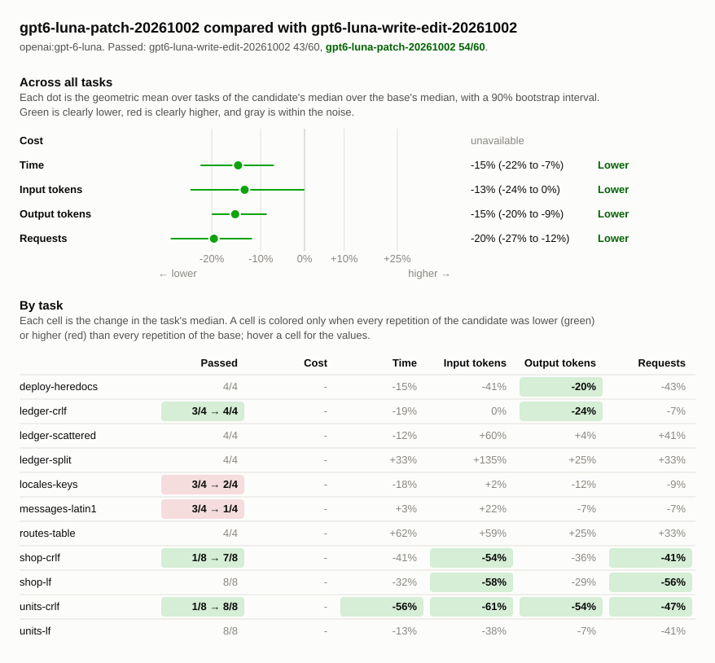
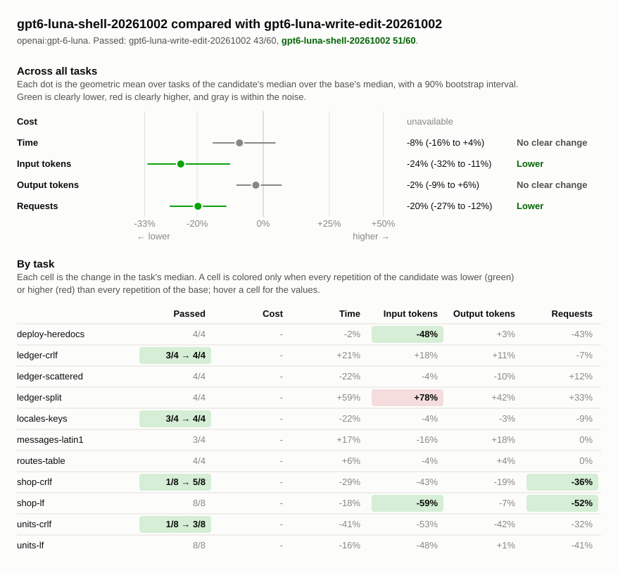

# Write/edit, patch, and shell edits on edit-heavy tasks

## Runs

| Label                         | Commit       | Dirty | Model               | Effort  | Providers | Results |
| ----------------------------- | ------------ | ----- | ------------------- | ------- | --------- | ------- |
| gpt6-luna-write-edit-20261002 | `8954a7f8b1` | no    | `openai:gpt-6-luna` | default | any       | 60      |
| gpt6-luna-patch-20261002      | `3bc8a4a453` | no    | `openai:gpt-6-luna` | default | any       | 60      |
| gpt6-luna-shell-20261002      | `addb7279a7` | no    | `openai:gpt-6-luna` | default | any       | 60      |

## Chart

## Summary

The tool set decides the outcome when a task asks for new code across several
files with Windows (CRLF) line endings. On the two such tasks, `units-crlf` and
`shop-crlf`, patch passed 15 of 16 runs, shell 8 of 16, and write/edit 2 of 16.
Patch beats write/edit with p < 0.0001 and shell with p = 0.015 (two-sided
Fisher exact test). The same tasks with Unix line endings, `units-lf` and
`shop-lf`, passed 16 of 16 runs for every tool set, so the line endings cause
the failures:

- Write/edit: `edit_file` matches `old_text` byte for byte, so text written with
  `\n` is absent from a CRLF file, and the error says only that it was absent.
  The model then rewrites the file with `write_file` in Unix line endings.
- Shell: the model edits with Python `read_text`/`write_text` or `cat >`
  heredocs, which also write Unix line endings.
- Patch: `apply_patch` matches lines regardless of line endings and keeps each
  file's line endings.

On the Unix-line-ending versions, every tool set passes, but write/edit is
slower. Against patch it makes 1.6–2 times the requests (8 and 12 against 5 and
6), sends 1.6–2.4 times the input tokens, and takes 15–48% longer, because it
makes one `edit_file` call per change where patch makes one call for all.

The other tasks show no clear difference. The model makes bulk or patterned
edits (`ledger-*`, `routes-table`, `locales-keys`, `deploy-heredocs`) with
Python scripts through the shell in every tool set, so the edit tools are rarely
used. `messages-latin1` and `locales-keys` differ in pass rate, but no tool set
used its edit tools on them, so the differences are noise in how the model
handled encoding and JSON formatting.

Write/edit is branch bench/tools-write-edit: commit `3bc8a4a453` with `b30f1a0`
(Restore apply_patch) reverted. Patch is commit `3bc8a4a453`. Shell is branch
bench/tools-shell: commit `3bc8a4a453` with `read_file`, `shell`,
`shell_process`, `glob`, and `grep` and without `write_file`, `edit_file`, and
`apply_patch`. All runs use openai:gpt-6-luna with default effort. The CRLF and
Unix-line-ending feature tasks have eight repetitions and the others four.
ChatGPT subscription responses report no cost.

Changes are relative to `gpt6-luna-write-edit-20261002`. A task's values are
medians over its repetitions, with the range in parentheses. Totals are sums of
task medians.

| Metric            | gpt6-luna-write-edit-20261002 | gpt6-luna-patch-20261002 | gpt6-luna-patch-20261002 change | gpt6-luna-shell-20261002 | gpt6-luna-shell-20261002 change |
| ----------------- | ----------------------------: | -----------------------: | ------------------------------: | -----------------------: | ------------------------------: |
| passed            |                         43/60 |                    54/60 |                                 |                    51/60 |                                 |
| seconds           |                           607 |                      492 |                            -19% |                      537 |                            -11% |
| requests          |                          84.5 |                     66.5 |                            -21% |                       66 |                            -22% |
| tool_calls        |                         126.5 |                    101.5 |                            -20% |                       98 |                            -23% |
| failed_calls      |                          13.5 |                        8 |                            -41% |                      6.5 |                            -52% |
| cancelled_calls   |                             0 |                        0 |                                 |                        0 |                                 |
| repeated_calls    |                           4.5 |                        2 |                            -56% |                        0 |                           -100% |
| input_tokens      |                        432747 |                   435002 |                             +1% |                 351379.5 |                            -19% |
| cached_tokens     |                        309248 |                   320000 |                             +3% |                   218368 |                            -29% |
| output_tokens     |                       19197.5 |                    16086 |                            -16% |                  18151.5 |                             -5% |
| reasoning_tokens  |                        1446.5 |                     1427 |                             -1% |                   1663.5 |                            +15% |
| cost              |                   unavailable |              unavailable |                                 |              unavailable |                                 |
| max_input_tokens  |                         85541 |                    90190 |                             +5% |                  88037.5 |                             +3% |
| tool_output_chars |                      161336.5 |                   162672 |                             +1% |                 181211.5 |                            +12% |

### Pass rate and cost by task

| Task               | gpt6-luna-write-edit-20261002 passed | gpt6-luna-patch-20261002 passed | gpt6-luna-shell-20261002 passed | gpt6-luna-write-edit-20261002 cost | gpt6-luna-patch-20261002 cost | gpt6-luna-patch-20261002 change | gpt6-luna-shell-20261002 cost | gpt6-luna-shell-20261002 change |
| ------------------ | -----------------------------------: | ------------------------------: | ------------------------------: | ---------------------------------: | ----------------------------: | ------------------------------: | ----------------------------: | ------------------------------: |
| `deploy-heredocs`  |                                  4/4 |                             4/4 |                             4/4 |                        unavailable |                   unavailable |                                 |                   unavailable |                                 |
| `ledger-crlf`      |                                  3/4 |                             4/4 |                             4/4 |                        unavailable |                   unavailable |                                 |                   unavailable |                                 |
| `ledger-scattered` |                                  4/4 |                             4/4 |                             4/4 |                        unavailable |                   unavailable |                                 |                   unavailable |                                 |
| `ledger-split`     |                                  4/4 |                             4/4 |                             4/4 |                        unavailable |                   unavailable |                                 |                   unavailable |                                 |
| `locales-keys`     |                                  3/4 |                             2/4 |                             4/4 |                        unavailable |                   unavailable |                                 |                   unavailable |                                 |
| `messages-latin1`  |                                  3/4 |                             1/4 |                             3/4 |                        unavailable |                   unavailable |                                 |                   unavailable |                                 |
| `routes-table`     |                                  4/4 |                             4/4 |                             4/4 |                        unavailable |                   unavailable |                                 |                   unavailable |                                 |
| `shop-crlf`        |                                  1/8 |                             7/8 |                             5/8 |                        unavailable |                   unavailable |                                 |                   unavailable |                                 |
| `shop-lf`          |                                  8/8 |                             8/8 |                             8/8 |                        unavailable |                   unavailable |                                 |                   unavailable |                                 |
| `units-crlf`       |                                  1/8 |                             8/8 |                             3/8 |                        unavailable |                   unavailable |                                 |                   unavailable |                                 |
| `units-lf`         |                                  8/8 |                             8/8 |                             8/8 |                        unavailable |                   unavailable |                                 |                   unavailable |                                 |

## Tasks

### `deploy-heredocs`

| Metric               | gpt6-luna-write-edit-20261002 | gpt6-luna-patch-20261002 | gpt6-luna-patch-20261002 change | gpt6-luna-shell-20261002 | gpt6-luna-shell-20261002 change |
| -------------------- | ----------------------------: | -----------------------: | ------------------------------: | -----------------------: | ------------------------------: |
| passed               |                           4/4 |                      4/4 |                                 |                      4/4 |                                 |
| status               |                    finished 4 |               finished 4 |                                 |               finished 4 |                                 |
| seconds              |                    39 (27–49) |               34 (27–39) |                            -15% |               38 (31–43) |                             -2% |
| requests             |                      7 (4–11) |                  4 (4–5) |                            -43% |                        4 |                            -43% |
| tool_calls           |                      8 (4–12) |                4.5 (4–7) |                            -44% |                  5 (4–5) |                            -38% |
| failed_calls         |                             0 |                        0 |                                 |                        0 |                                 |
| cancelled_calls      |                             0 |                        0 |                                 |                        0 |                                 |
| `apply_patch` calls  |                             0 |                        1 |                                 |                        0 |                                 |
| `apply_patch` failed |                             0 |                        0 |                                 |                        0 |                                 |
| `edit_file` calls    |                     3.5 (0–7) |                        0 |                           -100% |                        0 |                           -100% |
| `edit_file` failed   |                             0 |                        0 |                                 |                        0 |                                 |
| `read_file` calls    |                             2 |                  2 (0–2) |                             +0% |                  2 (0–2) |                             +0% |
| `read_file` failed   |                             0 |                        0 |                                 |                        0 |                                 |
| `shell` calls        |                     2.5 (2–3) |                1.5 (1–6) |                            -40% |                  3 (2–5) |                            +20% |
| `shell` failed       |                             0 |                        0 |                                 |                        0 |                                 |
| repeated_calls       |                             0 |                  0 (0–1) |                                 |                        0 |                                 |
| input_tokens         |         25123.5 (14071–45004) |      14897 (14408–19100) |                            -41% |    13036.5 (12217–13830) |                            -48% |
| cached_tokens        |            17152 (9216–31232) |        8448 (6656–12800) |                            -51% |         6144 (5120–6144) |                            -64% |
| output_tokens        |              1141 (1098–1344) |         909.5 (846–1010) |                            -20% |         1172 (1045–1271) |                             +3% |
| reasoning_tokens     |                  129 (56–211) |            85.5 (75–123) |                            -34% |           127.5 (79–141) |                             -1% |
| cost                 |                   unavailable |              unavailable |                                 |              unavailable |                                 |
| max_input_tokens     |              5338 (5246–6904) |       5081.5 (4752–5498) |                             -5% |         4762 (4368–5290) |                            -11% |
| tool_output_chars    |           8240.5 (8131–11730) |       6893.5 (5995–8155) |                            -16% |         7288 (6390–8528) |                            -12% |

### `ledger-crlf`

| Metric               | gpt6-luna-write-edit-20261002 | gpt6-luna-patch-20261002 | gpt6-luna-patch-20261002 change | gpt6-luna-shell-20261002 | gpt6-luna-shell-20261002 change |
| -------------------- | ----------------------------: | -----------------------: | ------------------------------: | -----------------------: | ------------------------------: |
| passed               |                           3/4 |                      4/4 |                                 |                      4/4 |                                 |
| status               |                    finished 4 |               finished 4 |                                 |               finished 4 |                                 |
| seconds              |                    52 (51–59) |               42 (35–52) |                            -19% |              62 (37–115) |                            +21% |
| requests             |                       7 (5–7) |                6.5 (5–9) |                             -7% |                6.5 (5–8) |                             -7% |
| tool_calls           |                       8 (6–9) |               9.5 (7–13) |                            +19% |                7.5 (6–9) |                             -6% |
| failed_calls         |                             1 |                1.5 (1–2) |                            +50% |                  1 (0–2) |                             +0% |
| cancelled_calls      |                             0 |                        0 |                                 |                        0 |                                 |
| `apply_patch` calls  |                             0 |                  2 (1–2) |                                 |                        0 |                                 |
| `apply_patch` failed |                             0 |                  0 (0–1) |                                 |                        0 |                                 |
| `edit_file` calls    |                       0 (0–1) |                        0 |                                 |                        0 |                                 |
| `edit_file` failed   |                       0 (0–1) |                        0 |                                 |                        0 |                                 |
| `glob` calls         |                       0 (0–1) |                  0 (0–1) |                                 |                        0 |                                 |
| `glob` failed        |                             0 |                        0 |                                 |                        0 |                                 |
| `grep` calls         |                       0 (0–1) |                        0 |                                 |                        0 |                                 |
| `grep` failed        |                             0 |                        0 |                                 |                        0 |                                 |
| `read_file` calls    |                       1 (0–3) |                  2 (2–3) |                           +100% |                  2 (0–2) |                           +100% |
| `read_file` failed   |                             0 |                        0 |                                 |                        0 |                                 |
| `shell` calls        |                     6.5 (2–8) |                5.5 (3–8) |                            -15% |                5.5 (4–9) |                            -15% |
| `shell` failed       |                       1 (0–1) |                1.5 (0–2) |                            +50% |                  1 (0–2) |                             +0% |
| repeated_calls       |                             0 |                  1 (0–1) |                                 |                        0 |                                 |
| input_tokens         |           51822 (35019–66281) |      51711 (41767–77632) |                             -0% |      60920 (38878–74682) |                            +18% |
| cached_tokens        |           36608 (24064–49152) |      37632 (28160–52224) |                             +3% |      38144 (23040–52736) |                             +4% |
| output_tokens        |              1838 (1617–2134) |       1398.5 (1241–1599) |                            -24% |       2046.5 (1444–3165) |                            +11% |
| reasoning_tokens     |                 181 (106–235) |          167.5 (146–178) |                             -7% |            258 (140–291) |                            +43% |
| cost                 |                   unavailable |              unavailable |                                 |              unavailable |                                 |
| max_input_tokens     |           12383 (10321–13410) |      11276 (10271–12600) |                             -9% |    13825.5 (11897–17396) |                            +12% |
| tool_output_chars    |         32647.5 (23778–37389) |    26673.5 (23976–31655) |                            -18% |      37758 (31950–46688) |                            +16% |

### `ledger-scattered`

| Metric               | gpt6-luna-write-edit-20261002 | gpt6-luna-patch-20261002 | gpt6-luna-patch-20261002 change | gpt6-luna-shell-20261002 | gpt6-luna-shell-20261002 change |
| -------------------- | ----------------------------: | -----------------------: | ------------------------------: | -----------------------: | ------------------------------: |
| passed               |                           4/4 |                      4/4 |                                 |                      4/4 |                                 |
| status               |                    finished 4 |               finished 4 |                                 |               finished 4 |                                 |
| seconds              |                  108 (52–119) |              95 (93–128) |                            -12% |              84 (68–105) |                            -22% |
| requests             |                    8.5 (7–14) |               12 (10–19) |                            +41% |               9.5 (8–11) |                            +12% |
| tool_calls           |                  10.5 (10–16) |               14 (13–22) |                            +33% |              10.5 (9–13) |                             +0% |
| failed_calls         |                       1 (0–2) |                2.5 (2–4) |                           +150% |                  1 (1–2) |                             +0% |
| cancelled_calls      |                             0 |                        0 |                                 |                        0 |                                 |
| `apply_patch` calls  |                             0 |                3.5 (0–6) |                                 |                        0 |                                 |
| `apply_patch` failed |                             0 |                  1 (0–1) |                                 |                        0 |                                 |
| `edit_file` calls    |                       0 (0–2) |                        0 |                                 |                        0 |                                 |
| `edit_file` failed   |                             0 |                        0 |                                 |                        0 |                                 |
| `glob` calls         |                       0 (0–1) |                0.5 (0–1) |                                 |                  0 (0–1) |                                 |
| `glob` failed        |                             0 |                        0 |                                 |                        0 |                                 |
| `grep` calls         |                       1 (1–2) |                0.5 (0–1) |                            -50% |                  1 (0–2) |                             +0% |
| `grep` failed        |                             0 |                        0 |                                 |                        0 |                                 |
| `read_file` calls    |                       1 (0–3) |                  0 (0–2) |                           -100% |                  1 (0–5) |                             +0% |
| `read_file` failed   |                             0 |                        0 |                                 |                        0 |                                 |
| `shell` calls        |                      9 (6–10) |                11 (6–16) |                            +22% |               7.5 (6–10) |                            -17% |
| `shell` failed       |                       1 (0–2) |                  2 (1–3) |                           +100% |                  1 (1–2) |                             +0% |
| repeated_calls       |                             0 |                  1 (0–2) |                                 |                        0 |                                 |
| input_tokens         |          99161 (71902–210558) | 159074.5 (126948–247085) |                            +60% |     94984 (67550–178547) |                             -4% |
| cached_tokens        |          78336 (54272–182784) |   132352 (100352–219136) |                            +69% |     72960 (48128–150016) |                             -7% |
| output_tokens        |              3784 (1851–4379) |       3931.5 (2894–4440) |                             +4% |         3398 (2689–3790) |                            -10% |
| reasoning_tokens     |                112.5 (89–412) |          283.5 (194–376) |                           +152% |          176.5 (129–262) |                            +57% |
| cost                 |                   unavailable |              unavailable |                                 |              unavailable |                                 |
| max_input_tokens     |           18333 (14895–21389) |      18662 (17827–20467) |                             +2% |    16040.5 (13953–21498) |                            -13% |
| tool_output_chars    |           49742 (32683–58413) |    45128.5 (41754–55191) |                             -9% |      39253 (35957–56596) |                            -21% |

### `ledger-split`

| Metric             | gpt6-luna-write-edit-20261002 | gpt6-luna-patch-20261002 | gpt6-luna-patch-20261002 change | gpt6-luna-shell-20261002 | gpt6-luna-shell-20261002 change |
| ------------------ | ----------------------------: | -----------------------: | ------------------------------: | -----------------------: | ------------------------------: |
| passed             |                           4/4 |                      4/4 |                                 |                      4/4 |                                 |
| status             |                    finished 4 |               finished 4 |                                 |               finished 4 |                                 |
| seconds            |                    34 (25–37) |               45 (26–56) |                            +33% |               54 (30–79) |                            +59% |
| requests           |                     4.5 (4–5) |                  6 (3–6) |                            +33% |                  6 (4–7) |                            +33% |
| tool_calls         |                     3.5 (3–6) |                  8 (4–8) |                           +129% |               6.5 (6–10) |                            +86% |
| failed_calls       |                       0 (0–1) |                        0 |                                 |                  0 (0–1) |                                 |
| cancelled_calls    |                             0 |                        0 |                                 |                        0 |                                 |
| `glob` calls       |                       0 (0–1) |                  0 (0–1) |                                 |                0.5 (0–1) |                                 |
| `glob` failed      |                             0 |                        0 |                                 |                        0 |                                 |
| `grep` calls       |                       0 (0–1) |                0.5 (0–1) |                                 |                0.5 (0–2) |                                 |
| `grep` failed      |                             0 |                        0 |                                 |                        0 |                                 |
| `read_file` calls  |                       0 (0–1) |                1.5 (1–3) |                                 |                0.5 (0–2) |                                 |
| `read_file` failed |                             0 |                        0 |                                 |                  0 (0–1) |                                 |
| `shell` calls      |                       3 (3–4) |                  5 (2–6) |                            +67% |                5.5 (3–7) |                            +83% |
| `shell` failed     |                       0 (0–1) |                        0 |                                 |                        0 |                                 |
| repeated_calls     |                             0 |                        0 |                                 |                        0 |                                 |
| input_tokens       |         21864.5 (13826–31998) |     51388 (27082–101527) |                           +135% |    38921.5 (37034–81188) |                            +78% |
| cached_tokens      |            13312 (4608–21504) |      38400 (14848–76800) |                           +188% |      25088 (22528–59904) |                            +88% |
| output_tokens      |             1098.5 (926–1279) |        1376.5 (913–1470) |                            +25% |       1556.5 (1008–2236) |                            +42% |
| reasoning_tokens   |                  113 (84–123) |             101 (63–181) |                            -11% |           115.5 (57–229) |                             +2% |
| cost               |                   unavailable |              unavailable |                                 |              unavailable |                                 |
| max_input_tokens   |            6828.5 (5296–9285) |       13193 (9552–23812) |                            +93% |       12373 (7128–16261) |                            +81% |
| tool_output_chars  |         13880.5 (10290–22194) |    32389.5 (19673–65982) |                           +133% |      32432 (11941–40743) |                           +134% |

### `locales-keys`

| Metric             | gpt6-luna-write-edit-20261002 | gpt6-luna-patch-20261002 | gpt6-luna-patch-20261002 change | gpt6-luna-shell-20261002 | gpt6-luna-shell-20261002 change |
| ------------------ | ----------------------------: | -----------------------: | ------------------------------: | -----------------------: | ------------------------------: |
| passed             |                           3/4 |                      2/4 |                                 |                      4/4 |                                 |
| status             |                    finished 4 |               finished 4 |                                 |               finished 4 |                                 |
| seconds            |                    50 (32–60) |               41 (36–44) |                            -18% |               39 (35–66) |                            -22% |
| requests           |                     5.5 (5–6) |                  5 (4–5) |                             -9% |                  5 (5–6) |                             -9% |
| tool_calls         |                       7 (6–8) |                  5 (4–8) |                            -29% |                  7 (6–7) |                             +0% |
| failed_calls       |                       0 (0–1) |                        0 |                                 |                        0 |                                 |
| cancelled_calls    |                             0 |                        0 |                                 |                        0 |                                 |
| `glob` calls       |                       1 (0–1) |                  0 (0–1) |                           -100% |                  1 (0–1) |                             +0% |
| `glob` failed      |                             0 |                        0 |                                 |                        0 |                                 |
| `grep` calls       |                     0.5 (0–1) |                  0 (0–1) |                           -100% |                0.5 (0–1) |                             +0% |
| `grep` failed      |                             0 |                        0 |                                 |                        0 |                                 |
| `read_file` calls  |                       1 (0–1) |                0.5 (0–5) |                            -50% |                  1 (0–1) |                             +0% |
| `read_file` failed |                             0 |                        0 |                                 |                        0 |                                 |
| `shell` calls      |                     4.5 (4–7) |                3.5 (2–5) |                            -22% |                  4 (4–7) |                            -11% |
| `shell` failed     |                       0 (0–1) |                        0 |                                 |                        0 |                                 |
| repeated_calls     |                             0 |                        0 |                                 |                        0 |                                 |
| input_tokens       |         24138.5 (23100–29731) |      24574 (18275–27616) |                             +2% |    23247.5 (19687–35446) |                             -4% |
| cached_tokens      |           13824 (12288–16384) |       14336 (9216–16896) |                             +4% |       12800 (9728–22528) |                             -7% |
| output_tokens      |            1398.5 (1232–1675) |         1229 (1059–1427) |                            -12% |         1363 (1192–1568) |                             -3% |
| reasoning_tokens   |                 167 (144–218) |             116 (54–268) |                            -31% |          188.5 (163–295) |                            +13% |
| cost               |                   unavailable |              unavailable |                                 |              unavailable |                                 |
| max_input_tokens   |              8434 (7801–8734) |         8330 (7806–8997) |                             -1% |         7949 (7547–9711) |                             -6% |
| tool_output_chars  |           13965 (12253–15262) |    13391.5 (11830–14734) |                             -4% |      14084 (12715–17770) |                             +1% |

### `messages-latin1`

| Metric             | gpt6-luna-write-edit-20261002 | gpt6-luna-patch-20261002 | gpt6-luna-patch-20261002 change | gpt6-luna-shell-20261002 | gpt6-luna-shell-20261002 change |
| ------------------ | ----------------------------: | -----------------------: | ------------------------------: | -----------------------: | ------------------------------: |
| passed             |                           3/4 |                      1/4 |                                 |                      3/4 |                                 |
| status             |                    finished 4 |               finished 4 |                                 |               finished 4 |                                 |
| seconds            |                    40 (34–56) |               42 (36–50) |                             +3% |               47 (44–63) |                            +17% |
| requests           |                     7.5 (6–8) |                  7 (6–7) |                             -7% |                7.5 (7–9) |                             +0% |
| tool_calls         |                     10 (9–13) |               9.5 (8–12) |                             -5% |                10 (9–14) |                             +0% |
| failed_calls       |                       2 (2–3) |                        2 |                             +0% |                1.5 (1–3) |                            -25% |
| cancelled_calls    |                             0 |                        0 |                                 |                        0 |                                 |
| `glob` calls       |                     0.5 (0–1) |                0.5 (0–1) |                             +0% |                  0 (0–2) |                           -100% |
| `glob` failed      |                             0 |                        0 |                                 |                        0 |                                 |
| `read_file` calls  |                       3 (2–3) |                  2 (2–3) |                            -33% |                2.5 (0–3) |                            -17% |
| `read_file` failed |                       1 (1–2) |                        1 |                             +0% |                  1 (0–1) |                             +0% |
| `shell` calls      |                       7 (6–9) |                  7 (6–8) |                             +0% |                8.5 (7–9) |                            +21% |
| `shell` failed     |                             1 |                        1 |                             +0% |                  1 (0–2) |                             +0% |
| repeated_calls     |                             0 |                        0 |                                 |                        0 |                                 |
| input_tokens       |           24543 (15451–29582) |    29858.5 (18402–36344) |                            +22% |      20690 (18271–38036) |                            -16% |
| cached_tokens      |            16896 (8704–18432) |      20736 (12288–27136) |                            +23% |       11264 (8192–25088) |                            -33% |
| output_tokens      |               1239 (971–1625) |         1158 (1045–1626) |                             -7% |       1460.5 (1319–1605) |                            +18% |
| reasoning_tokens   |                 179 (123–420) |            314 (139–431) |                            +75% |            225 (174–324) |                            +26% |
| cost               |                   unavailable |              unavailable |                                 |              unavailable |                                 |
| max_input_tokens   |              4368 (3650–7228) |       6162.5 (3947–7716) |                            +41% |       3905.5 (3791–7739) |                            -11% |
| tool_output_chars  |              3504 (2694–8433) |         5198 (2050–8146) |                            +48% |         3033 (2798–8715) |                            -13% |

### `routes-table`

| Metric               | gpt6-luna-write-edit-20261002 | gpt6-luna-patch-20261002 | gpt6-luna-patch-20261002 change | gpt6-luna-shell-20261002 | gpt6-luna-shell-20261002 change |
| -------------------- | ----------------------------: | -----------------------: | ------------------------------: | -----------------------: | ------------------------------: |
| passed               |                           4/4 |                      4/4 |                                 |                      4/4 |                                 |
| status               |                    finished 4 |               finished 4 |                                 |               finished 4 |                                 |
| seconds              |                    20 (18–36) |               32 (20–32) |                            +62% |               21 (18–26) |                             +6% |
| requests             |                       3 (3–5) |                  4 (3–6) |                            +33% |                  3 (3–4) |                             +0% |
| tool_calls           |                       3 (3–6) |                  4 (3–8) |                            +33% |                3.5 (3–4) |                            +17% |
| failed_calls         |                             0 |                        0 |                                 |                        0 |                                 |
| cancelled_calls      |                             0 |                        0 |                                 |                        0 |                                 |
| `apply_patch` calls  |                             0 |                  0 (0–1) |                                 |                        0 |                                 |
| `apply_patch` failed |                             0 |                        0 |                                 |                        0 |                                 |
| `read_file` calls    |                       2 (2–3) |                2.5 (0–3) |                            +25% |                  2 (2–3) |                             +0% |
| `read_file` failed   |                             0 |                        0 |                                 |                        0 |                                 |
| `shell` calls        |                       1 (1–3) |                2.5 (1–4) |                           +150% |                  1 (1–2) |                             +0% |
| `shell` failed       |                             0 |                        0 |                                 |                        0 |                                 |
| repeated_calls       |                             0 |                        0 |                                 |                        0 |                                 |
| input_tokens         |           16466 (16403–32864) |    26153.5 (15719–45857) |                            +59% |    15788.5 (15737–23092) |                             -4% |
| cached_tokens        |             8960 (8192–22528) |       15872 (5632–33280) |                            +77% |        6656 (6656–13312) |                            -26% |
| output_tokens        |               688.5 (624–851) |           860 (709–1268) |                            +25% |          718.5 (689–757) |                             +4% |
| reasoning_tokens     |                  32.5 (25–41) |               30 (24–63) |                             -8% |               26 (24–35) |                            -20% |
| cost                 |                   unavailable |              unavailable |                                 |              unavailable |                                 |
| max_input_tokens     |              7679 (7611–8213) |       8556.5 (7096–9931) |                            +11% |       7489.5 (7452–7658) |                             -2% |
| tool_output_chars    |           17018 (17018–17970) |    17470.5 (14729–21828) |                             +3% |      17043 (17018–17731) |                             +0% |

### `shop-crlf`

| Metric               | gpt6-luna-write-edit-20261002 | gpt6-luna-patch-20261002 | gpt6-luna-patch-20261002 change | gpt6-luna-shell-20261002 | gpt6-luna-shell-20261002 change |
| -------------------- | ----------------------------: | -----------------------: | ------------------------------: | -----------------------: | ------------------------------: |
| passed               |                           1/8 |                      7/8 |                                 |                      5/8 |                                 |
| status               |                    finished 8 |               finished 8 |                                 |               finished 8 |                                 |
| seconds              |                   90 (57–127) |               53 (36–85) |                            -41% |               64 (50–90) |                            -29% |
| requests             |                    11 (10–16) |                6.5 (5–8) |                            -41% |                  7 (5–9) |                            -36% |
| tool_calls           |                  21.5 (15–25) |              14.5 (7–18) |                            -33% |               14 (11–16) |                            -35% |
| failed_calls         |                     3.5 (1–5) |                1.5 (0–2) |                            -57% |                  1 (0–2) |                            -71% |
| cancelled_calls      |                             0 |                        0 |                                 |                        0 |                                 |
| `apply_patch` calls  |                             0 |                  1 (1–2) |                                 |                        0 |                                 |
| `apply_patch` failed |                             0 |                        0 |                                 |                        0 |                                 |
| `edit_file` calls    |                       2 (1–7) |                        0 |                           -100% |                        0 |                           -100% |
| `edit_file` failed   |                       2 (1–5) |                        0 |                           -100% |                        0 |                           -100% |
| `glob` calls         |                       1 (0–1) |                  1 (0–1) |                             +0% |                  1 (0–1) |                             +0% |
| `glob` failed        |                             0 |                        0 |                                 |                        0 |                                 |
| `grep` calls         |                       0 (0–1) |                        0 |                                 |                        0 |                                 |
| `grep` failed        |                             0 |                        0 |                                 |                        0 |                                 |
| `read_file` calls    |                      7 (6–10) |                  7 (1–7) |                             +0% |                  7 (6–7) |                             +0% |
| `read_file` failed   |                             0 |                        0 |                                 |                        0 |                                 |
| `shell` calls        |                      4 (2–12) |                  6 (3–8) |                            +50% |                  6 (3–8) |                            +50% |
| `shell` failed       |                     0.5 (0–3) |                1.5 (0–2) |                           +200% |                  1 (0–2) |                           +100% |
| `write_file` calls   |                       4 (0–4) |                        0 |                           -100% |                        0 |                           -100% |
| `write_file` failed  |                             0 |                        0 |                                 |                        0 |                                 |
| repeated_calls       |                     0.5 (0–4) |                  0 (0–2) |                           -100% |                        0 |                           -100% |
| input_tokens         |         54802.5 (36634–74356) |    25235.5 (17018–36295) |                            -54% |    31159.5 (15019–45645) |                            -43% |
| cached_tokens        |           41728 (25600–58368) |      17664 (10752–27648) |                            -58% |       19968 (7680–30720) |                            -52% |
| output_tokens        |            2654.5 (2146–3372) |         1709 (1386–2146) |                            -36% |       2137.5 (1748–2658) |                            -19% |
| reasoning_tokens     |                 215 (122–476) |            137.5 (0–321) |                            -36% |           205.5 (87–491) |                             -4% |
| cost                 |                   unavailable |              unavailable |                                 |              unavailable |                                 |
| max_input_tokens     |            6582.5 (5125–9799) |       5332.5 (4661–7856) |                            -19% |        7465 (4906–10404) |                            +13% |
| tool_output_chars    |             6321 (4405–17750) |        4851 (4026–13921) |                            -23% |     13853.5 (4039–22952) |                           +119% |

### `shop-lf`

| Metric               | gpt6-luna-write-edit-20261002 | gpt6-luna-patch-20261002 | gpt6-luna-patch-20261002 change | gpt6-luna-shell-20261002 | gpt6-luna-shell-20261002 change |
| -------------------- | ----------------------------: | -----------------------: | ------------------------------: | -----------------------: | ------------------------------: |
| passed               |                           8/8 |                      8/8 |                                 |                      8/8 |                                 |
| status               |                    finished 8 |               finished 8 |                                 |               finished 8 |                                 |
| seconds              |                    65 (58–85) |               44 (36–74) |                            -32% |               54 (38–92) |                            -18% |
| requests             |                  12.5 (10–14) |                5.5 (5–7) |                            -56% |                  6 (5–7) |                            -52% |
| tool_calls           |                    19 (15–21) |                13 (8–17) |                            -32% |             13.5 (10–15) |                            -29% |
| failed_calls         |                       1 (0–2) |                0.5 (0–1) |                            -50% |                  1 (0–2) |                             +0% |
| cancelled_calls      |                             0 |                        0 |                                 |                        0 |                                 |
| `apply_patch` calls  |                             0 |                  1 (1–2) |                                 |                        0 |                                 |
| `apply_patch` failed |                             0 |                        0 |                                 |                        0 |                                 |
| `edit_file` calls    |                      8 (4–10) |                        0 |                           -100% |                        0 |                           -100% |
| `edit_file` failed   |                             0 |                        0 |                                 |                        0 |                                 |
| `glob` calls         |                       1 (0–1) |                  1 (0–1) |                             +0% |                0.5 (0–1) |                            -50% |
| `glob` failed        |                             0 |                        0 |                                 |                        0 |                                 |
| `grep` calls         |                       0 (0–1) |                  0 (0–1) |                                 |                  0 (0–1) |                                 |
| `grep` failed        |                             0 |                        0 |                                 |                        0 |                                 |
| `read_file` calls    |                       7 (2–7) |                  7 (2–7) |                             +0% |                  7 (6–7) |                             +0% |
| `read_file` failed   |                             0 |                        0 |                                 |                        0 |                                 |
| `shell` calls        |                       4 (2–6) |                  5 (2–8) |                            +25% |                  6 (3–8) |                            +50% |
| `shell` failed       |                       1 (0–2) |                0.5 (0–1) |                            -50% |                  1 (0–2) |                             +0% |
| `write_file` calls   |                       0 (0–2) |                        0 |                                 |                        0 |                                 |
| `write_file` failed  |                             0 |                        0 |                                 |                        0 |                                 |
| repeated_calls       |                             0 |                  0 (0–1) |                                 |                        0 |                                 |
| input_tokens         |         47144.5 (38578–54053) |    19676.5 (17692–29003) |                            -58% |    19373.5 (15492–29453) |                            -59% |
| cached_tokens        |           35072 (27648–40960) |      13056 (10240–18432) |                            -63% |        9984 (4096–18944) |                            -72% |
| output_tokens        |              2070 (1854–2296) |       1478.5 (1289–2062) |                            -29% |       1920.5 (1486–2629) |                             -7% |
| reasoning_tokens     |                130.5 (83–234) |             81.5 (0–223) |                            -38% |              125 (0–176) |                             -4% |
| cost                 |                   unavailable |              unavailable |                                 |              unavailable |                                 |
| max_input_tokens     |              6093 (4884–6584) |         5218 (4833–5907) |                            -14% |       5998.5 (5248–6584) |                             -2% |
| tool_output_chars    |              8235 (4390–8792) |       4716.5 (4132–8188) |                            -43% |      8303.5 (7547–11447) |                             +1% |

### `units-crlf`

| Metric               | gpt6-luna-write-edit-20261002 | gpt6-luna-patch-20261002 | gpt6-luna-patch-20261002 change | gpt6-luna-shell-20261002 | gpt6-luna-shell-20261002 change |
| -------------------- | ----------------------------: | -----------------------: | ------------------------------: | -----------------------: | ------------------------------: |
| passed               |                           1/8 |                      8/8 |                                 |                      3/8 |                                 |
| status               |                    finished 8 |               finished 8 |                                 |               finished 8 |                                 |
| seconds              |                    71 (48–79) |               31 (28–38) |                            -56% |               42 (34–83) |                            -41% |
| requests             |                    9.5 (7–11) |                  5 (5–6) |                            -47% |                6.5 (5–9) |                            -32% |
| tool_calls           |                    22 (19–25) |                10 (8–11) |                            -55% |              10.5 (9–14) |                            -52% |
| failed_calls         |                       5 (5–8) |                  0 (0–1) |                           -100% |                  1 (0–2) |                            -80% |
| cancelled_calls      |                             0 |                        0 |                                 |                        0 |                                 |
| `apply_patch` calls  |                             0 |                        1 |                                 |                        0 |                                 |
| `apply_patch` failed |                             0 |                        0 |                                 |                        0 |                                 |
| `edit_file` calls    |                     6.5 (5–7) |                        0 |                           -100% |                        0 |                           -100% |
| `edit_file` failed   |                       5 (5–6) |                        0 |                           -100% |                        0 |                           -100% |
| `glob` calls         |                       0 (0–1) |                0.5 (0–1) |                                 |                  0 (0–1) |                                 |
| `glob` failed        |                             0 |                        0 |                                 |                  0 (0–1) |                                 |
| `grep` calls         |                       0 (0–1) |                        0 |                                 |                        0 |                                 |
| `grep` failed        |                             0 |                        0 |                                 |                        0 |                                 |
| `read_file` calls    |                     10 (6–10) |                  6 (5–6) |                            -40% |                  6 (6–7) |                            -40% |
| `read_file` failed   |                             0 |                        0 |                                 |                        0 |                                 |
| `shell` calls        |                     3.5 (2–6) |                  2 (2–3) |                            -43% |                4.5 (3–7) |                            +29% |
| `shell` failed       |                       0 (0–2) |                  0 (0–1) |                                 |                  1 (0–2) |                                 |
| `write_file` calls   |                       4 (0–4) |                        0 |                           -100% |                        0 |                           -100% |
| `write_file` failed  |                             0 |                        0 |                                 |                        0 |                                 |
| repeated_calls       |                       4 (0–5) |                        0 |                           -100% |                  0 (0–1) |                           -100% |
| input_tokens         |         41725.5 (25299–45960) |      16246 (14897–20703) |                            -61% |    19756.5 (12825–35538) |                            -53% |
| cached_tokens        |           30464 (17920–35328) |       10752 (8192–14336) |                            -65% |        9472 (5120–20480) |                            -69% |
| output_tokens        |            2170.5 (1875–2559) |          1001 (939–1191) |                            -54% |       1249.5 (1045–2021) |                            -42% |
| reasoning_tokens     |               134.5 (100–382) |              49 (19–112) |                            -64% |           144.5 (45–289) |                             +7% |
| cost                 |                   unavailable |              unavailable |                                 |              unavailable |                                 |
| max_input_tokens     |              5634 (5359–7266) |         4173 (3814–4383) |                            -26% |         4385 (3507–6915) |                            -22% |
| tool_output_chars    |            4839.5 (4723–8990) |         2995 (2444–3179) |                            -38% |      5056.5 (2829–11062) |                             +4% |

### `units-lf`

| Metric               | gpt6-luna-write-edit-20261002 | gpt6-luna-patch-20261002 | gpt6-luna-patch-20261002 change | gpt6-luna-shell-20261002 | gpt6-luna-shell-20261002 change |
| -------------------- | ----------------------------: | -----------------------: | ------------------------------: | -----------------------: | ------------------------------: |
| passed               |                           8/8 |                      8/8 |                                 |                      8/8 |                                 |
| status               |                    finished 8 |               finished 8 |                                 |               finished 8 |                                 |
| seconds              |                   38 (28–100) |               33 (29–40) |                            -13% |               32 (27–46) |                            -16% |
| requests             |                    8.5 (5–10) |                  5 (5–7) |                            -41% |                  5 (5–6) |                            -41% |
| tool_calls           |                    14 (13–15) |               9.5 (9–12) |                            -32% |                10 (9–11) |                            -29% |
| failed_calls         |                             0 |                  0 (0–1) |                                 |                  0 (0–1) |                                 |
| cancelled_calls      |                             0 |                        0 |                                 |                        0 |                                 |
| `apply_patch` calls  |                             0 |                        1 |                                 |                        0 |                                 |
| `apply_patch` failed |                             0 |                        0 |                                 |                        0 |                                 |
| `edit_file` calls    |                             6 |                        0 |                           -100% |                        0 |                           -100% |
| `edit_file` failed   |                             0 |                        0 |                                 |                        0 |                                 |
| `glob` calls         |                       0 (0–1) |                  0 (0–1) |                                 |                0.5 (0–1) |                                 |
| `glob` failed        |                             0 |                        0 |                                 |                        0 |                                 |
| `grep` calls         |                             0 |                  0 (0–1) |                                 |                  0 (0–1) |                                 |
| `grep` failed        |                             0 |                        0 |                                 |                        0 |                                 |
| `read_file` calls    |                       6 (5–6) |                        6 |                             +0% |                  6 (5–6) |                             +0% |
| `read_file` failed   |                             0 |                        0 |                                 |                        0 |                                 |
| `shell` calls        |                             2 |                  2 (2–5) |                             +0% |                  3 (2–5) |                            +50% |
| `shell` failed       |                             0 |                  0 (0–1) |                                 |                  0 (0–1) |                                 |
| repeated_calls       |                             0 |                        0 |                                 |                        0 |                                 |
| input_tokens         |           25956 (14288–31367) |    16187.5 (15909–26812) |                            -38% |      13502 (12217–17456) |                            -48% |
| cached_tokens        |            16896 (8704–23552) |       10752 (7168–18944) |                            -36% |         5888 (3072–9216) |                            -65% |
| output_tokens        |              1115 (1020–1135) |        1034.5 (942–1402) |                             -7% |          1129 (952–1392) |                             +1% |
| reasoning_tokens     |                  52.5 (32–73) |            61.5 (37–160) |                            +17% |             71.5 (35–90) |                            +36% |
| cost                 |                   unavailable |              unavailable |                                 |              unavailable |                                 |
| max_input_tokens     |              3868 (3707–3918) |         4205 (4073–5312) |                             +9% |         3844 (3413–4445) |                             -1% |
| tool_output_chars    |            2943.5 (2856–3014) |       2964.5 (2871–5292) |                             +1% |         3107 (2578–5158) |                             +6% |
