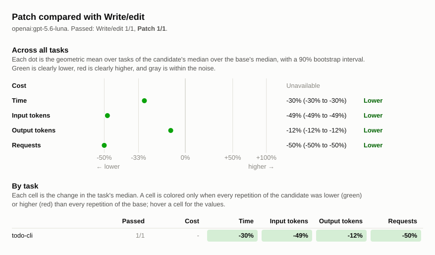

# Benchmark comparison: luna-before-patch-20261001, luna-after-patch-20261001

## Runs

| Label                      | Commit       | Dirty | Model                 | Effort  | Providers | Results |
| -------------------------- | ------------ | ----- | --------------------- | ------- | --------- | ------- |
| luna-before-patch-20261001 | `e610384016` | no    | `openai:gpt-5.6-luna` | default | any       | 1       |
| luna-after-patch-20261001  | `93dee39560` | no    | `openai:gpt-5.6-luna` | default | any       | 1       |

## Chart

## Summary

Both runs used openai:gpt-5.6-luna with default effort. Each commit has one
repetition, so these results do not establish a consistent performance
difference. The later commit also includes the transcript rendering change after
apply_patch was restored. Both runs passed all three generated unit tests and
the benchmark check.

The earlier run finished, but metric collection failed on unavailable OpenAI
cost. Its approximately 64.0-second duration was recovered from answer.txt and
check.txt creation timestamps; the other metrics came from the saved session
database. The later run used the normal runner timer. OpenAI cost is unavailable
for both runs and is marked unavailable in the chart. No repository code was
changed.

Changes are relative to `luna-before-patch-20261001`. A task's values are
medians over its repetitions, with the range in parentheses. Totals are sums of
task medians.

| Metric            | luna-before-patch-20261001 | luna-after-patch-20261001 | Change |
| ----------------- | -------------------------: | ------------------------: | -----: |
| passed            |                        1/1 |                       1/1 |        |
| seconds           |                         64 |                        45 |   -30% |
| requests          |                          8 |                         4 |   -50% |
| tool_calls        |                          8 |                         5 |   -38% |
| failed_calls      |                          0 |                         0 |        |
| cancelled_calls   |                          0 |                         0 |        |
| repeated_calls    |                          0 |                         0 |        |
| input_tokens      |                      24845 |                     12765 |   -49% |
| cached_tokens     |                      10752 |                      3072 |   -71% |
| output_tokens     |                       2264 |                      1999 |   -12% |
| reasoning_tokens  |                        304 |                       136 |   -55% |
| cost              |                unavailable |               unavailable |        |
| max_input_tokens  |                       4089 |                      4305 |    +5% |
| tool_output_chars |                        646 |                       649 |    +0% |

### Pass rate and cost by task

| Task       | luna-before-patch-20261001 passed | luna-after-patch-20261001 passed | luna-before-patch-20261001 cost | luna-after-patch-20261001 cost | Change |
| ---------- | --------------------------------: | -------------------------------: | ------------------------------: | -----------------------------: | -----: |
| `todo-cli` |                               1/1 |                              1/1 |                     unavailable |                    unavailable |        |

## Tasks

### `todo-cli`

| Metric               | luna-before-patch-20261001 | luna-after-patch-20261001 | Change |
| -------------------- | -------------------------: | ------------------------: | -----: |
| passed               |                        1/1 |                       1/1 |        |
| status               |                 finished 1 |                finished 1 |        |
| seconds              |                         64 |                        45 |   -30% |
| requests             |                          8 |                         4 |   -50% |
| tool_calls           |                          8 |                         5 |   -38% |
| failed_calls         |                          0 |                         0 |        |
| cancelled_calls      |                          0 |                         0 |        |
| `apply_patch` calls  |                          0 |                         1 |        |
| `apply_patch` failed |                          0 |                         0 |        |
| `edit_file` calls    |                          2 |                         0 |  -100% |
| `edit_file` failed   |                          0 |                         0 |        |
| `glob` calls         |                          0 |                         1 |        |
| `glob` failed        |                          0 |                         0 |        |
| `shell` calls        |                          3 |                         3 |    +0% |
| `shell` failed       |                          0 |                         0 |        |
| `write_file` calls   |                          3 |                         0 |  -100% |
| `write_file` failed  |                          0 |                         0 |        |
| repeated_calls       |                          0 |                         0 |        |
| input_tokens         |                      24845 |                     12765 |   -49% |
| cached_tokens        |                      10752 |                      3072 |   -71% |
| output_tokens        |                       2264 |                      1999 |   -12% |
| reasoning_tokens     |                        304 |                       136 |   -55% |
| cost                 |                unavailable |               unavailable |        |
| max_input_tokens     |                       4089 |                      4305 |    +5% |
| tool_output_chars    |                        646 |                       649 |    +0% |
