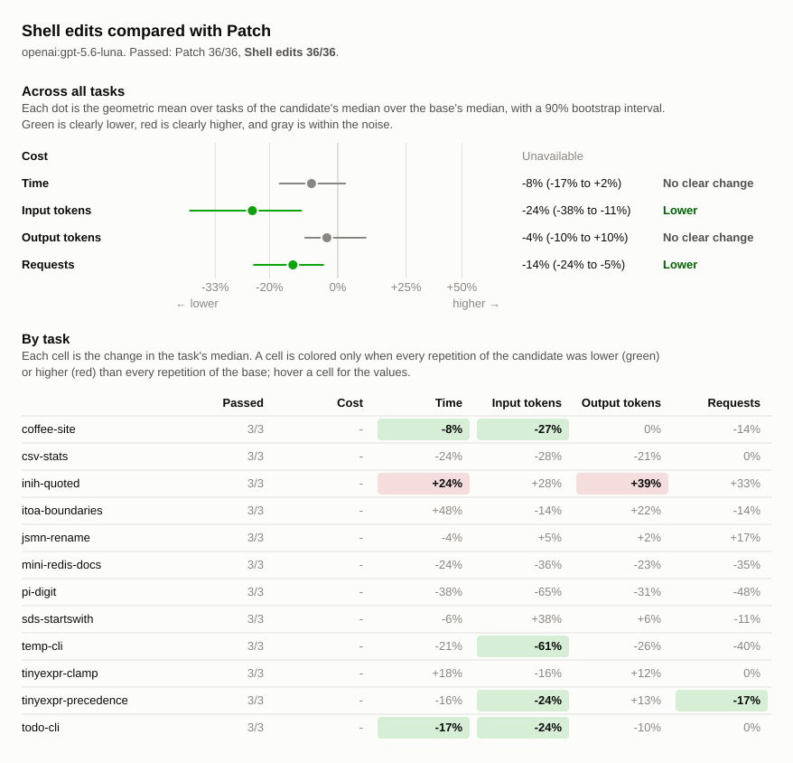

# Shell edits compared with Patch

## Runs

| Label                        | Commit       | Dirty | Model                 | Effort  | Providers | Results |
| ---------------------------- | ------------ | ----- | --------------------- | ------- | --------- | ------- |
| luna-patch-3x-20261001       | `93dee39560` | no    | `openai:gpt-5.6-luna` | default | any       | 36      |
| luna-shell-edits-3x-20261002 | `11c9e9fec7` | no    | `openai:gpt-5.6-luna` | default | any       | 36      |

## Chart

## Summary

Shell edits is branch bench/shell-edits, commit `11c9e9fec7`, based on the
previously benchmarked Patch commit `93dee39560`. It retains the original
read_file tool unchanged, plus shell, shell_process, glob, and grep. Only
write_file, edit_file, and apply_patch are absent; changes use shell commands.
The comparison reuses the saved three repetitions per scenario for the other
tool set. All runs use openai:gpt-5.6-luna with default effort, four concurrent
runs, and the same prompts and checks. OpenAI cost is unavailable.

Changes are relative to `luna-patch-3x-20261001`. A task's values are medians
over its repetitions, with the range in parentheses. Totals are sums of task
medians.

| Metric            | luna-patch-3x-20261001 | luna-shell-edits-3x-20261002 | Change |
| ----------------- | ---------------------: | ---------------------------: | -----: |
| passed            |                  36/36 |                        36/36 |        |
| seconds           |                   1032 |                          888 |   -14% |
| requests          |                    119 |                           99 |   -17% |
| tool_calls        |                    145 |                          119 |   -18% |
| failed_calls      |                      7 |                            4 |   -43% |
| cancelled_calls   |                      0 |                            0 |        |
| repeated_calls    |                      8 |                            0 |  -100% |
| input_tokens      |                1309268 |                       986881 |   -25% |
| cached_tokens     |                1041920 |                       728576 |   -30% |
| output_tokens     |                  36859 |                        33089 |   -10% |
| reasoning_tokens  |                  11935 |                        10973 |    -8% |
| cost              |            unavailable |                  unavailable |        |
| max_input_tokens  |                 147451 |                       146405 |    -1% |
| tool_output_chars |                 284347 |                       321386 |   +13% |

### Pass rate and cost by task

| Task                  | luna-patch-3x-20261001 passed | luna-shell-edits-3x-20261002 passed | luna-patch-3x-20261001 cost | luna-shell-edits-3x-20261002 cost | Change |
| --------------------- | ----------------------------: | ----------------------------------: | --------------------------: | --------------------------------: | -----: |
| `coffee-site`         |                           3/3 |                                 3/3 |                 unavailable |                       unavailable |        |
| `csv-stats`           |                           3/3 |                                 3/3 |                 unavailable |                       unavailable |        |
| `inih-quoted`         |                           3/3 |                                 3/3 |                 unavailable |                       unavailable |        |
| `itoa-boundaries`     |                           3/3 |                                 3/3 |                 unavailable |                       unavailable |        |
| `jsmn-rename`         |                           3/3 |                                 3/3 |                 unavailable |                       unavailable |        |
| `mini-redis-docs`     |                           3/3 |                                 3/3 |                 unavailable |                       unavailable |        |
| `pi-digit`            |                           3/3 |                                 3/3 |                 unavailable |                       unavailable |        |
| `sds-startswith`      |                           3/3 |                                 3/3 |                 unavailable |                       unavailable |        |
| `temp-cli`            |                           3/3 |                                 3/3 |                 unavailable |                       unavailable |        |
| `tinyexpr-clamp`      |                           3/3 |                                 3/3 |                 unavailable |                       unavailable |        |
| `tinyexpr-precedence` |                           3/3 |                                 3/3 |                 unavailable |                       unavailable |        |
| `todo-cli`            |                           3/3 |                                 3/3 |                 unavailable |                       unavailable |        |

## Comparison without pi-digit

Excluding pi-digit and giving each remaining scenario equal weight, Shell edits
uses 19% fewer input tokens and 17% fewer tool calls than Patch. The charts
above retain all 12 scenarios.

## Tasks

### `coffee-site`

| Metric                 | luna-patch-3x-20261001 | luna-shell-edits-3x-20261002 | Change |
| ---------------------- | ---------------------: | ---------------------------: | -----: |
| passed                 |                    3/3 |                          3/3 |        |
| status                 |             finished 3 |                   finished 3 |        |
| seconds                |          111 (109–112) |                 102 (98–108) |    -8% |
| requests               |                7 (6–7) |                      6 (4–6) |   -14% |
| tool_calls             |                6 (6–7) |                      5 (4–6) |   -17% |
| failed_calls           |                      0 |                            0 |        |
| cancelled_calls        |                      0 |                            0 |        |
| `apply_patch` calls    |                2 (1–2) |                            0 |  -100% |
| `apply_patch` failed   |                      0 |                            0 |        |
| `glob` calls           |                0 (0–1) |                      0 (0–1) |        |
| `glob` failed          |                      0 |                            0 |        |
| `shell` calls          |                3 (3–4) |                            4 |   +33% |
| `shell` failed         |                      0 |                            0 |        |
| `shell_process` calls  |                      1 |                      1 (0–1) |    +0% |
| `shell_process` failed |                      0 |                            0 |        |
| repeated_calls         |                      0 |                            0 |        |
| input_tokens           |    39447 (31257–41023) |          28620 (15788–28956) |   -27% |
| cached_tokens          |    25088 (20992–29696) |           16896 (5632–16896) |   -33% |
| output_tokens          |       5046 (4640–5394) |             5035 (4889–5143) |    -0% |
| reasoning_tokens       |           160 (62–180) |                116 (111–117) |   -28% |
| cost                   |            unavailable |                  unavailable |        |
| max_input_tokens       |       7447 (7052–7761) |             6769 (6565–6871) |    -9% |
| tool_output_chars      |          944 (912–969) |              1021 (451–1236) |    +8% |

### `csv-stats`

| Metric               | luna-patch-3x-20261001 | luna-shell-edits-3x-20261002 | Change |
| -------------------- | ---------------------: | ---------------------------: | -----: |
| passed               |                    3/3 |                          3/3 |        |
| status               |             finished 3 |                   finished 3 |        |
| seconds              |            87 (63–103) |                   66 (64–91) |   -24% |
| requests             |                4 (4–7) |                      4 (3–5) |    +0% |
| tool_calls           |               5 (4–10) |                      3 (2–5) |   -40% |
| failed_calls         |                      0 |                            0 |        |
| cancelled_calls      |                      0 |                            0 |        |
| `apply_patch` calls  |                1 (1–3) |                            0 |  -100% |
| `apply_patch` failed |                      0 |                            0 |        |
| `glob` calls         |                1 (0–1) |                            0 |  -100% |
| `glob` failed        |                      0 |                            0 |        |
| `grep` calls         |                      0 |                      0 (0–1) |        |
| `grep` failed        |                      0 |                            0 |        |
| `shell` calls        |                3 (2–7) |                      3 (2–4) |    +0% |
| `shell` failed       |                      0 |                            0 |        |
| repeated_calls       |                      0 |                            0 |        |
| input_tokens         |    17143 (13834–36542) |           12407 (7137–19445) |   -28% |
| cached_tokens        |      6144 (4608–13824) |                3584 (0–9728) |   -42% |
| output_tokens        |       4128 (2930–4765) |             3258 (2928–4240) |   -21% |
| reasoning_tokens     |        1526 (915–1610) |             1169 (1086–1747) |   -23% |
| cost                 |            unavailable |                  unavailable |        |
| max_input_tokens     |       7221 (4795–8081) |             4908 (4062–6839) |   -32% |
| tool_output_chars    |        6099 (529–6229) |               760 (342–5266) |   -88% |

### `inih-quoted`

| Metric               | luna-patch-3x-20261001 | luna-shell-edits-3x-20261002 | Change |
| -------------------- | ---------------------: | ---------------------------: | -----: |
| passed               |                    3/3 |                          3/3 |        |
| status               |             finished 3 |                   finished 3 |        |
| seconds              |             83 (82–90) |                 103 (95–112) |   +24% |
| requests             |             12 (12–13) |                   16 (12–16) |   +33% |
| tool_calls           |             17 (17–21) |                   20 (19–23) |   +18% |
| failed_calls         |                2 (1–2) |                      0 (0–1) |  -100% |
| cancelled_calls      |                      0 |                            0 |        |
| `apply_patch` calls  |                      1 |                            0 |  -100% |
| `apply_patch` failed |                      0 |                            0 |        |
| `glob` calls         |                2 (2–3) |                      2 (0–3) |    +0% |
| `glob` failed        |                      0 |                            0 |        |
| `grep` calls         |                3 (1–3) |                      3 (2–4) |    +0% |
| `grep` failed        |                      0 |                            0 |        |
| `read_file` calls    |                6 (3–7) |                      6 (5–7) |    +0% |
| `read_file` failed   |                      0 |                            0 |        |
| `shell` calls        |                7 (7–8) |                    10 (8–12) |   +43% |
| `shell` failed       |                2 (1–2) |                      0 (0–1) |  -100% |
| repeated_calls       |                      0 |                            0 |        |
| input_tokens         | 129713 (127456–170703) |       166612 (154107–189985) |   +28% |
| cached_tokens        |  106496 (92672–133632) |       140288 (115200–146944) |   +32% |
| output_tokens        |       2560 (2546–2778) |             3557 (3512–3713) |   +39% |
| reasoning_tokens     |       1561 (1458–1753) |             1969 (1962–2206) |   +26% |
| cost                 |            unavailable |                  unavailable |        |
| max_input_tokens     |    15068 (13113–19453) |          17274 (16515–19682) |   +15% |
| tool_output_chars    |    34089 (28733–48896) |          42861 (37507–48651) |   +26% |

### `itoa-boundaries`

| Metric               | luna-patch-3x-20261001 | luna-shell-edits-3x-20261002 | Change |
| -------------------- | ---------------------: | ---------------------------: | -----: |
| passed               |                    3/3 |                          3/3 |        |
| status               |             finished 3 |                   finished 3 |        |
| seconds              |             49 (44–73) |                   72 (49–83) |   +48% |
| requests             |                7 (7–9) |                      6 (6–9) |   -14% |
| tool_calls           |              10 (8–12) |                     9 (9–12) |   -10% |
| failed_calls         |                0 (0–1) |                            1 |        |
| cancelled_calls      |                      0 |                            0 |        |
| `apply_patch` calls  |                2 (1–2) |                            0 |  -100% |
| `apply_patch` failed |                      0 |                            0 |        |
| `glob` calls         |                      1 |                      1 (1–2) |    +0% |
| `glob` failed        |                      0 |                      0 (0–1) |        |
| `grep` calls         |                      1 |                            1 |    +0% |
| `grep` failed        |                      0 |                            0 |        |
| `read_file` calls    |                4 (3–4) |                      4 (3–4) |    +0% |
| `read_file` failed   |                      0 |                            0 |        |
| `shell` calls        |                2 (2–4) |                      3 (3–6) |   +50% |
| `shell` failed       |                0 (0–1) |                      1 (0–1) |        |
| repeated_calls       |                0 (0–1) |                      0 (0–1) |        |
| input_tokens         |    49684 (42153–74555) |          42878 (41276–63875) |   -14% |
| cached_tokens        |    29696 (29696–51200) |           25088 (9216–35328) |   -16% |
| output_tokens        |        1480 (922–1886) |             1810 (1634–2503) |   +22% |
| reasoning_tokens     |          531 (334–941) |              1018 (783–1511) |   +92% |
| cost                 |            unavailable |                  unavailable |        |
| max_input_tokens     |     10576 (8786–11347) |          10952 (10589–11282) |    +4% |
| tool_output_chars    |    22013 (18300–23278) |          23955 (21563–26177) |    +9% |

### `jsmn-rename`

| Metric             | luna-patch-3x-20261001 | luna-shell-edits-3x-20261002 | Change |
| ------------------ | ---------------------: | ---------------------------: | -----: |
| passed             |                    3/3 |                          3/3 |        |
| status             |             finished 3 |                   finished 3 |        |
| seconds            |             28 (26–33) |                   27 (23–29) |    -4% |
| requests           |                6 (6–8) |                      7 (6–7) |   +17% |
| tool_calls         |                8 (7–9) |                            9 |   +12% |
| failed_calls       |                      0 |                            0 |        |
| cancelled_calls    |                      0 |                            0 |        |
| `glob` calls       |                      1 |                      0 (0–1) |  -100% |
| `glob` failed      |                      0 |                            0 |        |
| `grep` calls       |                      1 |                      0 (0–2) |  -100% |
| `grep` failed      |                      0 |                            0 |        |
| `read_file` calls  |                      1 |                      1 (1–3) |    +0% |
| `read_file` failed |                      0 |                            0 |        |
| `shell` calls      |                5 (4–6) |                      6 (5–8) |   +20% |
| `shell` failed     |                      0 |                            0 |        |
| repeated_calls     |                      0 |                      0 (0–1) |        |
| input_tokens       |    28009 (27116–40547) |          29276 (23985–34860) |    +5% |
| cached_tokens      |    14336 (10752–26624) |           16384 (9728–21504) |   +14% |
| output_tokens      |          662 (616–735) |                676 (674–680) |    +2% |
| reasoning_tokens   |          218 (184–245) |                202 (193–205) |    -7% |
| cost               |            unavailable |                  unavailable |        |
| max_input_tokens   |       6765 (6007–6933) |             5870 (5353–7001) |   -13% |
| tool_output_chars  |     11961 (9720–12039) |           11058 (9737–14693) |    -8% |

### `mini-redis-docs`

| Metric               | luna-patch-3x-20261001 | luna-shell-edits-3x-20261002 | Change |
| -------------------- | ---------------------: | ---------------------------: | -----: |
| passed               |                    3/3 |                          3/3 |        |
| status               |             finished 3 |                   finished 3 |        |
| seconds              |          168 (119–185) |                127 (126–155) |   -24% |
| requests             |             20 (14–20) |                   13 (13–17) |   -35% |
| tool_calls           |             22 (17–25) |                   16 (15–24) |   -27% |
| failed_calls         |                3 (2–5) |                      2 (1–3) |   -33% |
| cancelled_calls      |                      0 |                            0 |        |
| `apply_patch` calls  |                9 (4–9) |                            0 |  -100% |
| `apply_patch` failed |                1 (0–3) |                            0 |  -100% |
| `grep` calls         |                      0 |                      0 (0–1) |        |
| `grep` failed        |                      0 |                            0 |        |
| `read_file` calls    |                      0 |                      0 (0–4) |        |
| `read_file` failed   |                      0 |                            0 |        |
| `shell` calls        |             13 (13–16) |                   16 (15–19) |   +23% |
| `shell` failed       |                      2 |                      2 (1–3) |    +0% |
| repeated_calls       |                3 (2–3) |                            0 |  -100% |
| input_tokens         | 433082 (285345–450281) |       278533 (255717–422311) |   -36% |
| cached_tokens        | 377856 (241664–389632) |       239104 (209920–370688) |   -37% |
| output_tokens        |       5180 (3669–6204) |             4012 (3737–4702) |   -23% |
| reasoning_tokens     |          489 (439–643) |                495 (454–539) |    +1% |
| cost                 |            unavailable |                  unavailable |        |
| max_input_tokens     |    30021 (28941–32522) |          31258 (29916–35113) |    +4% |
| tool_output_chars    |    90424 (82839–95332) |        100430 (98190–108293) |   +11% |

### `pi-digit`

| Metric               | luna-patch-3x-20261001 | luna-shell-edits-3x-20261002 | Change |
| -------------------- | ---------------------: | ---------------------------: | -----: |
| passed               |                    3/3 |                          3/3 |        |
| status               |             finished 3 |                   finished 3 |        |
| seconds              |          245 (173–266) |                153 (101–262) |   -38% |
| requests             |             23 (16–34) |                    12 (8–21) |   -48% |
| tool_calls           |             23 (16–34) |                    11 (8–21) |   -52% |
| failed_calls         |                1 (0–2) |                      0 (0–2) |  -100% |
| cancelled_calls      |                      0 |                            0 |        |
| `apply_patch` calls  |                5 (3–9) |                            0 |  -100% |
| `apply_patch` failed |                      0 |                            0 |        |
| `glob` calls         |                      1 |                      0 (0–1) |  -100% |
| `glob` failed        |                      0 |                            0 |        |
| `grep` calls         |                      0 |                      0 (0–1) |        |
| `grep` failed        |                      0 |                            0 |        |
| `read_file` calls    |                1 (0–1) |                            0 |  -100% |
| `read_file` failed   |                1 (0–1) |                            0 |  -100% |
| `shell` calls        |             16 (12–23) |                    11 (7–20) |   -31% |
| `shell` failed       |                0 (0–1) |                      0 (0–2) |        |
| repeated_calls       |                4 (0–5) |                            0 |  -100% |
| input_tokens         | 182151 (110119–274498) |         63179 (27947–166826) |   -65% |
| cached_tokens        |  141312 (68096–240128) |         32256 (15872–110080) |   -77% |
| output_tokens        |       9477 (7613–9913) |            6566 (4580–10382) |   -31% |
| reasoning_tokens     |       5273 (4398–5729) |             3769 (2410–6414) |   -29% |
| cost                 |            unavailable |                  unavailable |        |
| max_input_tokens     |    12821 (10559–13204) |            8702 (6325–13563) |   -32% |
| tool_output_chars    |       2444 (2270–2596) |              1998 (879–4232) |   -18% |

### `sds-startswith`

| Metric                 | luna-patch-3x-20261001 | luna-shell-edits-3x-20261002 | Change |
| ---------------------- | ---------------------: | ---------------------------: | -----: |
| passed                 |                    3/3 |                          3/3 |        |
| status                 |             finished 3 |                   finished 3 |        |
| seconds                |             55 (43–61) |                   52 (46–57) |    -6% |
| requests               |                9 (6–9) |                      8 (7–9) |   -11% |
| tool_calls             |             13 (10–14) |                   12 (11–14) |    -8% |
| failed_calls           |                1 (0–2) |                      0 (0–1) |  -100% |
| cancelled_calls        |                      0 |                            0 |        |
| `apply_patch` calls    |                3 (2–3) |                            0 |  -100% |
| `apply_patch` failed   |                1 (0–1) |                            0 |  -100% |
| `glob` calls           |                      1 |                      0 (0–1) |  -100% |
| `glob` failed          |                      0 |                            0 |        |
| `grep` calls           |                2 (2–3) |                      3 (2–3) |   +50% |
| `grep` failed          |                0 (0–1) |                            0 |        |
| `read_file` calls      |                5 (4–6) |                      6 (4–7) |   +20% |
| `read_file` failed     |                      0 |                            0 |        |
| `shell` calls          |                1 (1–2) |                      3 (3–4) |  +200% |
| `shell` failed         |                      0 |                      0 (0–1) |        |
| `shell_process` calls  |                      0 |                      0 (0–1) |        |
| `shell_process` failed |                      0 |                            0 |        |
| repeated_calls         |                      0 |                            0 |        |
| input_tokens           |    57980 (41875–71696) |         79744 (49088–115892) |   +38% |
| cached_tokens          |    37376 (30720–38400) |          48128 (34816–80896) |   +29% |
| output_tokens          |       1689 (1281–1814) |             1796 (1419–1932) |    +6% |
| reasoning_tokens       |          344 (294–398) |                278 (245–427) |   -19% |
| cost                   |            unavailable |                  unavailable |        |
| max_input_tokens       |      9967 (8941–11027) |           15621 (9729–17062) |   +57% |
| tool_output_chars      |    18546 (13953–20958) |          39401 (18597–42030) |  +112% |

### `temp-cli`

| Metric               | luna-patch-3x-20261001 | luna-shell-edits-3x-20261002 | Change |
| -------------------- | ---------------------: | ---------------------------: | -----: |
| passed               |                    3/3 |                          3/3 |        |
| status               |             finished 3 |                   finished 3 |        |
| seconds              |             37 (32–59) |                   29 (25–33) |   -21% |
| requests             |                5 (4–7) |                      3 (3–4) |   -40% |
| tool_calls           |                6 (5–7) |                            3 |   -50% |
| failed_calls         |                0 (0–1) |                            0 |        |
| cancelled_calls      |                      0 |                            0 |        |
| `apply_patch` calls  |                1 (1–2) |                            0 |  -100% |
| `apply_patch` failed |                      0 |                            0 |        |
| `glob` calls         |                      1 |                      1 (0–1) |    +0% |
| `glob` failed        |                      0 |                            0 |        |
| `shell` calls        |                4 (3–4) |                      2 (2–3) |   -50% |
| `shell` failed       |                0 (0–1) |                            0 |        |
| repeated_calls       |                      0 |                            0 |        |
| input_tokens         |    15248 (11275–22435) |             5920 (5846–8493) |   -61% |
| cached_tokens        |      7168 (6144–14848) |                            0 |  -100% |
| output_tokens        |       1398 (1137–1635) |              1033 (988–1180) |   -26% |
| reasoning_tokens     |           217 (84–386) |                  85 (74–136) |   -61% |
| cost                 |            unavailable |                  unavailable |        |
| max_input_tokens     |       3822 (3614–4330) |             2799 (2718–2838) |   -27% |
| tool_output_chars    |        1114 (972–1829) |              1095 (857–1246) |    -2% |

### `tinyexpr-clamp`

| Metric               | luna-patch-3x-20261001 | luna-shell-edits-3x-20261002 | Change |
| -------------------- | ---------------------: | ---------------------------: | -----: |
| passed               |                    3/3 |                          3/3 |        |
| status               |             finished 3 |                   finished 3 |        |
| seconds              |             43 (43–64) |                   51 (33–96) |   +18% |
| requests             |              10 (6–11) |                    10 (6–11) |    +0% |
| tool_calls           |              14 (9–16) |                   13 (10–14) |    -7% |
| failed_calls         |                0 (0–2) |                      1 (0–1) |        |
| cancelled_calls      |                      0 |                            0 |        |
| `apply_patch` calls  |                1 (1–4) |                            0 |  -100% |
| `apply_patch` failed |                0 (0–2) |                            0 |        |
| `glob` calls         |                      1 |                            1 |    +0% |
| `glob` failed        |                      0 |                            0 |        |
| `grep` calls         |                      1 |                      1 (1–2) |    +0% |
| `grep` failed        |                      0 |                            0 |        |
| `read_file` calls    |                8 (5–9) |                      6 (6–7) |   -25% |
| `read_file` failed   |                      0 |                      0 (0–1) |        |
| `shell` calls        |                2 (1–2) |                      3 (2–6) |   +50% |
| `shell` failed       |                      0 |                      0 (0–1) |        |
| repeated_calls       |                      0 |                            0 |        |
| input_tokens         |  101805 (46202–131465) |         85757 (41867–111332) |   -16% |
| cached_tokens        |   83968 (19968–108544) |          55296 (27648–74240) |   -34% |
| output_tokens        |       1228 (1161–2040) |             1370 (1127–1974) |   +12% |
| reasoning_tokens     |          470 (258–539) |                440 (327–687) |    -6% |
| cost                 |            unavailable |                  unavailable |        |
| max_input_tokens     |    12559 (11493–19250) |          12260 (10576–17348) |    -2% |
| tool_output_chars    |    25526 (22849–50111) |          26316 (24708–41586) |    +3% |

### `tinyexpr-precedence`

| Metric               | luna-patch-3x-20261001 | luna-shell-edits-3x-20261002 | Change |
| -------------------- | ---------------------: | ---------------------------: | -----: |
| passed               |                    3/3 |                          3/3 |        |
| status               |             finished 3 |                   finished 3 |        |
| seconds              |             66 (58–66) |                   56 (53–63) |   -16% |
| requests             |             12 (11–14) |                           10 |   -17% |
| tool_calls           |             16 (14–18) |                   14 (13–14) |   -12% |
| failed_calls         |                      0 |                            0 |        |
| cancelled_calls      |                      0 |                            0 |        |
| `apply_patch` calls  |                      1 |                            0 |  -100% |
| `apply_patch` failed |                      0 |                            0 |        |
| `glob` calls         |                1 (1–2) |                      1 (1–2) |    +0% |
| `glob` failed        |                      0 |                            0 |        |
| `grep` calls         |                2 (2–3) |                      2 (2–3) |    +0% |
| `grep` failed        |                      0 |                            0 |        |
| `read_file` calls    |                7 (6–8) |                      7 (5–7) |    +0% |
| `read_file` failed   |                      0 |                            0 |        |
| `shell` calls        |                4 (3–6) |                      4 (3–4) |    +0% |
| `shell` failed       |                      0 |                            0 |        |
| repeated_calls       |                      1 |                            0 |  -100% |
| input_tokens         | 241522 (186411–279756) |       183766 (161650–184145) |   -24% |
| cached_tokens        | 204288 (156160–245760) |       148992 (113152–151552) |   -27% |
| output_tokens        |       1622 (1439–2032) |             1834 (1781–1903) |   +13% |
| reasoning_tokens     |         800 (733–1287) |             1128 (1098–1143) |   +41% |
| cost                 |            unavailable |                  unavailable |        |
| max_input_tokens     |    26496 (24541–27300) |          26308 (24149–26590) |    -1% |
| tool_output_chars    |    70533 (65033–70798) |          71900 (64326–72299) |    +2% |

### `todo-cli`

| Metric               | luna-patch-3x-20261001 | luna-shell-edits-3x-20261002 | Change |
| -------------------- | ---------------------: | ---------------------------: | -----: |
| passed               |                    3/3 |                          3/3 |        |
| status               |             finished 3 |                   finished 3 |        |
| seconds              |             60 (59–62) |                   49 (46–54) |   -17% |
| requests             |                4 (4–6) |                            4 |    +0% |
| tool_calls           |                5 (5–7) |                            4 |   -20% |
| failed_calls         |                0 (0–1) |                            0 |        |
| cancelled_calls      |                      0 |                            0 |        |
| `apply_patch` calls  |                1 (1–2) |                            0 |  -100% |
| `apply_patch` failed |                      0 |                            0 |        |
| `glob` calls         |                1 (0–1) |                            0 |  -100% |
| `glob` failed        |                      0 |                            0 |        |
| `grep` calls         |                      0 |                      1 (0–1) |        |
| `grep` failed        |                      0 |                            0 |        |
| `shell` calls        |                3 (3–5) |                      3 (3–4) |    +0% |
| `shell` failed       |                0 (0–1) |                            0 |        |
| repeated_calls       |                      0 |                            0 |        |
| input_tokens         |    13484 (13051–25642) |           10189 (9936–10386) |   -24% |
| cached_tokens        |      8192 (6656–12288) |             2560 (1536–4096) |   -69% |
| output_tokens        |       2389 (2203–2499) |             2142 (1935–2371) |   -10% |
| reasoning_tokens     |          346 (282–360) |                304 (244–343) |   -12% |
| cost                 |            unavailable |                  unavailable |        |
| max_input_tokens     |       4688 (4468–6344) |             3684 (3529–3850) |   -21% |
| tool_output_chars    |         654 (650–7938) |                591 (570–689) |   -10% |
