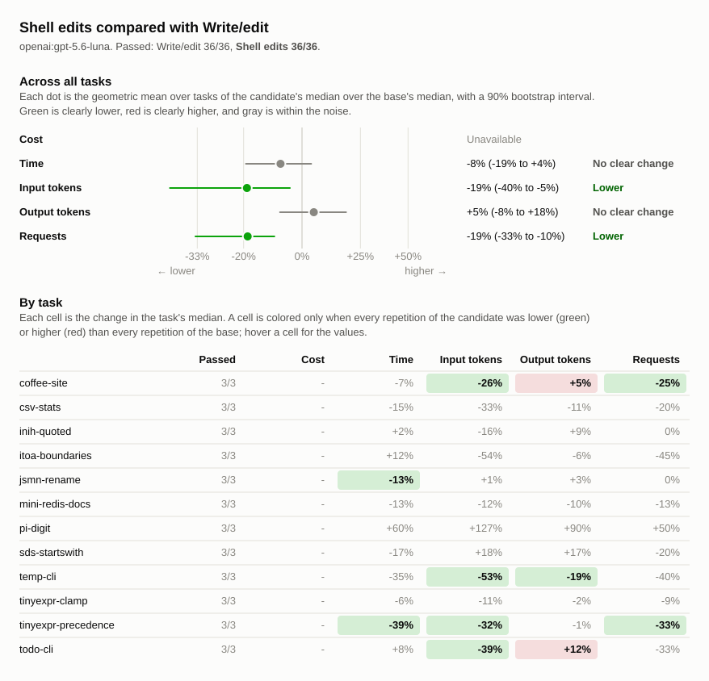

# Shell edits compared with Write/edit

## Runs

| Label                        | Commit       | Dirty | Model                 | Effort  | Providers | Results |
| ---------------------------- | ------------ | ----- | --------------------- | ------- | --------- | ------- |
| luna-write-edit-3x-20261001  | `e610384016` | no    | `openai:gpt-5.6-luna` | default | any       | 36      |
| luna-shell-edits-3x-20261002 | `11c9e9fec7` | no    | `openai:gpt-5.6-luna` | default | any       | 36      |

## Chart

## Summary

Shell edits is branch bench/shell-edits, commit `11c9e9fec7`, based on the
previously benchmarked Patch commit `93dee39560`. It retains the original
read_file tool unchanged, plus shell, shell_process, glob, and grep. Only
write_file, edit_file, and apply_patch are absent; changes use shell commands.
The comparison reuses the saved three repetitions per scenario for the other
tool set. All runs use openai:gpt-5.6-luna with default effort, four concurrent
runs, and the same prompts and checks. OpenAI cost is unavailable.

Changes are relative to `luna-write-edit-3x-20261001`. A task's values are
medians over its repetitions, with the range in parentheses. Totals are sums of
task medians.

| Metric            | luna-write-edit-3x-20261001 | luna-shell-edits-3x-20261002 | Change |
| ----------------- | --------------------------: | ---------------------------: | -----: |
| passed            |                       36/36 |                        36/36 |        |
| seconds           |                         924 |                          888 |    -4% |
| requests          |                         117 |                           99 |   -15% |
| tool_calls        |                         152 |                          119 |   -22% |
| failed_calls      |                           7 |                            4 |   -43% |
| cancelled_calls   |                           0 |                            0 |        |
| repeated_calls    |                           3 |                            0 |  -100% |
| input_tokens      |                     1184597 |                       986881 |   -17% |
| cached_tokens     |                      940544 |                       728576 |   -23% |
| output_tokens     |                       30235 |                        33089 |    +9% |
| reasoning_tokens  |                        9692 |                        10973 |   +13% |
| cost              |                 unavailable |                  unavailable |        |
| max_input_tokens  |                      138664 |                       146405 |    +6% |
| tool_output_chars |                      296860 |                       321386 |    +8% |

### Pass rate and cost by task

| Task                  | luna-write-edit-3x-20261001 passed | luna-shell-edits-3x-20261002 passed | luna-write-edit-3x-20261001 cost | luna-shell-edits-3x-20261002 cost | Change |
| --------------------- | ---------------------------------: | ----------------------------------: | -------------------------------: | --------------------------------: | -----: |
| `coffee-site`         |                                3/3 |                                 3/3 |                      unavailable |                       unavailable |        |
| `csv-stats`           |                                3/3 |                                 3/3 |                      unavailable |                       unavailable |        |
| `inih-quoted`         |                                3/3 |                                 3/3 |                      unavailable |                       unavailable |        |
| `itoa-boundaries`     |                                3/3 |                                 3/3 |                      unavailable |                       unavailable |        |
| `jsmn-rename`         |                                3/3 |                                 3/3 |                      unavailable |                       unavailable |        |
| `mini-redis-docs`     |                                3/3 |                                 3/3 |                      unavailable |                       unavailable |        |
| `pi-digit`            |                                3/3 |                                 3/3 |                      unavailable |                       unavailable |        |
| `sds-startswith`      |                                3/3 |                                 3/3 |                      unavailable |                       unavailable |        |
| `temp-cli`            |                                3/3 |                                 3/3 |                      unavailable |                       unavailable |        |
| `tinyexpr-clamp`      |                                3/3 |                                 3/3 |                      unavailable |                       unavailable |        |
| `tinyexpr-precedence` |                                3/3 |                                 3/3 |                      unavailable |                       unavailable |        |
| `todo-cli`            |                                3/3 |                                 3/3 |                      unavailable |                       unavailable |        |

## Comparison without pi-digit

Excluding pi-digit and giving each remaining scenario equal weight, Shell edits
uses 26% fewer input tokens and 31% fewer tool calls than Write/edit. The charts
above retain all 12 scenarios.

## Tasks

### `coffee-site`

| Metric                 | luna-write-edit-3x-20261001 | luna-shell-edits-3x-20261002 | Change |
| ---------------------- | --------------------------: | ---------------------------: | -----: |
| passed                 |                         3/3 |                          3/3 |        |
| status                 |                  finished 3 |                   finished 3 |        |
| seconds                |               110 (106–115) |                 102 (98–108) |    -7% |
| requests               |                           8 |                      6 (4–6) |   -25% |
| tool_calls             |                     7 (7–8) |                      5 (4–6) |   -29% |
| failed_calls           |                           0 |                            0 |        |
| cancelled_calls        |                           0 |                            0 |        |
| `glob` calls           |                     0 (0–1) |                      0 (0–1) |        |
| `glob` failed          |                           0 |                            0 |        |
| `shell` calls          |                           3 |                            4 |   +33% |
| `shell` failed         |                           0 |                            0 |        |
| `shell_process` calls  |                           1 |                      1 (0–1) |    +0% |
| `shell_process` failed |                           0 |                            0 |        |
| `write_file` calls     |                           3 |                            0 |  -100% |
| `write_file` failed    |                           0 |                            0 |        |
| repeated_calls         |                           0 |                            0 |        |
| input_tokens           |         38460 (37138–38987) |          28620 (15788–28956) |   -26% |
| cached_tokens          |         21504 (21504–25600) |           16896 (5632–16896) |   -21% |
| output_tokens          |            4814 (4551–4834) |             5035 (4889–5143) |    +5% |
| reasoning_tokens       |                  93 (92–98) |                116 (111–117) |   +25% |
| cost                   |                 unavailable |                  unavailable |        |
| max_input_tokens       |            6788 (6522–6854) |             6769 (6565–6871) |    -0% |
| tool_output_chars      |               875 (837–966) |              1021 (451–1236) |   +17% |

### `csv-stats`

| Metric              | luna-write-edit-3x-20261001 | luna-shell-edits-3x-20261002 | Change |
| ------------------- | --------------------------: | ---------------------------: | -----: |
| passed              |                         3/3 |                          3/3 |        |
| status              |                  finished 3 |                   finished 3 |        |
| seconds             |                 78 (77–115) |                   66 (64–91) |   -15% |
| requests            |                    5 (5–11) |                      4 (3–5) |   -20% |
| tool_calls          |                    8 (7–16) |                      3 (2–5) |   -62% |
| failed_calls        |                     0 (0–2) |                            0 |        |
| cancelled_calls     |                           0 |                            0 |        |
| `edit_file` calls   |                     0 (0–6) |                            0 |        |
| `edit_file` failed  |                     0 (0–2) |                            0 |        |
| `glob` calls        |                     0 (0–1) |                            0 |        |
| `glob` failed       |                           0 |                            0 |        |
| `grep` calls        |                     0 (0–1) |                      0 (0–1) |        |
| `grep` failed       |                           0 |                            0 |        |
| `shell` calls       |                     2 (2–4) |                      3 (2–4) |   +50% |
| `shell` failed      |                           0 |                            0 |        |
| `write_file` calls  |                           5 |                            0 |  -100% |
| `write_file` failed |                           0 |                            0 |        |
| repeated_calls      |                           0 |                            0 |        |
| input_tokens        |         18484 (16658–55716) |           12407 (7137–19445) |   -33% |
| cached_tokens       |          11264 (4608–30720) |                3584 (0–9728) |   -68% |
| output_tokens       |            3674 (3016–4825) |             3258 (2928–4240) |   -11% |
| reasoning_tokens    |             1493 (910–1823) |             1169 (1086–1747) |   -22% |
| cost                |                 unavailable |                  unavailable |        |
| max_input_tokens    |            5239 (4695–6851) |             4908 (4062–6839) |    -6% |
| tool_output_chars   |              544 (414–1056) |               760 (342–5266) |   +40% |

### `inih-quoted`

| Metric              | luna-write-edit-3x-20261001 | luna-shell-edits-3x-20261002 | Change |
| ------------------- | --------------------------: | ---------------------------: | -----: |
| passed              |                         3/3 |                          3/3 |        |
| status              |                  finished 3 |                   finished 3 |        |
| seconds             |                101 (92–104) |                 103 (95–112) |    +2% |
| requests            |                  16 (15–17) |                   16 (12–16) |    +0% |
| tool_calls          |                  21 (20–23) |                   20 (19–23) |    -5% |
| failed_calls        |                           1 |                      0 (0–1) |  -100% |
| cancelled_calls     |                           0 |                            0 |        |
| `edit_file` calls   |                     2 (2–4) |                            0 |  -100% |
| `edit_file` failed  |                           0 |                            0 |        |
| `glob` calls        |                     2 (0–2) |                      2 (0–3) |    +0% |
| `glob` failed       |                           0 |                            0 |        |
| `grep` calls        |                           2 |                      3 (2–4) |   +50% |
| `grep` failed       |                           0 |                            0 |        |
| `read_file` calls   |                     6 (4–7) |                      6 (5–7) |    +0% |
| `read_file` failed  |                           0 |                            0 |        |
| `shell` calls       |                    8 (7–10) |                    10 (8–12) |   +25% |
| `shell` failed      |                           1 |                      0 (0–1) |  -100% |
| `write_file` calls  |                     1 (1–2) |                            0 |  -100% |
| `write_file` failed |                           0 |                            0 |        |
| repeated_calls      |                           0 |                            0 |        |
| input_tokens        |      198362 (141654–216130) |       166612 (154107–189985) |   -16% |
| cached_tokens       |      158720 (112640–175616) |       140288 (115200–146944) |   -12% |
| output_tokens       |            3259 (2926–3857) |             3557 (3512–3713) |    +9% |
| reasoning_tokens    |            2019 (1806–2387) |             1969 (1962–2206) |    -2% |
| cost                |                 unavailable |                  unavailable |        |
| max_input_tokens    |         16955 (13073–17597) |          17274 (16515–19682) |    +2% |
| tool_output_chars   |         40789 (28354–41048) |          42861 (37507–48651) |    +5% |

### `itoa-boundaries`

| Metric             | luna-write-edit-3x-20261001 | luna-shell-edits-3x-20261002 | Change |
| ------------------ | --------------------------: | ---------------------------: | -----: |
| passed             |                         3/3 |                          3/3 |        |
| status             |                  finished 3 |                   finished 3 |        |
| seconds            |                 65 (45–108) |                   72 (49–83) |   +12% |
| requests           |                   11 (6–15) |                      6 (6–9) |   -45% |
| tool_calls         |                   12 (7–18) |                     9 (9–12) |   -25% |
| failed_calls       |                     0 (0–3) |                            1 |        |
| cancelled_calls    |                           0 |                            0 |        |
| `edit_file` calls  |                     3 (1–6) |                            0 |  -100% |
| `edit_file` failed |                     0 (0–1) |                            0 |        |
| `glob` calls       |                           1 |                      1 (1–2) |    +0% |
| `glob` failed      |                           0 |                      0 (0–1) |        |
| `grep` calls       |                     1 (0–1) |                            1 |    +0% |
| `grep` failed      |                           0 |                            0 |        |
| `read_file` calls  |                     4 (2–6) |                      4 (3–4) |    +0% |
| `read_file` failed |                           0 |                            0 |        |
| `shell` calls      |                     3 (2–5) |                      3 (3–6) |    +0% |
| `shell` failed     |                     0 (0–2) |                      1 (0–1) |        |
| repeated_calls     |                     1 (0–1) |                      0 (0–1) |  -100% |
| input_tokens       |        92482 (35044–149180) |          42878 (41276–63875) |   -54% |
| cached_tokens      |        66560 (11776–120320) |           25088 (9216–35328) |   -62% |
| output_tokens      |            1926 (1033–2502) |             1810 (1634–2503) |    -6% |
| reasoning_tokens   |               912 (357–944) |              1018 (783–1511) |   +12% |
| cost               |                 unavailable |                  unavailable |        |
| max_input_tokens   |          12176 (8708–13731) |          10952 (10589–11282) |   -10% |
| tool_output_chars  |         27495 (18754–30477) |          23955 (21563–26177) |   -13% |

### `jsmn-rename`

| Metric             | luna-write-edit-3x-20261001 | luna-shell-edits-3x-20261002 | Change |
| ------------------ | --------------------------: | ---------------------------: | -----: |
| passed             |                         3/3 |                          3/3 |        |
| status             |                  finished 3 |                   finished 3 |        |
| seconds            |                  31 (30–38) |                   27 (23–29) |   -13% |
| requests           |                     7 (6–8) |                      7 (6–7) |    +0% |
| tool_calls         |                   10 (7–11) |                            9 |   -10% |
| failed_calls       |                           0 |                            0 |        |
| cancelled_calls    |                           0 |                            0 |        |
| `glob` calls       |                           1 |                      0 (0–1) |  -100% |
| `glob` failed      |                           0 |                            0 |        |
| `grep` calls       |                     1 (0–2) |                      0 (0–2) |  -100% |
| `grep` failed      |                           0 |                            0 |        |
| `read_file` calls  |                     1 (1–3) |                      1 (1–3) |    +0% |
| `read_file` failed |                           0 |                            0 |        |
| `shell` calls      |                     6 (4–7) |                      6 (5–8) |    +0% |
| `shell` failed     |                           0 |                            0 |        |
| repeated_calls     |                     0 (0–1) |                      0 (0–1) |        |
| input_tokens       |         29071 (25407–36573) |          29276 (23985–34860) |    +1% |
| cached_tokens      |         18432 (16384–23552) |           16384 (9728–21504) |   -11% |
| output_tokens      |               654 (624–860) |                676 (674–680) |    +3% |
| reasoning_tokens   |               218 (154–288) |                202 (193–205) |    -7% |
| cost               |                 unavailable |                  unavailable |        |
| max_input_tokens   |            5541 (5516–7648) |             5870 (5353–7001) |    +6% |
| tool_output_chars  |           9714 (9588–15521) |           11058 (9737–14693) |   +14% |

### `mini-redis-docs`

| Metric             | luna-write-edit-3x-20261001 | luna-shell-edits-3x-20261002 | Change |
| ------------------ | --------------------------: | ---------------------------: | -----: |
| passed             |                         3/3 |                          3/3 |        |
| status             |                  finished 3 |                   finished 3 |        |
| seconds            |               146 (143–152) |                127 (126–155) |   -13% |
| requests           |                  15 (14–19) |                   13 (13–17) |   -13% |
| tool_calls         |                  22 (17–23) |                   16 (15–24) |   -27% |
| failed_calls       |                     3 (2–4) |                      2 (1–3) |   -33% |
| cancelled_calls    |                           0 |                            0 |        |
| `edit_file` calls  |                     3 (0–7) |                            0 |  -100% |
| `edit_file` failed |                     0 (0–1) |                            0 |        |
| `grep` calls       |                           0 |                      0 (0–1) |        |
| `grep` failed      |                           0 |                            0 |        |
| `read_file` calls  |                           0 |                      0 (0–4) |        |
| `read_file` failed |                           0 |                            0 |        |
| `shell` calls      |                  17 (16–19) |                   16 (15–19) |    -6% |
| `shell` failed     |                     2 (2–4) |                      2 (1–3) |    +0% |
| repeated_calls     |                     0 (0–2) |                            0 |        |
| input_tokens       |      315740 (302103–411803) |       278533 (255717–422311) |   -12% |
| cached_tokens      |      270848 (265728–344576) |       239104 (209920–370688) |   -12% |
| output_tokens      |            4468 (4273–4556) |             4012 (3737–4702) |   -10% |
| reasoning_tokens   |               870 (781–953) |                495 (454–539) |   -43% |
| cost               |                 unavailable |                  unavailable |        |
| max_input_tokens   |         31348 (30258–31755) |          31258 (29916–35113) |    -0% |
| tool_output_chars  |        98498 (93257–101692) |        100430 (98190–108293) |    +2% |

### `pi-digit`

| Metric              | luna-write-edit-3x-20261001 | luna-shell-edits-3x-20261002 | Change |
| ------------------- | --------------------------: | ---------------------------: | -----: |
| passed              |                         3/3 |                          3/3 |        |
| status              |                  finished 3 |                   finished 3 |        |
| seconds             |                 96 (52–252) |                153 (101–262) |   +60% |
| requests            |                    8 (7–34) |                    12 (8–21) |   +50% |
| tool_calls          |                    8 (8–35) |                    11 (8–21) |   +38% |
| failed_calls        |                     1 (0–2) |                      0 (0–2) |  -100% |
| cancelled_calls     |                           0 |                            0 |        |
| `edit_file` calls   |                     1 (1–9) |                            0 |  -100% |
| `edit_file` failed  |                           0 |                            0 |        |
| `glob` calls        |                           1 |                      0 (0–1) |  -100% |
| `glob` failed       |                           0 |                            0 |        |
| `grep` calls        |                           0 |                      0 (0–1) |        |
| `grep` failed       |                           0 |                            0 |        |
| `read_file` calls   |                           1 |                            0 |  -100% |
| `read_file` failed  |                     1 (0–1) |                            0 |  -100% |
| `shell` calls       |                    2 (2–20) |                    11 (7–20) |  +450% |
| `shell` failed      |                     0 (0–1) |                      0 (0–2) |        |
| `write_file` calls  |                     3 (3–4) |                            0 |  -100% |
| `write_file` failed |                           0 |                            0 |        |
| repeated_calls      |                     1 (0–3) |                            0 |  -100% |
| input_tokens        |        27847 (21161–244449) |         63179 (27947–166826) |  +127% |
| cached_tokens       |         17408 (5632–201728) |         32256 (15872–110080) |   +85% |
| output_tokens       |            3453 (1472–9169) |            6566 (4580–10382) |   +90% |
| reasoning_tokens    |             1790 (533–5416) |             3769 (2410–6414) |  +111% |
| cost                |                 unavailable |                  unavailable |        |
| max_input_tokens    |           5262 (3276–13270) |            8702 (6325–13563) |   +65% |
| tool_output_chars   |              330 (329–4677) |              1998 (879–4232) |  +505% |

### `sds-startswith`

| Metric                 | luna-write-edit-3x-20261001 | luna-shell-edits-3x-20261002 | Change |
| ---------------------- | --------------------------: | ---------------------------: | -----: |
| passed                 |                         3/3 |                          3/3 |        |
| status                 |                  finished 3 |                   finished 3 |        |
| seconds                |                  62 (52–62) |                   52 (46–57) |   -17% |
| requests               |                   10 (7–10) |                      8 (7–9) |   -20% |
| tool_calls             |                  15 (12–16) |                   12 (11–14) |   -20% |
| failed_calls           |                           0 |                      0 (0–1) |        |
| cancelled_calls        |                           0 |                            0 |        |
| `edit_file` calls      |                     4 (3–4) |                            0 |  -100% |
| `edit_file` failed     |                           0 |                            0 |        |
| `glob` calls           |                           1 |                      0 (0–1) |  -100% |
| `glob` failed          |                           0 |                            0 |        |
| `grep` calls           |                     1 (1–3) |                      3 (2–3) |  +200% |
| `grep` failed          |                           0 |                            0 |        |
| `read_file` calls      |                     6 (6–7) |                      6 (4–7) |    +0% |
| `read_file` failed     |                           0 |                            0 |        |
| `shell` calls          |                     2 (1–2) |                      3 (3–4) |   +50% |
| `shell` failed         |                           0 |                      0 (0–1) |        |
| `shell_process` calls  |                           0 |                      0 (0–1) |        |
| `shell_process` failed |                           0 |                            0 |        |
| repeated_calls         |                           0 |                            0 |        |
| input_tokens           |         67360 (38010–88227) |         79744 (49088–115892) |   +18% |
| cached_tokens          |         54272 (16896–58880) |          48128 (34816–80896) |   -11% |
| output_tokens          |            1535 (1457–2027) |             1796 (1419–1932) |   +17% |
| reasoning_tokens       |               378 (349–663) |                278 (245–427) |   -26% |
| cost                   |                 unavailable |                  unavailable |        |
| max_input_tokens       |           9907 (8598–13180) |           15621 (9729–17062) |   +58% |
| tool_output_chars      |         18809 (15553–27193) |          39401 (18597–42030) |  +109% |

### `temp-cli`

| Metric              | luna-write-edit-3x-20261001 | luna-shell-edits-3x-20261002 | Change |
| ------------------- | --------------------------: | ---------------------------: | -----: |
| passed              |                         3/3 |                          3/3 |        |
| status              |                  finished 3 |                   finished 3 |        |
| seconds             |                  44 (32–47) |                   29 (25–33) |   -35% |
| requests            |                     5 (4–7) |                      3 (3–4) |   -40% |
| tool_calls          |                           6 |                            3 |   -50% |
| failed_calls        |                     1 (0–1) |                            0 |  -100% |
| cancelled_calls     |                           0 |                            0 |        |
| `glob` calls        |                     0 (0–1) |                      1 (0–1) |        |
| `glob` failed       |                           0 |                            0 |        |
| `shell` calls       |                     3 (2–3) |                      2 (2–3) |   -33% |
| `shell` failed      |                     1 (0–1) |                            0 |  -100% |
| `write_file` calls  |                           3 |                            0 |  -100% |
| `write_file` failed |                           0 |                            0 |        |
| repeated_calls      |                           0 |                            0 |        |
| input_tokens        |          12589 (9330–17284) |             5920 (5846–8493) |   -53% |
| cached_tokens       |           8704 (5632–11776) |                            0 |  -100% |
| output_tokens       |            1273 (1189–1588) |              1033 (988–1180) |   -19% |
| reasoning_tokens    |               198 (181–493) |                  85 (74–136) |   -57% |
| cost                |                 unavailable |                  unavailable |        |
| max_input_tokens    |            3223 (3043–3418) |             2799 (2718–2838) |   -13% |
| tool_output_chars   |              871 (841–1076) |              1095 (857–1246) |   +26% |

### `tinyexpr-clamp`

| Metric             | luna-write-edit-3x-20261001 | luna-shell-edits-3x-20261002 | Change |
| ------------------ | --------------------------: | ---------------------------: | -----: |
| passed             |                         3/3 |                          3/3 |        |
| status             |                  finished 3 |                   finished 3 |        |
| seconds            |                  54 (51–59) |                   51 (33–96) |    -6% |
| requests           |                   11 (9–13) |                    10 (6–11) |    -9% |
| tool_calls         |                  17 (14–17) |                   13 (10–14) |   -24% |
| failed_calls       |                     1 (1–2) |                      1 (0–1) |    +0% |
| cancelled_calls    |                           0 |                            0 |        |
| `edit_file` calls  |                     4 (4–5) |                            0 |  -100% |
| `edit_file` failed |                     1 (1–2) |                            0 |  -100% |
| `glob` calls       |                           1 |                            1 |    +0% |
| `glob` failed      |                           0 |                            0 |        |
| `grep` calls       |                     2 (1–2) |                      1 (1–2) |   -50% |
| `grep` failed      |                           0 |                            0 |        |
| `read_file` calls  |                     7 (6–8) |                      6 (6–7) |   -14% |
| `read_file` failed |                           0 |                      0 (0–1) |        |
| `shell` calls      |                           2 |                      3 (2–6) |   +50% |
| `shell` failed     |                           0 |                      0 (0–1) |        |
| repeated_calls     |                           0 |                            0 |        |
| input_tokens       |        96220 (76463–124678) |         85757 (41867–111332) |   -11% |
| cached_tokens      |        69632 (48640–103424) |          55296 (27648–74240) |   -21% |
| output_tokens      |            1400 (1329–1535) |             1370 (1127–1974) |    -2% |
| reasoning_tokens   |               336 (273–583) |                440 (327–687) |   +31% |
| cost               |                 unavailable |                  unavailable |        |
| max_input_tokens   |         11929 (11684–12384) |          12260 (10576–17348) |    +3% |
| tool_output_chars  |         26292 (24285–28331) |          26316 (24708–41586) |    +0% |

### `tinyexpr-precedence`

| Metric             | luna-write-edit-3x-20261001 | luna-shell-edits-3x-20261002 | Change |
| ------------------ | --------------------------: | ---------------------------: | -----: |
| passed             |                         3/3 |                          3/3 |        |
| status             |                  finished 3 |                   finished 3 |        |
| seconds            |                  92 (71–94) |                   56 (53–63) |   -39% |
| requests           |                  15 (14–18) |                           10 |   -33% |
| tool_calls         |                  20 (16–21) |                   14 (13–14) |   -30% |
| failed_calls       |                           0 |                            0 |        |
| cancelled_calls    |                           0 |                            0 |        |
| `edit_file` calls  |                     2 (1–2) |                            0 |  -100% |
| `edit_file` failed |                           0 |                            0 |        |
| `glob` calls       |                           1 |                      1 (1–2) |    +0% |
| `glob` failed      |                           0 |                            0 |        |
| `grep` calls       |                     2 (2–3) |                      2 (2–3) |    +0% |
| `grep` failed      |                           0 |                            0 |        |
| `read_file` calls  |                     8 (7–9) |                      7 (5–7) |   -12% |
| `read_file` failed |                           0 |                            0 |        |
| `shell` calls      |                     6 (4–8) |                      4 (3–4) |   -33% |
| `shell` failed     |                           0 |                            0 |        |
| repeated_calls     |                           1 |                            0 |  -100% |
| input_tokens       |      271178 (263103–322710) |       183766 (161650–184145) |   -32% |
| cached_tokens      |      235008 (214528–285696) |       148992 (113152–151552) |   -37% |
| output_tokens      |            1859 (1795–2386) |             1834 (1781–1903) |    -1% |
| reasoning_tokens   |             1142 (933–1408) |             1128 (1098–1143) |    -1% |
| cost               |                 unavailable |                  unavailable |        |
| max_input_tokens   |         26513 (19346–28806) |          26308 (24149–26590) |    -1% |
| tool_output_chars  |         72041 (47576–78362) |          71900 (64326–72299) |    -0% |

### `todo-cli`

| Metric              | luna-write-edit-3x-20261001 | luna-shell-edits-3x-20261002 | Change |
| ------------------- | --------------------------: | ---------------------------: | -----: |
| passed              |                         3/3 |                          3/3 |        |
| status              |                  finished 3 |                   finished 3 |        |
| seconds             |                  46 (46–55) |                   49 (46–54) |    +8% |
| requests            |                     6 (4–7) |                            4 |   -33% |
| tool_calls          |                     6 (5–6) |                            4 |   -33% |
| failed_calls        |                           0 |                            0 |        |
| cancelled_calls     |                           0 |                            0 |        |
| `grep` calls        |                           0 |                      1 (0–1) |        |
| `grep` failed       |                           0 |                            0 |        |
| `shell` calls       |                     3 (2–3) |                      3 (3–4) |    +0% |
| `shell` failed      |                           0 |                            0 |        |
| `write_file` calls  |                           3 |                            0 |  -100% |
| `write_file` failed |                           0 |                            0 |        |
| repeated_calls      |                           0 |                            0 |        |
| input_tokens        |         16804 (10867–20056) |           10189 (9936–10386) |   -39% |
| cached_tokens       |           8192 (3072–11264) |             2560 (1536–4096) |   -69% |
| output_tokens       |            1920 (1868–1922) |             2142 (1935–2371) |   +12% |
| reasoning_tokens    |               243 (232–275) |                304 (244–343) |   +25% |
| cost                |                 unavailable |                  unavailable |        |
| max_input_tokens    |            3783 (3741–3785) |             3684 (3529–3850) |    -3% |
| tool_output_chars   |               602 (583–614) |                591 (570–689) |    -2% |
