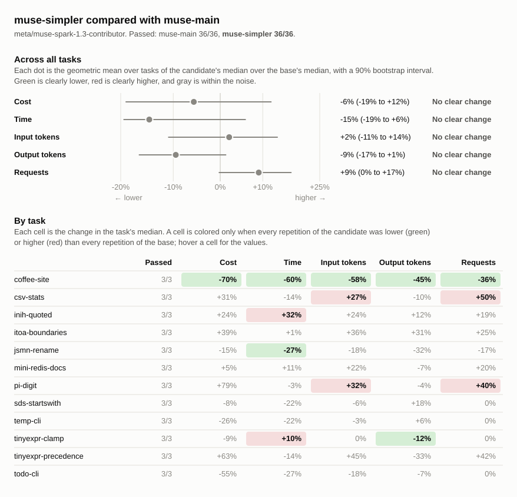

# Benchmark comparison: muse-main, muse-simpler

## Runs

| Label        | Commit       | Dirty | Model                             | Effort  | Providers | Results |
| ------------ | ------------ | ----- | --------------------------------- | ------- | --------- | ------- |
| muse-main    | `b577037dbb` | no    | `meta/muse-spark-1.3-contributor` | default | any       | 36      |
| muse-simpler | `debe5fd3b2` | no    | `meta/muse-spark-1.3-contributor` | default | any       | 36      |

## Chart

## Summary

Changes are relative to `muse-main`. A task's values are medians over its
repetitions, with the range in parentheses. Totals are sums of task medians.

| Metric            | muse-main | muse-simpler | Change |
| ----------------- | --------: | -----------: | -----: |
| passed            |     36/36 |        36/36 |        |
| seconds           |      1377 |         1314 |    -5% |
| requests          |       164 |          184 |   +12% |
| tool_calls        |       209 |          235 |   +12% |
| failed_calls      |         3 |            4 |   +33% |
| cancelled_calls   |         0 |            0 |        |
| repeated_calls    |         0 |            1 |        |
| input_tokens      |   5111386 |      6080994 |   +19% |
| cached_tokens     |   1056898 |      1931177 |   +83% |
| output_tokens     |     71692 |        64773 |   -10% |
| reasoning_tokens  |     28790 |        25208 |   -12% |
| cost              |   $0.4188 |      $0.4509 |    +8% |
| max_input_tokens  |    292033 |       279792 |    -4% |
| tool_output_chars |    599225 |       593112 |    -1% |
| compactions       |         0 |            0 |        |
| summarizer_cost   |   $0.0000 |      $0.0000 |        |
| subagents         |         0 |            0 |        |

### Pass rate and cost by task

| Task                  | muse-main passed | muse-simpler passed |            muse-main cost |         muse-simpler cost | Change |
| --------------------- | ---------------: | ------------------: | ------------------------: | ------------------------: | -----: |
| `coffee-site`         |              3/3 |                 3/3 | $0.0067 ($0.0042–$0.0071) | $0.0020 ($0.0015–$0.0040) |   -70% |
| `csv-stats`           |              3/3 |                 3/3 | $0.0048 ($0.0043–$0.0057) | $0.0064 ($0.0051–$0.0079) |   +31% |
| `inih-quoted`         |              3/3 |                 3/3 | $0.0316 ($0.0245–$0.0401) | $0.0394 ($0.0316–$0.0407) |   +24% |
| `itoa-boundaries`     |              3/3 |                 3/3 | $0.0066 ($0.0060–$0.0071) | $0.0092 ($0.0070–$0.0103) |   +39% |
| `jsmn-rename`         |              3/3 |                 3/3 | $0.0162 ($0.0068–$0.0203) | $0.0137 ($0.0055–$0.0182) |   -15% |
| `mini-redis-docs`     |              3/3 |                 3/3 | $0.2830 ($0.1795–$0.2895) | $0.2985 ($0.2833–$0.3732) |    +5% |
| `pi-digit`            |              3/3 |                 3/3 | $0.0032 ($0.0029–$0.0051) | $0.0057 ($0.0041–$0.0064) |   +79% |
| `sds-startswith`      |              3/3 |                 3/3 | $0.0117 ($0.0097–$0.0132) | $0.0108 ($0.0062–$0.0171) |    -8% |
| `temp-cli`            |              3/3 |                 3/3 | $0.0052 ($0.0034–$0.0055) | $0.0038 ($0.0020–$0.0041) |   -26% |
| `tinyexpr-clamp`      |              3/3 |                 3/3 | $0.0192 ($0.0181–$0.0198) | $0.0174 ($0.0173–$0.0189) |    -9% |
| `tinyexpr-precedence` |              3/3 |                 3/3 | $0.0255 ($0.0224–$0.0529) | $0.0417 ($0.0377–$0.0450) |   +63% |
| `todo-cli`            |              3/3 |                 3/3 | $0.0051 ($0.0021–$0.0065) | $0.0023 ($0.0023–$0.0030) |   -55% |

## Tasks

### `coffee-site`

| Metric                 |                 muse-main |              muse-simpler | Change |
| ---------------------- | ------------------------: | ------------------------: | -----: |
| passed                 |                       3/3 |                       3/3 |        |
| status                 |                finished 3 |                finished 3 |        |
| seconds                |                78 (68–79) |                31 (26–49) |   -60% |
| requests               |                11 (10–11) |                   7 (6–7) |   -36% |
| tool_calls             |                 10 (9–10) |                   8 (7–8) |   -20% |
| failed_calls           |                         1 |                         0 |  -100% |
| cancelled_calls        |                         0 |                         0 |        |
| `apply_patch` calls    |                   1 (1–2) |                         0 |  -100% |
| `apply_patch` failed   |                         1 |                         0 |  -100% |
| `glob` calls           |                   0 (0–1) |                   0 (0–1) |        |
| `glob` failed          |                         0 |                         0 |        |
| `shell` calls          |                         6 |                   4 (2–4) |   -33% |
| `shell` failed         |                         0 |                         0 |        |
| `shell_process` calls  |                         2 |                         1 |   -50% |
| `shell_process` failed |                         0 |                         0 |        |
| `write_file` calls     |                         0 |                         3 |        |
| `write_file` failed    |                         0 |                         0 |        |
| repeated_calls         |                         0 |                         0 |        |
| input_tokens           |       82875 (70792–87325) |       34549 (27860–37994) |   -58% |
| cached_tokens          |       32219 (21467–39146) |        17574 (5143–20503) |   -45% |
| output_tokens          |          4794 (4748–5479) |          2620 (2343–3439) |   -45% |
| reasoning_tokens       |             678 (328–892) |             217 (163–244) |   -68% |
| cost                   | $0.0067 ($0.0042–$0.0071) | $0.0020 ($0.0015–$0.0040) |   -70% |
| max_input_tokens       |        10303 (9535–11320) |          6362 (6149–7073) |   -38% |
| tool_output_chars      |          5783 (3828–6956) |          1952 (1876–2318) |   -66% |
| compactions            |                         0 |                         0 |        |
| summarizer_cost        |                   $0.0000 |                   $0.0000 |        |
| subagents              |                         0 |                         0 |        |

### `csv-stats`

| Metric               |                 muse-main |              muse-simpler | Change |
| -------------------- | ------------------------: | ------------------------: | -----: |
| passed               |                       3/3 |                       3/3 |        |
| status               |                finished 3 |                finished 3 |        |
| seconds              |              127 (86–131) |              109 (84–124) |   -14% |
| requests             |                   6 (5–7) |                  9 (8–10) |   +50% |
| tool_calls           |                   5 (4–6) |                11 (10–12) |  +120% |
| failed_calls         |                         0 |                   1 (0–1) |        |
| cancelled_calls      |                         0 |                         0 |        |
| `apply_patch` calls  |                   1 (1–2) |                         0 |  -100% |
| `apply_patch` failed |                         0 |                         0 |        |
| `edit_file` calls    |                         0 |                   1 (0–1) |        |
| `edit_file` failed   |                         0 |                         0 |        |
| `shell` calls        |                   4 (3–4) |                   5 (5–6) |   +25% |
| `shell` failed       |                         0 |                   1 (0–1) |        |
| `write_file` calls   |                         0 |                         5 |        |
| `write_file` failed  |                         0 |                         0 |        |
| repeated_calls       |                   0 (0–1) |                         0 |        |
| input_tokens         |       52069 (38133–56918) |       66151 (60365–76485) |   +27% |
| cached_tokens        |        16279 (9781–19238) |       17800 (10858–20729) |    +9% |
| output_tokens        |          7457 (6143–9302) |          6691 (5285–7446) |   -10% |
| reasoning_tokens     |          4063 (2505–5689) |          2619 (1651–4048) |   -36% |
| cost                 | $0.0048 ($0.0043–$0.0057) | $0.0064 ($0.0051–$0.0079) |   +31% |
| max_input_tokens     |        10897 (9934–13287) |        10580 (9073–11154) |    -3% |
| tool_output_chars    |          2386 (1354–3414) |          2893 (2415–3141) |   +21% |
| compactions          |                         0 |                         0 |        |
| summarizer_cost      |                   $0.0000 |                   $0.0000 |        |
| subagents            |                         0 |                         0 |        |

### `inih-quoted`

| Metric               |                 muse-main |              muse-simpler | Change |
| -------------------- | ------------------------: | ------------------------: | -----: |
| passed               |                       3/3 |                       3/3 |        |
| status               |                finished 3 |                finished 3 |        |
| seconds              |             130 (120–130) |             172 (142–172) |   +32% |
| requests             |                16 (15–18) |                19 (17–22) |   +19% |
| tool_calls           |                24 (23–27) |                26 (26–31) |    +8% |
| failed_calls         |                         0 |                   1 (0–2) |        |
| cancelled_calls      |                         0 |                         0 |        |
| `apply_patch` calls  |                   3 (2–3) |                         0 |  -100% |
| `apply_patch` failed |                         0 |                         0 |        |
| `edit_file` calls    |                         0 |                         1 |        |
| `edit_file` failed   |                         0 |                         0 |        |
| `glob` calls         |                         1 |                   1 (1–2) |    +0% |
| `glob` failed        |                         0 |                         0 |        |
| `grep` calls         |                         0 |                         1 |        |
| `grep` failed        |                         0 |                         0 |        |
| `read_file` calls    |                12 (12–13) |                13 (11–14) |    +8% |
| `read_file` failed   |                         0 |                         0 |        |
| `shell` calls        |                  8 (7–11) |                 11 (8–13) |   +38% |
| `shell` failed       |                         0 |                   1 (0–2) |        |
| `write_file` calls   |                         0 |                         1 |        |
| `write_file` failed  |                         0 |                         0 |        |
| repeated_calls       |                         0 |                         0 |        |
| input_tokens         |    367446 (294343–486752) |    455661 (423310–484400) |   +24% |
| cached_tokens        |      65296 (61087–102002) |     108598 (31105–156387) |   +66% |
| output_tokens        |          6466 (5318–7327) |          7245 (6931–7958) |   +12% |
| reasoning_tokens     |          3262 (2848–3559) |          4049 (2691–4050) |   +24% |
| cost                 | $0.0316 ($0.0245–$0.0401) | $0.0394 ($0.0316–$0.0407) |   +24% |
| max_input_tokens     |       32098 (28128–36536) |       33134 (31546–37117) |    +3% |
| tool_output_chars    |       72496 (64640–83613) |       77298 (67331–89040) |    +7% |
| compactions          |                         0 |                         0 |        |
| summarizer_cost      |                   $0.0000 |                   $0.0000 |        |
| subagents            |                         0 |                         0 |        |

### `itoa-boundaries`

| Metric               |                 muse-main |              muse-simpler | Change |
| -------------------- | ------------------------: | ------------------------: | -----: |
| passed               |                       3/3 |                       3/3 |        |
| status               |                finished 3 |                finished 3 |        |
| seconds              |                64 (41–98) |                65 (65–76) |    +1% |
| requests             |                   8 (8–9) |                 10 (9–12) |   +25% |
| tool_calls           |                  9 (9–10) |                11 (10–13) |   +22% |
| failed_calls         |                         0 |                         0 |        |
| cancelled_calls      |                         0 |                         0 |        |
| `apply_patch` calls  |                   1 (1–2) |                         0 |  -100% |
| `apply_patch` failed |                         0 |                         0 |        |
| `edit_file` calls    |                         0 |                         2 |        |
| `edit_file` failed   |                         0 |                         0 |        |
| `glob` calls         |                         1 |                         1 |    +0% |
| `glob` failed        |                         0 |                         0 |        |
| `read_file` calls    |                         5 |                   5 (5–6) |    +0% |
| `read_file` failed   |                         0 |                         0 |        |
| `shell` calls        |                         2 |                   3 (2–4) |   +50% |
| `shell` failed       |                         0 |                         0 |        |
| repeated_calls       |                         0 |                         0 |        |
| input_tokens         |       80527 (79141–98093) |     109806 (93517–138243) |   +36% |
| cached_tokens        |       27528 (19336–36089) |       31993 (27114–43468) |   +16% |
| output_tokens        |          3071 (3029–3925) |          4038 (3796–4485) |   +31% |
| reasoning_tokens     |          1406 (1369–2149) |          1815 (1761–2265) |   +29% |
| cost                 | $0.0066 ($0.0060–$0.0071) | $0.0092 ($0.0070–$0.0103) |   +39% |
| max_input_tokens     |       14927 (14421–15992) |       16517 (15171–16522) |   +11% |
| tool_output_chars    |       28483 (27554–29291) |       30386 (28000–31713) |    +7% |
| compactions          |                         0 |                         0 |        |
| summarizer_cost      |                   $0.0000 |                   $0.0000 |        |
| subagents            |                         0 |                         0 |        |

### `jsmn-rename`

| Metric             |                 muse-main |              muse-simpler | Change |
| ------------------ | ------------------------: | ------------------------: | -----: |
| passed             |                       3/3 |                       3/3 |        |
| status             |                finished 3 |                finished 3 |        |
| seconds            |                62 (48–84) |                46 (34–46) |   -27% |
| requests           |                 12 (8–13) |                 10 (8–13) |   -17% |
| tool_calls         |                18 (12–18) |                15 (12–21) |   -17% |
| failed_calls       |                         0 |                         0 |        |
| cancelled_calls    |                         0 |                         0 |        |
| `glob` calls       |                         1 |                         1 |    +0% |
| `glob` failed      |                         0 |                         0 |        |
| `grep` calls       |                         1 |                   1 (1–2) |    +0% |
| `grep` failed      |                         0 |                         0 |        |
| `read_file` calls  |                  9 (7–10) |                  9 (7–12) |    +0% |
| `read_file` failed |                         0 |                         0 |        |
| `shell` calls      |                   6 (3–7) |                   4 (3–6) |   -33% |
| `shell` failed     |                         0 |                         0 |        |
| repeated_calls     |                         0 |                         0 |        |
| input_tokens       |    197264 (113437–222010) |     161437 (77944–211975) |   -18% |
| cached_tokens      |       42188 (24765–49928) |       29290 (26120–37181) |   -31% |
| output_tokens      |          2852 (1989–2863) |          1937 (1421–2987) |   -32% |
| reasoning_tokens   |             953 (701–978) |            439 (243–1043) |   -54% |
| cost               | $0.0162 ($0.0068–$0.0203) | $0.0137 ($0.0055–$0.0182) |   -15% |
| max_input_tokens   |       23084 (21633–23553) |       22074 (15257–22787) |    -4% |
| tool_output_chars  |       49236 (47403–50628) |       48822 (31453–50300) |    -1% |
| compactions        |                         0 |                         0 |        |
| summarizer_cost    |                   $0.0000 |                   $0.0000 |        |
| subagents          |                         0 |                         0 |        |

### `mini-redis-docs`

| Metric               |                 muse-main |              muse-simpler | Change |
| -------------------- | ------------------------: | ------------------------: | -----: |
| passed               |                       3/3 |                       3/3 |        |
| status               |                finished 3 |                finished 3 |        |
| seconds              |             402 (365–581) |             446 (436–522) |   +11% |
| requests             |                54 (39–59) |                65 (59–79) |   +20% |
| tool_calls           |                77 (66–84) |               91 (86–107) |   +18% |
| failed_calls         |                   0 (0–2) |                   1 (0–1) |        |
| cancelled_calls      |                         0 |                         0 |        |
| `apply_patch` calls  |                 27 (3–34) |                         0 |  -100% |
| `apply_patch` failed |                   0 (0–2) |                         0 |        |
| `edit_file` calls    |                         0 |                39 (37–39) |        |
| `edit_file` failed   |                         0 |                         0 |        |
| `glob` calls         |                         1 |                   1 (0–1) |    +0% |
| `glob` failed        |                         0 |                         0 |        |
| `grep` calls         |                   1 (0–1) |                   0 (0–1) |  -100% |
| `grep` failed        |                         0 |                         0 |        |
| `read_file` calls    |                39 (38–40) |                41 (38–47) |    +5% |
| `read_file` failed   |                         0 |                         0 |        |
| `shell` calls        |                 10 (9–22) |                 10 (8–18) |    +0% |
| `shell` failed       |                         0 |                   1 (0–1) |        |
| `write_file` calls   |                         0 |                   1 (0–3) |        |
| `write_file` failed  |                         0 |                         0 |        |
| repeated_calls       |                         0 |                         0 |        |
| input_tokens         | 3517658 (2279607–4028057) | 4305959 (3731264–5368352) |   +22% |
| cached_tokens        |   674774 (531526–1259930) |  1537600 (795659–1709181) |  +128% |
| output_tokens        |       18383 (18374–19417) |       17100 (16978–19109) |    -7% |
| reasoning_tokens     |          6360 (4975–7255) |          5185 (4578–5752) |   -18% |
| cost                 | $0.2830 ($0.1795–$0.2895) | $0.2985 ($0.2833–$0.3732) |    +5% |
| max_input_tokens     |       86178 (83025–90699) |       84560 (78457–87428) |    -2% |
| tool_output_chars    |    237652 (228904–251512) |    237744 (216677–240936) |    +0% |
| compactions          |                         0 |                         0 |        |
| summarizer_cost      |                   $0.0000 |                   $0.0000 |        |
| subagents            |                         0 |                         0 |        |

### `pi-digit`

| Metric               |                 muse-main |              muse-simpler | Change |
| -------------------- | ------------------------: | ------------------------: | -----: |
| passed               |                       3/3 |                       3/3 |        |
| status               |                finished 3 |                finished 3 |        |
| seconds              |              108 (76–115) |              105 (82–161) |    -3% |
| requests             |                         5 |                   7 (6–7) |   +40% |
| tool_calls           |                         4 |                         7 |   +75% |
| failed_calls         |                         1 |                         0 |  -100% |
| cancelled_calls      |                         0 |                         0 |        |
| `apply_patch` calls  |                         1 |                         0 |  -100% |
| `apply_patch` failed |                         0 |                         0 |        |
| `grep` calls         |                         0 |                   0 (0–1) |        |
| `grep` failed        |                         0 |                         0 |        |
| `shell` calls        |                         3 |                   4 (3–4) |   +33% |
| `shell` failed       |                         1 |                         0 |  -100% |
| `write_file` calls   |                         0 |                         3 |        |
| `write_file` failed  |                         0 |                         0 |        |
| repeated_calls       |                         0 |                         0 |        |
| input_tokens         |       34715 (33586–39841) |       45871 (40790–66417) |   +32% |
| cached_tokens        |        15925 (3637–16053) |         11942 (678–20503) |   -25% |
| output_tokens        |          6230 (5672–7347) |          5974 (5681–8856) |    -4% |
| reasoning_tokens     |          3963 (3740–4631) |          3611 (2905–6186) |    -9% |
| cost                 | $0.0032 ($0.0029–$0.0051) | $0.0057 ($0.0041–$0.0064) |   +79% |
| max_input_tokens     |         9593 (9086–10697) |         9363 (8868–12234) |    -2% |
| tool_output_chars    |          1007 (1007–1107) |          1357 (1074–1679) |   +35% |
| compactions          |                         0 |                         0 |        |
| summarizer_cost      |                   $0.0000 |                   $0.0000 |        |
| subagents            |                         0 |                         0 |        |

### `sds-startswith`

| Metric               |                 muse-main |              muse-simpler | Change |
| -------------------- | ------------------------: | ------------------------: | -----: |
| passed               |                       3/3 |                       3/3 |        |
| status               |                finished 3 |                finished 3 |        |
| seconds              |                56 (49–83) |                44 (36–73) |   -22% |
| requests             |                        11 |                11 (10–14) |    +0% |
| tool_calls           |                        14 |                13 (13–17) |    -7% |
| failed_calls         |                         0 |                   0 (0–1) |        |
| cancelled_calls      |                         0 |                         0 |        |
| `apply_patch` calls  |                         4 |                         0 |  -100% |
| `apply_patch` failed |                         0 |                         0 |        |
| `edit_file` calls    |                         0 |                   4 (3–4) |        |
| `edit_file` failed   |                         0 |                         0 |        |
| `glob` calls         |                         1 |                   1 (1–2) |    +0% |
| `glob` failed        |                         0 |                         0 |        |
| `grep` calls         |                         1 |                         1 |    +0% |
| `grep` failed        |                         0 |                         0 |        |
| `read_file` calls    |                         7 |                   7 (6–8) |    +0% |
| `read_file` failed   |                         0 |                         0 |        |
| `shell` calls        |                         1 |                   1 (1–2) |    +0% |
| `shell` failed       |                         0 |                   0 (0–1) |        |
| repeated_calls       |                         0 |                   0 (0–1) |        |
| input_tokens         |    143014 (138582–144080) |    133809 (125914–201233) |    -6% |
| cached_tokens        |       32219 (19163–47067) |       41006 (31978–71274) |   +27% |
| output_tokens        |          2692 (2413–3139) |          3190 (2518–4751) |   +18% |
| reasoning_tokens     |            645 (519–1134) |           1195 (681–2322) |   +85% |
| cost                 | $0.0117 ($0.0097–$0.0132) | $0.0108 ($0.0062–$0.0171) |    -8% |
| max_input_tokens     |       18580 (17877–18700) |       18663 (17721–21367) |    +0% |
| tool_output_chars    |       37002 (36851–38028) |       38581 (37529–41561) |    +4% |
| compactions          |                         0 |                         0 |        |
| summarizer_cost      |                   $0.0000 |                   $0.0000 |        |
| subagents            |                         0 |                         0 |        |

### `temp-cli`

| Metric               |                 muse-main |              muse-simpler | Change |
| -------------------- | ------------------------: | ------------------------: | -----: |
| passed               |                       3/3 |                       3/3 |        |
| status               |                finished 3 |                finished 3 |        |
| seconds              |                76 (48–86) |                59 (44–83) |   -22% |
| requests             |                 10 (9–13) |                 10 (9–10) |    +0% |
| tool_calls           |                 10 (8–13) |                   9 (8–9) |   -10% |
| failed_calls         |                   0 (0–1) |                         0 |        |
| cancelled_calls      |                         0 |                         0 |        |
| `apply_patch` calls  |                         2 |                         0 |  -100% |
| `apply_patch` failed |                   0 (0–1) |                         0 |        |
| `read_file` calls    |                   2 (1–3) |                         1 |   -50% |
| `read_file` failed   |                         0 |                         0 |        |
| `shell` calls        |                   6 (5–8) |                   6 (5–6) |    +0% |
| `shell` failed       |                         0 |                         0 |        |
| `write_file` calls   |                         0 |                         2 |        |
| `write_file` failed  |                         0 |                         0 |        |
| repeated_calls       |                         0 |                         0 |        |
| input_tokens         |       53183 (48284–87465) |       51350 (40728–53376) |    -3% |
| cached_tokens        |        20729 (7673–42173) |       22634 (17770–26617) |    +9% |
| output_tokens        |          3298 (3063–4245) |          3504 (2451–3635) |    +6% |
| reasoning_tokens     |           1089 (768–1514) |           1050 (717–1181) |    -4% |
| cost                 | $0.0052 ($0.0034–$0.0055) | $0.0038 ($0.0020–$0.0041) |   -26% |
| max_input_tokens     |         8251 (8240–10608) |          7572 (6349–7602) |    -8% |
| tool_output_chars    |          5957 (5351–9387) |          3041 (2976–3326) |   -49% |
| compactions          |                         0 |                         0 |        |
| summarizer_cost      |                   $0.0000 |                   $0.0000 |        |
| subagents            |                         0 |                         0 |        |

### `tinyexpr-clamp`

| Metric               |                 muse-main |              muse-simpler | Change |
| -------------------- | ------------------------: | ------------------------: | -----: |
| passed               |                       3/3 |                       3/3 |        |
| status               |                finished 3 |                finished 3 |        |
| seconds              |                54 (49–55) |               60 (60–130) |   +10% |
| requests             |                11 (10–11) |                11 (11–13) |    +0% |
| tool_calls           |                15 (14–15) |                16 (15–16) |    +7% |
| failed_calls         |                         0 |                         0 |        |
| cancelled_calls      |                         0 |                         0 |        |
| `apply_patch` calls  |                         2 |                         0 |  -100% |
| `apply_patch` failed |                         0 |                         0 |        |
| `edit_file` calls    |                         0 |                   3 (3–4) |        |
| `edit_file` failed   |                         0 |                         0 |        |
| `glob` calls         |                         1 |                         1 |    +0% |
| `glob` failed        |                         0 |                         0 |        |
| `grep` calls         |                   1 (0–1) |                   0 (0–1) |  -100% |
| `grep` failed        |                         0 |                         0 |        |
| `read_file` calls    |                 10 (9–10) |                        10 |    +0% |
| `read_file` failed   |                         0 |                         0 |        |
| `shell` calls        |                   1 (1–2) |                         1 |    +0% |
| `shell` failed       |                         0 |                         0 |        |
| repeated_calls       |                         0 |                         0 |        |
| input_tokens         |    223115 (201040–227796) |    222574 (200359–253593) |    -0% |
| cached_tokens        |       32475 (26474–42459) |       39131 (32219–86205) |   +20% |
| output_tokens        |          2828 (2803–3473) |          2482 (2233–2602) |   -12% |
| reasoning_tokens     |             649 (635–699) |             546 (530–755) |   -16% |
| cost                 | $0.0192 ($0.0181–$0.0198) | $0.0174 ($0.0173–$0.0189) |    -9% |
| max_input_tokens     |       30014 (29634–31257) |       28284 (25734–28706) |    -6% |
| tool_output_chars    |       73320 (72539–75302) |       69402 (62762–71929) |    -5% |
| compactions          |                         0 |                         0 |        |
| summarizer_cost      |                   $0.0000 |                   $0.0000 |        |
| subagents            |                         0 |                         0 |        |

### `tinyexpr-precedence`

| Metric               |                 muse-main |              muse-simpler | Change |
| -------------------- | ------------------------: | ------------------------: | -----: |
| passed               |                       3/3 |                       3/3 |        |
| status               |                finished 3 |                finished 3 |        |
| seconds              |              156 (95–172) |             134 (129–232) |   -14% |
| requests             |                12 (11–20) |                17 (16–17) |   +42% |
| tool_calls           |                16 (14–24) |                21 (20–21) |   +31% |
| failed_calls         |                   0 (0–1) |                   1 (0–2) |        |
| cancelled_calls      |                         0 |                         0 |        |
| `apply_patch` calls  |                   2 (2–4) |                         0 |  -100% |
| `apply_patch` failed |                   0 (0–1) |                         0 |        |
| `edit_file` calls    |                         0 |                   2 (2–3) |        |
| `edit_file` failed   |                         0 |                         0 |        |
| `glob` calls         |                         1 |                         1 |    +0% |
| `glob` failed        |                         0 |                         0 |        |
| `read_file` calls    |                  9 (8–14) |                12 (10–12) |   +33% |
| `read_file` failed   |                         0 |                         0 |        |
| `shell` calls        |                   4 (3–5) |                   6 (4–8) |   +50% |
| `shell` failed       |                         0 |                   1 (0–2) |        |
| repeated_calls       |                   0 (0–2) |                         1 |        |
| input_tokens         |    313810 (248180–593138) |    456402 (435656–466271) |   +45% |
| cached_tokens        |       81100 (35690–86740) |       52993 (39041–74512) |   -35% |
| output_tokens        |        10351 (5495–10513) |         6944 (6184–10925) |   -33% |
| reasoning_tokens     |          5359 (2869–7444) |          4151 (2580–7144) |   -23% |
| cost                 | $0.0255 ($0.0224–$0.0529) | $0.0417 ($0.0377–$0.0450) |   +63% |
| max_input_tokens     |       39886 (32663–41449) |       36391 (35485–39328) |    -9% |
| tool_output_chars    |       81047 (73848–84679) |       79938 (77451–83515) |    -1% |
| compactions          |                         0 |                         0 |        |
| summarizer_cost      |                   $0.0000 |                   $0.0000 |        |
| subagents            |                         0 |                         0 |        |

### `todo-cli`

| Metric               |                 muse-main |              muse-simpler | Change |
| -------------------- | ------------------------: | ------------------------: | -----: |
| passed               |                       3/3 |                       3/3 |        |
| status               |                finished 3 |                finished 3 |        |
| seconds              |                62 (41–67) |                46 (36–65) |   -27% |
| requests             |                  8 (6–12) |                   8 (6–8) |    +0% |
| tool_calls           |                  7 (5–11) |                   7 (6–7) |    +0% |
| failed_calls         |                   1 (0–2) |                         0 |  -100% |
| cancelled_calls      |                         0 |                         0 |        |
| `apply_patch` calls  |                   3 (2–4) |                         0 |  -100% |
| `apply_patch` failed |                   0 (0–1) |                         0 |        |
| `glob` calls         |                   0 (0–1) |                   0 (0–1) |        |
| `glob` failed        |                         0 |                         0 |        |
| `read_file` calls    |                   0 (0–1) |                         0 |        |
| `read_file` failed   |                         0 |                         0 |        |
| `shell` calls        |                   4 (3–5) |                   3 (3–4) |   -25% |
| `shell` failed       |                   1 (0–1) |                         0 |  -100% |
| `write_file` calls   |                         0 |                         3 |        |
| `write_file` failed  |                         0 |                         0 |        |
| repeated_calls       |                   0 (0–1) |                         0 |        |
| input_tokens         |       45710 (30813–79869) |       37425 (27964–40205) |   -18% |
| cached_tokens        |         16166 (904–24396) |        20616 (3494–23432) |   +28% |
| output_tokens        |          3270 (2964–4539) |          3048 (2804–3050) |    -7% |
| reasoning_tokens     |             363 (282–978) |             331 (324–413) |    -9% |
| cost                 | $0.0051 ($0.0021–$0.0065) | $0.0023 ($0.0023–$0.0030) |   -55% |
| max_input_tokens     |          8222 (6826–9180) |          6292 (6149–6545) |   -23% |
| tool_output_chars    |          4856 (1986–5877) |          1698 (1511–1873) |   -65% |
| compactions          |                         0 |                         0 |        |
| summarizer_cost      |                   $0.0000 |                   $0.0000 |        |
| subagents            |                         0 |                         0 |        |
