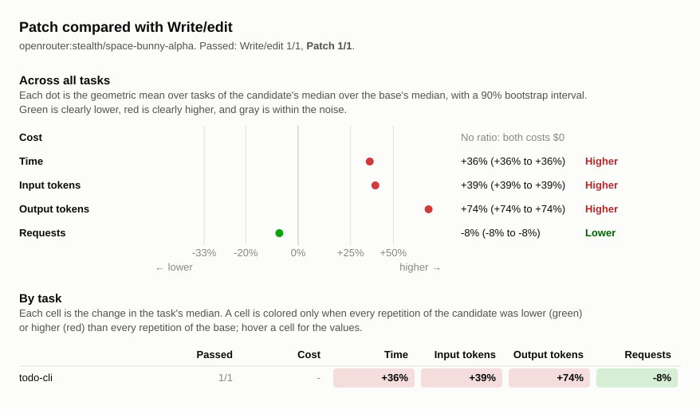

# Benchmark comparison: space-bunny-alpha-before-patch-20261001, space-bunny-alpha-todo-20261001

## Runs

| Label                                   | Commit       | Dirty | Model                                  | Effort  | Providers | Results |
| --------------------------------------- | ------------ | ----- | -------------------------------------- | ------- | --------- | ------- |
| space-bunny-alpha-before-patch-20261001 | `e610384016` | no    | `openrouter:stealth/space-bunny-alpha` | default | any       | 1       |
| space-bunny-alpha-todo-20261001         | `93dee39560` | no    | `openrouter:stealth/space-bunny-alpha` | default | any       | 1       |

## Chart

## Summary

Each commit has one repetition, so these results do not establish a consistent
performance difference. The later run also includes the transcript rendering
change after apply_patch was restored. The chart shows no cost ratio because
both runs recorded zero dollars; the tables retain both values.

Changes are relative to `space-bunny-alpha-before-patch-20261001`. A task's
values are medians over its repetitions, with the range in parentheses. Totals
are sums of task medians.

| Metric            | space-bunny-alpha-before-patch-20261001 | space-bunny-alpha-todo-20261001 | Change |
| ----------------- | --------------------------------------: | ------------------------------: | -----: |
| passed            |                                     1/1 |                             1/1 |        |
| seconds           |                                      49 |                              66 |   +36% |
| requests          |                                      13 |                              12 |    -8% |
| tool_calls        |                                      12 |                              12 |    +0% |
| failed_calls      |                                       0 |                               1 |        |
| cancelled_calls   |                                       0 |                               0 |        |
| repeated_calls    |                                       1 |                               0 |  -100% |
| input_tokens      |                                   89326 |                          124098 |   +39% |
| cached_tokens     |                                   83004 |                          112594 |   +36% |
| output_tokens     |                                    5984 |                           10434 |   +74% |
| reasoning_tokens  |                                       0 |                               0 |        |
| cost              |                                 $0.0000 |                         $0.0000 |        |
| max_input_tokens  |                                    9853 |                           13767 |   +40% |
| tool_output_chars |                                    6385 |                            3032 |   -53% |

### Pass rate and cost by task

| Task       | space-bunny-alpha-before-patch-20261001 passed | space-bunny-alpha-todo-20261001 passed | space-bunny-alpha-before-patch-20261001 cost | space-bunny-alpha-todo-20261001 cost | Change |
| ---------- | ---------------------------------------------: | -------------------------------------: | -------------------------------------------: | -----------------------------------: | -----: |
| `todo-cli` |                                            1/1 |                                    1/1 |                                      $0.0000 |                              $0.0000 |        |

## Tasks

### `todo-cli`

| Metric               | space-bunny-alpha-before-patch-20261001 | space-bunny-alpha-todo-20261001 | Change |
| -------------------- | --------------------------------------: | ------------------------------: | -----: |
| passed               |                                     1/1 |                             1/1 |        |
| status               |                              finished 1 |                      finished 1 |        |
| seconds              |                                      49 |                              66 |   +36% |
| requests             |                                      13 |                              12 |    -8% |
| tool_calls           |                                      12 |                              12 |    +0% |
| failed_calls         |                                       0 |                               1 |        |
| cancelled_calls      |                                       0 |                               0 |        |
| `apply_patch` calls  |                                       0 |                               4 |        |
| `apply_patch` failed |                                       0 |                               1 |        |
| `edit_file` calls    |                                       1 |                               0 |  -100% |
| `edit_file` failed   |                                       0 |                               0 |        |
| `glob` calls         |                                       0 |                               1 |        |
| `glob` failed        |                                       0 |                               0 |        |
| `shell` calls        |                                       8 |                               7 |   -12% |
| `shell` failed       |                                       0 |                               0 |        |
| `write_file` calls   |                                       3 |                               0 |  -100% |
| `write_file` failed  |                                       0 |                               0 |        |
| repeated_calls       |                                       1 |                               0 |  -100% |
| input_tokens         |                                   89326 |                          124098 |   +39% |
| cached_tokens        |                                   83004 |                          112594 |   +36% |
| output_tokens        |                                    5984 |                           10434 |   +74% |
| reasoning_tokens     |                                       0 |                               0 |        |
| cost                 |                                 $0.0000 |                         $0.0000 |        |
| max_input_tokens     |                                    9853 |                           13767 |   +40% |
| tool_output_chars    |                                    6385 |                            3032 |   -53% |
