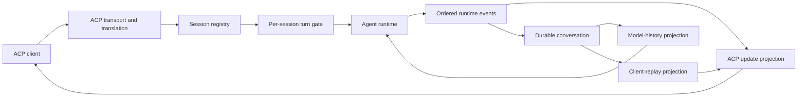
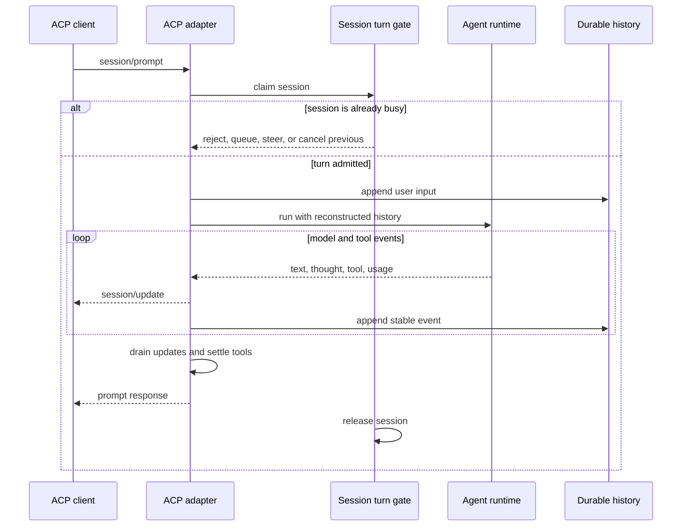

# ACP agent architecture review

## Big idea

These projects converge on one architecture: **ACP is a session-scoped event adapter around an agent runtime**. The adapter admits a turn, drives or delegates the agent loop, translates runtime events into ACP updates, and restores sessions from durable history. The live session registry is temporary; the durable conversation is the real product boundary.

They do **not** converge on three decisions:

1. who owns the agent runtime and durable conversation;
2. what a second prompt does while the session is busy; and
3. whether an event is stored before or after the client sees it.

Those decisions explain most of the code, most replay differences, and nearly every race found in the reports. For Ox, the clearest fit is the small native form it already has: one durable event log, one explicit active-turn guard per session, and two projections of the same events—model history and ACP replay. There is no evidence that Ox needs a subprocess gateway, actor framework, or second transcript yet.

This review covers the fourteen reports available on 2026-09-19: twelve ACP server or adapter implementations, OpenHands as a gateway above ACP, and Ante, whose repository documents a native agent protocol with no ACP implementation at the pinned revision.

## The common shape

All twelve direct implementations reduce to the following data flow, even when the runtime sits in another process or behind HTTP:

The boxes move across process boundaries, but their responsibilities remain stable:

- The transport negotiates capabilities and maps protocol methods.
- The session registry maps an ACP session ID to live state.
- The turn gate defines same-session concurrency and cancellation.
- The runtime owns the model/tool loop.
- The event path orders text, thought, tool, usage, and terminal updates.
- Durable history rebuilds model context after restart and, usually, the client's transcript on load.

A normal turn also has a recognizable sequence:

The order of the two middle actions varies. Text deltas usually reach the client before their consolidated durable record. Tool states are more often persisted before or with their notification. Docker Agent is the clearest persist-before-deliver design; wrapped-agent adapters cannot observe the commit point at all.

## Three architecture families

### 1. Native, in-process agents

[kimi-cli](research/MoonshotAI--kimi-cli.md), [goose](research/aaif-goose--goose.md), [Docker Agent](research/docker--docker-agent.md), [fast-agent](research/evalstate--fast-agent.md), [Gemini CLI](research/google-gemini--gemini-cli.md), [octomind](research/Muvon--octomind.md), [stakpak/agent](research/stakpak--agent.md), and [VTCode](research/vinhnx--VTCode.md) call their own agent runtimes directly.

This is the simplest topology. Session identity, cancellation, event conversion, and persistence are visible in one codebase. The cost is that the ACP layer must make every lifecycle choice itself. The implementations range from very thin translation (Docker Agent) to an ACP-owned live-session subsystem (fast-agent, octomind). The newest Rust entries also show how the topology fails when the session layer is skipped: stakpak collapses every ACP session onto one shared history with process-global cancellation, and VTCode keeps sessions memory-only with unguarded same-session prompts.

### 2. Adapters around another runtime

[claude-agent-acp](research/agentclientprotocol--claude-agent-acp.md), [agentclientprotocol/codex-acp](research/agentclientprotocol--codex-acp.md), [Zed's codex-acp](research/zed-industries--codex-acp.md), and [opencode](research/anomalyco--opencode.md) translate ACP into another runtime surface.

The topology differs substantially:

| Project | Runtime boundary | Consequence |
| --- | --- | --- |
| claude-agent-acp | One Claude CLI subprocess per session | Strong session isolation; queue and transcript semantics depend on the CLI stream. |
| agentclientprotocol/codex-acp | One shared Codex app-server child | Thin thread/turn mapping; one shared crash and restart domain. |
| Zed codex-acp | codex-core linked in-process | A small per-session actor; persistence and turn behavior still belong to codex-core. |
| opencode | Loopback HTTP requests plus SSE in the same process | Clean service boundary and durable event bus, with extra connection and replay machinery. |

Adapters are smaller only when the wrapped runtime already exposes sessions, streaming events, cancellation, and resume. Otherwise, complexity moves into correlation, deduplication, late-event suppression, and undocumented stream assumptions.

### 3. Gateway above ACP

[OpenHands](research/OpenHands--OpenHands.md) sits one level higher. Its frontend talks REST and WebSocket to an external agent-server, which spawns an ACP CLI per conversation. OpenHands therefore persists and replays a product-level event stream while the wrapped CLI owns model context. It is useful evidence for reconnect and UI architecture, but not for the internal design of an ACP server; that code is outside the inspected repository.

### 4. Protocol-only surface

[Ante](research/AntigmaLabs--ante.md) has no ACP layer at this revision: the `ante-acp` crate advertised in its README is an empty stub. The observable surface is the native Op/Evt JSONL protocol of a closed-source `ante serve` daemon, wrapped by a published client SDK. It contributes wire-schema and replay evidence rather than server mechanics: a standalone protocol-types crate with `#[serde(default)]` versioning and round-trip tests, explicit session-replacement semantics (`StartSession` supersedes with a `SessionEnd(Replaced)` signal), a three-way event classification (live deltas, final records, replay-only records, plus a never-persisted class), and a ≤200-event replay window on resume. Concurrency and persistence timing inside the daemon are unverifiable.

## The major divisions

### Session ownership and storage

There are three equally common durability choices among the twelve direct implementations:

| Durable owner | Projects | Character |
| --- | --- | --- |
| Embedded database | goose, opencode, Docker Agent | Explicit ordering and transactional updates; easiest to query and coordinate. |
| Local files | kimi-cli, fast-agent, Gemini CLI, octomind | Low machinery and natural append/checkpoint formats; cross-process ownership needs separate care. Octomind adds a strict atomic-add contract: each message is appended to its zstd JSONL log before it enters memory. |
| Checkpoints in SQLite or a remote API | stakpak/agent | Full-history checkpoint chains written after completed turns only; never read back by the ACP path, so they are an audit record, not runtime truth. |
| Memory only | VTCode | ACP sessions never touch disk; advertised load depends on archive files written by other runloops of the same binary. |
| Wrapped runtime | both Codex adapters, claude-agent-acp | Thin adapter; commit timing and recovery guarantees become opaque. |

The stable rule is more important than the medium: **there should be one authoritative conversation owner**. Live maps contain runtime handles, locks, queues, and caches; none is treated as durable truth. Kimi makes a deliberate exception by keeping separate model and presentation logs. That improves separation of concerns but creates a consistency problem between the two files. VTCode and stakpak show what happens when the rule is dropped: VTCode has no durable truth at all, and stakpak's durable checkpoints are never consulted, so resume silently loses the conversation while the checkpoint chain keeps growing by ID.

OpenHands repeats the same issue at a larger scale: the agent-server owns the UI event log while the ACP subprocess owns model context. The UI can recover even when model-continuation semantics are unknown.

### Same-session prompt policy

Every implementation allows different sessions to run concurrently. There is no consensus for a busy session:

| Policy | Projects | Assessment |
| --- | --- | --- |
| Reject | goose | Smallest contract; the caller gets immediate, explicit feedback. |
| Queue | claude-agent-acp, fast-agent, octomind | Friendly to clients, but cancellation and orphaned queued work require bookkeeping. Octomind serializes on a per-session mutex held across the whole prompt and removes the session from its registry while the turn runs, so every other accessor must take the same lock. |
| Cancel previous | Docker Agent, Gemini CLI | Responsive and compact; surprising unless the client expects replacement semantics. |
| Steer or join the active run | opencode, Zed codex-acp | Natural for interactive agents; the second request's ownership and completion are harder to define. |
| Unguarded or delegated | kimi-cli, agentclientprotocol/codex-acp, stakpak/agent, VTCode | The highest-risk choice; shared turn state can be overwritten or behavior becomes unknowable. Stakpak interleaves same-session prompts into one shared history and cancels every session's work on any cancel; VTCode resets a shared cancel flag and interleaves messages under the first prompt's feet. |

This is a protocol contract, not an implementation detail. The safest small default is rejection. Queueing, steering, and cancel-previous are product features that need explicit client semantics and tests.

### Event delivery and backpressure

Six implementations translate runtime events directly in the prompt task. The others first cross a subprocess stream, channel, bus, or SSE connection. In both groups, each session preserves event order and nearly every implementation ensures updates are sent or drained before returning the prompt response.

Backpressure is less disciplined:

- goose and Docker Agent use bounded internal channels, then allow client writes to slow the turn;
- Gemini directly awaits client writes;
- kimi-cli, claude-agent-acp, both Codex adapters, opencode, fast-agent, and octomind contain unbounded queues, promise chains, or per-delta tasks somewhere in the path;
- stakpak funnels updates through per-notification oneshot acks, but the ack fires when the update is queued, not consumed, and the outgoing channel is unbounded;
- VTCode sends fire-and-forget notifications from the prompt task and drops send errors;
- Zed's adapter fires notifications without observing client pressure.

No design is free. Backpressure couples UI health to model progress; unbounded buffering converts a stalled client into memory growth. The important property is to choose and document one behavior rather than inherit it accidentally from an SDK.

### Persistence timing and partial output

All systems distinguish ephemeral streaming deltas from stable conversation records, even when that distinction is implicit.

- User input is normally persisted before the model call.
- Assistant text is commonly streamed first and persisted as a consolidated message later.
- Tool calls and results are persisted at stable state transitions.
- Cancellation must close or repair unfinished tool calls so the next model request remains valid.

Docker Agent persists every streaming update before forwarding it. opencode persists partial text during abort cleanup. Fast-agent checkpoints at tool-loop boundaries. Octomind commits each fully built message before mutating memory ("atomic add") and synthesizes results for interrupted tool calls on load, but drops cancelled post-tool rounds entirely, so the client can have seen work the log does not contain. Gemini deliberately rolls an aborted turn back. Kimi preserves partial output in its UI transcript but not its model history. Stakpak checkpoints only completed model turns, so a cancelled turn leaves no record while its streamed deltas remain with the client. VTCode commits tool calls incrementally in memory but discards streamed assistant text on cancel. The wrapped adapters cannot prove when the underlying CLI commits.

There is no universal need to persist tokens or deltas. The real invariant is that restart reconstruction must never produce an invalid tool conversation or treat a partial assistant turn as complete.

### Load, resume, and replay

Eight of the twelve direct implementations can replay at least part of a stored transcript to the client; Docker Agent and octomind reconstruct model context only, and stakpak and VTCode neither replay nor reliably rebuild context. A recurring distinction is:

- **load**: restore the runtime and replay history to the client;
- **resume**: restore the runtime without replay because the client already has the transcript.

Replay is always a projection, not a byte-for-byte reproduction of the live stream. Chunk boundaries disappear. Reasoning, plans, approvals, usage, terminal output, or tool structure may be omitted. The best implementations reuse the live event converter or replay the same stored event type; duplicated live and replay conversion paths drift.

The weakest common lifecycle edge is **load or resume during an active prompt**. It is unguarded, ambiguous, or only partially handled in most reports. Gemini can create two writers to one transcript. Zed can replace a registered actor while the old actor continues. Claude and opencode can interleave replay with live updates. Stakpak's `load_session` re-points a single `Cell` mid-prompt while the old prompt keeps streaming. VTCode's archive import can replace a registry entry while the old handle keeps streaming detached. The TypeScript Codex adapter has the most deliberate defense: generation counters, close fences, queue draining, and stale-turn suppression.

A second, quieter failure is **session ID namespaces that never match durable records**. VTCode mints `vtcode-zed-session-<n>` IDs while its load path only accepts archive identifiers written by other runloops, so `load_session` is unreachable for bridge-created sessions and the advertised capability overpromises.

### Recovery boundary

Durable sessions recover completed history, not running computations. After a process restart, recovery is client-driven through load or resume; in-flight model calls, permission requests, and adapter queues are generally lost. This is consistent across the projects and is a useful boundary: durable conversation recovery is common, durable turn execution is not.

## Recurring strengths

Several patterns repeatedly earn their complexity:

1. **One session ID across protocol, runtime, and storage.** It removes translation tables and makes load paths direct.
2. **A single per-session admission point.** A mutex, actor, semaphore, or active-run map is enough; global coordination is unnecessary.
3. **An ordered event chokepoint.** One consumer per session makes update ordering, cancellation, and prompt settlement auditable.
4. **Updates before the prompt response.** Queue drain, idle observation, or direct awaited sends give clients a strong rendering contract.
5. **Explicit terminal repair on cancellation.** Interrupted tools become terminal failures or are rolled back before history is reused.
6. **Replay from durable records, not in-memory output.** This exposes fidelity gaps early and makes restart behavior testable.
7. **Persist the built record before mutating memory.** Octomind's atomic-add contract keeps the durable log and the in-memory history from diverging when a write fails.

## Recurring failure modes

The same problems appear across otherwise different implementations:

- A second prompt overwrites a single `current_turn` or active-prompt slot.
- Load/replay races with a live prompt and interleaves old and new updates.
- Live and replay converters evolve separately.
- The client sees text that is not yet durable, without that contract being stated.
- Unbounded output queues hide a stalled client until memory grows.
- Session-scoped calls mutate global config, shared HOME files, provider state, or shared toolsets.
- Multiple ACP session IDs collapse onto one runtime session: stakpak keeps a single shared history and `current_session_id` slot, so `new_session` wipes the only context and `load_session` silently re-points it.
- Cancellation is process-global: stakpak's cancel broadcast ignores the session ID and stops every in-flight stream and tool.
- Session ID namespaces that never match durable records silently disable resume (VTCode).
- Adapter layers claim recovery properties they cannot verify in the wrapped runtime.
- Close, delete, and resume mean different things to live state and durable state.

These are lifecycle errors, not model-loop errors. A small explicit session state model prevents more bugs than a more elaborate agent abstraction.

## Implications for Ox

Ox already matches the strongest common core:

- SQLite is the authoritative ordered event log.
- The same stored events feed model-history reconstruction and ACP replay.
- User input is committed before the model call.
- Assistant iterations are committed transactionally.
- Same-session prompts are rejected through a small in-flight map.
- Cancellation makes unfinished tool calls terminal before storing the iteration.
- Session deletion is rejected while a prompt is active.

That is a coherent architecture. The research suggests tightening it, not replacing it:

1. **Keep rejection as the busy-session policy.** It is explicit, cheap, and avoids the queue/steering accounting seen elsewhere.
2. **Make load-during-prompt behavior explicit.** Reject it, or replay only through a captured event cursor. Do not allow an unbounded replay to interleave with live updates on the same session.
3. **State the durability contract.** Current streaming chunks are visible before their iteration is committed; the prompt response should continue to mean all stable events have been stored and all updates have been sent.
4. **Keep one event schema as the seam.** Model reconstruction and ACP replay may remain separate projections, but neither should gain an independent transcript.
5. **Add a bounded output policy only when observed load requires it.** A per-session actor or bus is not justified merely because larger systems use one.
6. **Test lifecycle interleavings before adding capabilities.** The highest-value cases are prompt-versus-load, cancel during a tool call, send failure after persistence, and process restart after a committed iteration.

The practical target is not the most featureful project. It is goose's explicit turn claim, Docker Agent's cancellation repair, opencode's single durable event truth, and octomind's persist-before-memory commit—implemented with Ox's smaller surface.

## Project map

| Project | Form | Durable state | Same-session prompts | Replay to client |
| --- | --- | --- | --- | --- |
| kimi-cli | Native | Model JSONL + UI JSONL | Unguarded concurrent | Yes |
| goose | Native | SQLite | Reject | Yes |
| claude-agent-acp | Per-session subprocess adapter | Claude transcript | FIFO queue | Yes |
| agentclientprotocol/codex-acp | Shared-subprocess adapter | Codex rollout | Delegated/unknown | Partial |
| Zed codex-acp | Linked-library adapter | Codex rollout/store | Steering; response edge unclear | Partial |
| opencode | In-process HTTP/SSE adapter | SQLite event log + projections | Join/steer | Yes |
| Docker Agent | Native | SQLite | Cancel previous | No |
| fast-agent | Native | JSON snapshots and histories | FIFO lock | Partial |
| Gemini CLI | Native | Append-only JSONL | Cancel previous | Yes |
| octomind | Native | Append-only zstd JSONL + SUMMARY snapshots | Queue (per-session mutex) | No |
| stakpak/agent | Native | SQLite/API checkpoint chain | Unguarded concurrent | No |
| VTCode | Native | Memory-only | Unguarded concurrent | No |
| Ante | Protocol-only (closed daemon) | Local files (documented, format closed) | Unknown; `Steer` op exists | ≤200-event window on resume |
| OpenHands | Gateway/orchestrator | External event log + wrapped context | Unknown | Product-event replay |

## Scope and confidence

The conclusions above come from the reports' pinned revisions, not current upstream heads. Twelve reports have high confidence (the nine originals plus octomind, stakpak/agent, and VTCode). The OpenHands report has medium confidence because the inspected repository contains the frontend gateway, while its agent-server and ACP client live in an external package. The Ante report has medium confidence because the daemon that owns sessions, runs the model loop, and writes session files is a closed-source binary; its wire schema, SDK, and documentation are established from code, but every daemon-internal property rests on the project's own docs. Claims about common ACP-server mechanics therefore use the twelve direct implementations; OpenHands is used only for gateway, reconnect, and split-ownership observations, and Ante only for wire-schema and replay-window observations.
