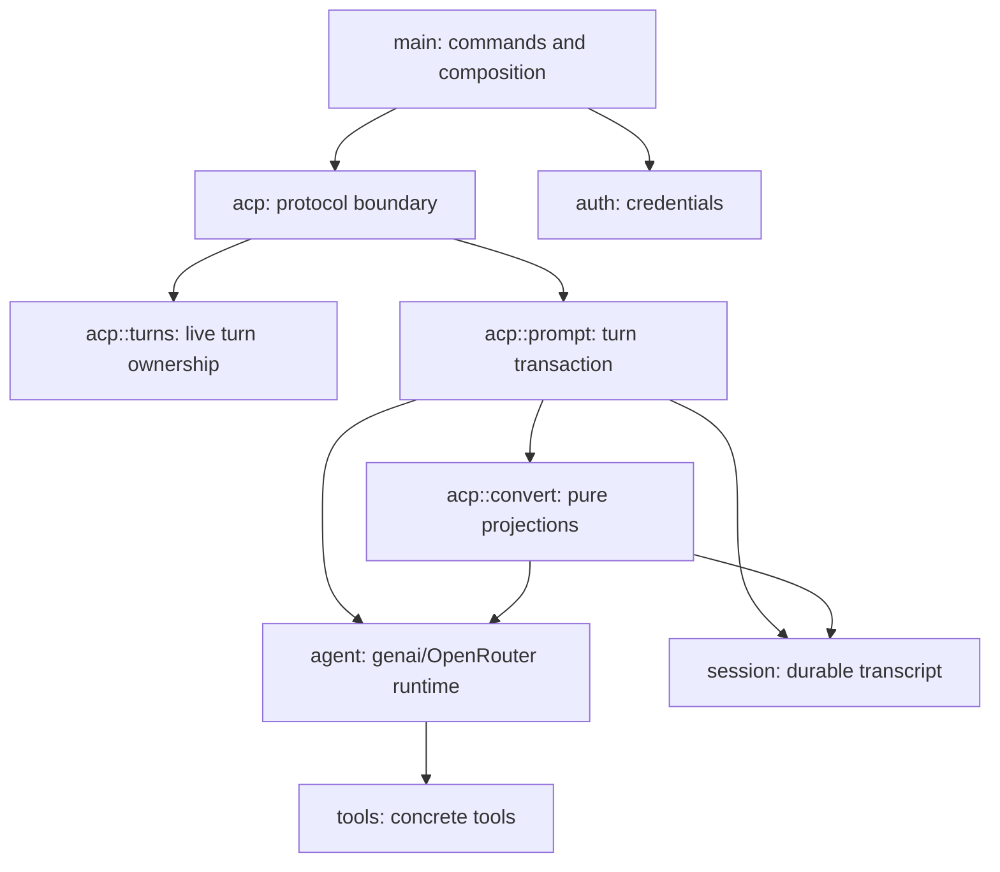

# Organizing Ox as a small Rust agent

## Recommendation up front

Ox is on the right architectural track. Keep it as one crate, one ACP process, one concrete agent runtime, and one SQLite transcript. Organize the code around **ownership and lifetime**:

- ACP owns protocol handling and one prompt's orchestration.
- A session store owns durable sessions and transcript entries.
- An active-turn registry owns live exclusion and cancellation.
- The agent module owns the `genai` client and provider-specific behavior.
- Pure conversion functions connect ACP, `genai` chat types, and transcript types.

The next step is a modest module split, not a framework. In particular, do not add generic repositories, pluggable backends, an event bus, or a per-session actor yet. The six Rust reviews show that those mechanisms help only when a real second runtime, transport, or source of background work requires them.

## Proposed shape

```text
src/
  main.rs                 command parsing and process composition
  auth.rs                 credential lookup and mutation
  agent.rs                concrete genai/OpenRouter adapter and model/tool loop
  tools.rs                concrete tool implementations and display metadata
  session/
    mod.rs                session identity, transcript domain types, SessionStore API
    sqlite.rs             schema, codecs, SQL, migrations
  acp/
    mod.rs                server construction and handler registration
    prompt.rs             one admitted prompt from input through final response
    convert.rs            pure ACP ↔ transcript ↔ genai projections
    turns.rs              active-turn admission, cancellation, cleanup
```

This is a target boundary, not a requirement to create every file immediately. `session/mod.rs` and `session/sqlite.rs` can remain one file until the split makes either easier to read. The four ACP files are already justified: the production portion of `acp.rs` currently combines transport registration, server state, turn admission, input conversion, model-history reconstruction, live stream handling, persistence, replay, and cancellation repair.

The dependency direction should stay simple:



`session` should not know how ACP notifications are shaped, and `agent` should not know how SQLite records are encoded. `acp::prompt` is the intentional integration point that knows about both.

## What the Rust projects teach

| Project | Useful lesson | Warning for Ox |
| --- | --- | --- |
| [goose](research/aaif-goose--goose.md) | A small active-run registry with a drop guard makes busy-session behavior explicit. Core storage, not ACP, owns the conversation. | Its two agent loops and large manager surface show the cost of carrying parallel architectures. |
| [Zed codex-acp](research/zed-industries--codex-acp.md) | A per-session actor is an effective serialization and event-correlation point when wrapping a rich runtime. | Separate live and replay converters drift; an actor is unnecessary overhead before Ox has background session operations. |
| [Octomind](research/Muvon--octomind.md) | One runtime shared by all frontends, a documented per-session lock, and persist-before-memory mutation are strong invariants. | Its `LocalSet` actor bridge, task-local registries, and map-removal ownership are complexity forced by `!Send` internals, not patterns to copy by default. |
| [Stakpak Agent](research/stakpak--agent.md) | A single module can make an end-to-end path easy to audit. | One shared history, current-session slot, model setting, and cancel channel behind many session IDs demonstrates why ownership must be session-scoped, not merely mutex-protected. |
| [VTCode](research/vinhnx--VTCode.md) | A dedicated ACP crate can make protocol code easy to locate. | Its ACP-specific agent loop diverges from the main runtime and misses persistence and permission behavior. A clean directory is not a clean boundary if behavior is duplicated. |
| [Ante](research/AntigmaLabs--ante.md) | A small crate of closed, version-tolerant wire enums is useful when multiple programs consume the protocol. | Its empty ACP crate is a reminder not to create packages or abstractions before an implementation needs them. |

The common lesson is to share behavior downward and translate at the edge. Ox should have one prompt engine and one transcript model. ACP-specific code should adapt them, not become a second agent runtime.

## Recommended boundaries

### `acp`: protocol edge and orchestration

`acp::mod` should be mostly wiring:

- build the protocol server;
- register handlers;
- hold a cloneable `ServerState`;
- translate returned errors into ACP errors;
- send protocol responses.

Move the body of the prompt closure into `acp::prompt::run`. A named function or concrete `PromptRunner` makes the lifecycle visible without introducing a trait:

1. claim the session's active-turn slot;
2. validate the session and read history;
3. commit the user message;
4. run the agent stream;
5. emit live updates and accumulate stable transcript entries;
6. repair open tool calls on cancellation or failure;
7. commit the final iteration;
8. return only after updates and storage are complete.

Handlers for new, load, list, delete, login, and logout can remain short functions in `acp::mod`. Do not create one module per RPC; that fragments a still-small surface.

### `session`: durable truth

Replace the collection of free functions in `sessions.rs` with a concrete `SessionStore`. It needs no trait and can remain a thin owner of the database path:

```rust
#[derive(Clone)]
pub(crate) struct SessionStore {
    path: PathBuf,
}
```

Methods should describe domain operations rather than SQL queries:

- `create`
- `contains`
- `contains_in_workspace`
- `title`
- `list`
- `append_user_message`
- `append_iteration`
- `transcript`
- `delete`

This makes the store explicit in `ServerState`, removes environment lookup from every operation, and gives tests an ordinary temporary path. It is still a concrete SQLite implementation, not dependency injection.

The session module should return domain data such as `SessionSummary` and `TranscriptEntry`; `acp::convert` should build `SessionInfo` and `SessionUpdate`. Today `sessions.rs` imports ACP's `SessionId` and `SessionInfo`, which makes the durable layer part of the protocol layer. Preserve the one-to-one ID value, but let the session module own its representation if the split is made. Do not introduce a translation table.

Keep serialized database DTOs private to `session::sqlite`. The public transcript enum should express behavior, while the private DTOs preserve on-disk compatibility. This is the useful part of Ante's protocol-shape discipline without creating another crate.

### `acp::turns`: live ownership

Rename `InFlightPrompts` to `ActiveTurns` and make admission return an RAII guard:

```rust
let turn = state.active_turns.try_start(session_id.clone())?;
```

`ActiveTurn` should own the cancellation signal and remove itself from the registry on drop. It should expose only what the lifecycle needs: `cancelled()`, `is_cancelled()`, and perhaps `cancel()`. `ActiveTurns` should expose `try_start`, `cancel`, and `is_active`.

This follows goose's strongest small abstraction. It removes the separate manual `finish` call and makes cleanup survive early returns or future refactoring. It also gives load and delete one shared definition of “busy.”

Do not turn this into a session actor yet. Ox has no steering, background work, pending approvals, or out-of-band runtime events that need a mailbox. A mutex-protected map is the simpler correct tool.

### `acp::prompt`: a transaction script

Treat one prompt as a direct transaction script, not as a general state-machine framework. The current loop has four pieces of coupled temporary state—thought text, response text, transcript events, and iteration completion. Give that state one private type:

```rust
struct PendingIteration {
    thought: String,
    message: String,
    events: Vec<TranscriptEvent>,
}
```

Useful methods are `push_thought`, `push_text`, `start_tool`, `finish_tool`, `finish_open_tools`, and `drain`. This type should enforce transcript ordering and cancellation repair. It should not send notifications or write SQLite; the prompt runner remains responsible for effects.

This is a useful abstraction because it owns a real invariant. By contrast, an `EventSink`, `AgentBackend`, or generic `PromptPipeline<T>` would only hide one implementation.

### `acp::convert`: a functional core

Move pure transformations here and keep them exhaustive:

- ACP prompt blocks → model input text;
- transcript entries → `genai::chat::ChatMessage` history;
- transcript entries → ACP replay updates;
- `genai` tool calls and local tool outcomes → transcript entries and live ACP updates;
- session summaries → ACP session summaries.

Pure projection code is where separate live and replay paths most often drift in the reviewed projects. Both paths should consume the same `TranscriptEvent` vocabulary even when their outputs differ. Tests here should cover every enum variant and corrupt/unsupported input without starting the server.

### `agent`: one concrete runtime adapter

Ox uses `genai` with OpenRouter. Today `agent.rs` wraps a `genai::Client`, builds a `ChatRequest` with tool definitions and capture options, and starts one model stream. The repeated model/tool loop and `MAX_TURNS` currently live in `acp.rs`, which dispatches calls through `tools::execute` and adds `ToolResponse` messages to history.

Keep `agent.rs` concrete. The target boundary should give it ownership of:

- `genai` client construction and OpenRouter authentication;
- model and turn-limit constants;
- chat request construction, tool definitions, and stream capture options;
- model streaming and the repeated model/tool loop;
- local tool dispatch and `genai` tool-response history.

Moving that loop out of ACP is a refactoring recommendation, not a description of the current implementation. ACP should retain notification delivery, persistence, and prompt cancellation orchestration; the agent module should own model/tool execution without depending on ACP or SQLite.

Do not define an `AgentRuntime` trait until a second runtime actually exists. VTCode's duplicated ACP loop is the failure to avoid; Ox should reuse this single adapter from every future surface.

`OxAgent` is brand-oriented rather than role-oriented. `ModelClient` describes its current role; `AgentRuntime` would fit once it owns the model/tool loop. Keep the durable `ToolOutcome` name: it represents completion, failure, or cancellation and carries result text where applicable.

## Naming conventions

Prefer names that reveal lifetime and representation:

| Current name | Recommended name | Reason |
| --- | --- | --- |
| `sessions` module | `session` | Modules usually name the concept; collections belong in types. |
| `EventKind` | `TranscriptEvent` | It is a closed domain event, not merely a discriminator. |
| `Event` | `TranscriptEntry` | The wrapper is one timestamped stored entry. |
| `AgentState` | `ServerState` | It will own the agent, store, and active turns, not only the agent. |
| `InFlightPrompts` | `ActiveTurns` | “Turn” names the owned lifecycle; “active” states the invariant. |
| `PromptCancellation` | `ActiveTurn` or `TurnCancellation` | Separate registry membership from the signal mechanism. |
| `session_history_from_events` | `model_history` or `events_to_model_history` | Names the projection and its destination. |
| `session_updates` | `replay_updates` or `events_to_session_updates` | Distinguishes load replay from live updates. |
| `record_iteration` | `commit_iteration` | The operation is transactional and durable. |
| `unfinished_tool_calls` | `open_tool_calls` | Shorter and matches lifecycle terminology. |
| `tool_call_update` | `tool_call_started` | The function creates the initial call, not a generic update. |
| `tool_result_update` | `tool_call_finished` | Names the state transition rather than the input object. |

Use `Runtime` for live model/tool execution, `Store` for durable I/O, `Entry` for a stored record, `Event` for the closed transcript vocabulary, and `Update` only for ACP output. Avoid generic `Manager` and `Service` names unless the type truly coordinates several owners.

Use `pub(crate)` for cross-module APIs and keep storage DTOs, SQL helpers, and stream buffers private. Public visibility should document an actual crate boundary, not compensate for unclear modules.

## Patterns to keep

### One durable event seam

Continue using the transcript as the common source for model reconstruction and client replay. This is “event log as a seam,” not a reason to adopt a full event-sourcing framework. Session metadata may remain ordinary rows updated transactionally with appended entries.

Use exhaustive `match` expressions for `TranscriptEvent`. Unknown persisted kinds should remain errors rather than silently disappearing. Add `#[serde(default)]` only for fields whose old-record meaning is genuinely well defined.

### Explicit commit boundaries

Keep these boundaries visible in method names and tests:

- the user entry is durable before inference;
- one assistant/tool iteration commits atomically;
- open tool calls become terminal on cancel or failure;
- a prompt response means the final commit and all preceding notifications succeeded.

Do not hide this ordering behind a generic event publisher. Octomind's “persist before memory mutation” and goose's active-run claim are valuable because their guarantees are apparent at the call site.

### Imperative shell, pure projections

The prompt runner should be straightforward effectful code. Conversion, open-tool detection, title derivation, and transcript reconstruction should be pure helpers. This gives the code most of the testability of a layered architecture without interfaces between every module.

## Patterns to avoid for now

- **No repository trait.** There is one SQLite store and no caller that needs polymorphism.
- **No agent-backend trait.** There is one concrete `genai`/OpenRouter implementation.
- **No internal event bus.** Direct streaming keeps ordering and failure visible; several reviewed projects gained only unbounded queues from a bus.
- **No session actor.** Add one only if steering, background tasks, or long-lived permission interactions require serialized out-of-band messages.
- **No workspace split.** A separate protocol/domain crate is useful only when another binary consumes it.
- **No second transcript.** Kimi's model/UI split is powerful but creates reconciliation work Ox does not need.
- **No ACP-specific agent loop.** Protocol handlers should call the same agent runtime future surfaces use.

## Testing by boundary

Keep unit tests beside the code they specify, but let the module split organize them:

- `session::sqlite`: schema creation, ordering, transactional iteration commits, deletion, corrupt persisted data;
- `acp::convert`: every transcript variant to model history and replay updates;
- `acp::turns`: duplicate admission, isolated cancellation, cleanup on guard drop;
- `acp::prompt`: cancel during a tool call, provider failure with an open tool call, notification failure, commit-before-response;
- server boundary: prompt versus load, prompt versus delete, two sessions running concurrently, restart followed by load.

Do not add traits only to mock these tests. Extract deterministic state transitions, use a temporary SQLite path, and reserve end-to-end tests for the few lifecycle contracts that cross modules.

## Suggested refactoring order

1. Extract and rename pure conversion helpers into `acp::convert`; move their existing tests with them.
2. Introduce concrete `SessionStore` and `ServerState`; keep SQL and behavior unchanged.
3. Replace manual in-flight cleanup with `ActiveTurns` and an `ActiveTurn` drop guard. Use it to define load/delete busy behavior.
4. Move the prompt transaction into `acp::prompt` and introduce `PendingIteration` only for its current invariants.
5. Split `session::sqlite` from the session domain once `session/mod.rs` is otherwise doing two jobs.
6. Move the model/tool loop into `agent` so future surfaces can reuse execution while ACP retains protocol and persistence orchestration.

Each step can be behavior-preserving and reviewed independently. Stop after any step that makes the code easy to navigate; the goal is not the target tree itself, but keeping ownership obvious as Ox grows.

## Bottom line

The best Rust examples do not point to one framework. They point to a few disciplined boundaries: goose's active-turn claim, Octomind's explicit persistence invariant, Zed's isolated per-session event ownership, and Ante's closed wire vocabulary. The weakest examples fail by sharing live state across sessions, duplicating the agent loop, or advertising persistence they do not reconstruct.

For Ox, a concrete store, a turn guard, a small prompt transaction, and pure projections are enough. Everything else should wait for a second real use case.
